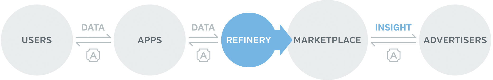
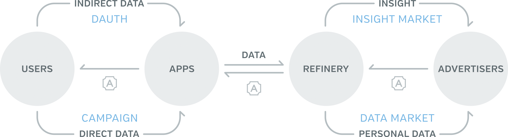

Airbloc Technical White Paper
=================

*Hyojun Kim* [hyojun@airbloc.org]()  
*Byeongsu Hong* [frostornge@airbloc.org]()

**Version 1.1** First published on April 9, 2018.  
Copyright © 2018 Airbloc Foundation. All rights are reserved.

Without permission, anyone may use, reproduce or distribute any material in this paper for non-commercial and educational use (i.e., other than for a fee or for commercial purposes) provided that the original source and the applicable copyright notice are cited.

## Table of Contents

* [Introduction](#introduction)
* [Airbloc](#airbloc)
    * [Stakeholders](#stakeholders)
    * [Architecture](#architecture)
    * [Why Blockchain?](#why-blockchain)
* [Data](#data)
    * [Types](#types)
    * [Components](#components)
    * [Rights on Data](#rights-on-data)
* [Data Pipeline](#data-pipeline)
    * [Data Collection](#data-collection)
        * [DAuth](#dauth)
        * [Data Campaign](#data-campaign)
    * [Data Ingestion](#data-ingestion)
    * [Data Refinery](#data-refinery)
    * [Marketplace](#marketplace)
        * [Sale Methods](#sale-methods)
        * [Pricing](#pricing)
* [Airbloc Token Economics](#airbloc-token-economics)
    * [Airbloc Token (ABL)](#airbloc-token-abl)
    * [Airbloc Reward (AIR)](#airbloc-reward-air)
    * [AIR Pool](#air-pool)
* [Reliability Proof System](#reliability-proof-system)
    * [Personal Identification](#personal-identification-kyc)
    * [Automated Fraud Detection](#automated-fraud-detection)
    * [Personal Evaluation](#personal-evaluation)
    * [Data Cross-Validation](#data-cross-validation)
    * [Data Reliability Mining](#data-reliability-mining)
* [Aero Network](#aero-network)
* [To Be Described (TBD)](#to-be-described-tbd)
* [Citations](#citations)
* [Appendix](#appendix)
    * [Considerations](#considerations)
    * [Direct Data Engineering](#direct-data-engineering)

## Introduction
At this moment, the data market is dominantly controlled by centralized services a.k.a “walled gardens” and big data brokers who aggregate data to sell off insights to large enterprises to generate huge revenues. 

Under this market status, most Data Suppliers are completely alienated from the market. To individual, who is the original data source, neither fair rewards nor data ownership is granted. Likewise, small Apps with insufficient number of customers can’t sell and monetize their customers’ data. Only Apps with sufficient number of customer data are eligible for limited market participation to sell data in turn-key.  

Meanwhile, from the Data Consumer’s side, small enterprises are often barred from data purchase, even in little amount. Similarly, large enterprises within the legal jurisdiction, can only access market trends, and they can’t execute micro-targeting techniques which are highly effective for running ad campaigns. 

Via Airbloc, Users can directly submit data to the blockchain-based data supply chain. Users can track and control  data transactions, as well as monetize their own data. Through DAuth protocol on Airbloc, Apps can get permission from Users and sell data on behalf of them. Also, Advertisers can easily purchase and access small amount of data, and optimize their marketing campaigns by running effective micro-targeting based on high-quality and diverse set of user interest data. 

Our mission at Airbloc is to democratize the data market to the level where individuals and small and medium sized apps can participate, which can improve data by its quality and quantity, so that all market players will eventually benefit from the win-win cycle. 

## Airbloc

Airbloc is basically a decentralized ad data exchange platform. Indirect data such as installed apps, app usage history, and GPS are collected via Airbloc’s Main Client Service’s app or via services that use Airbloc’s SDK to get permission from their users with DAuth protocol. The direct data are collected by data campaigns, where advertisers use various question forms to ask for the users’ responses. The collected data will then be sold to the advertisers directly or go through data refineries to add more user-level attributes, either in a raw data format or as a group of identifiers such as ADIDs.

On Airbloc, **Individual Users** can exercise sovereignty over data as a legitimate data owner and original data source. Airbloc can track the entire record of what data is collected, how it is collected, to whom it is sold, and how it is used. Also, Users can configure permission levels as to what extent their data shall be used. For example, Users can decide for themselves if only a common identifier could be  sold as targets, neither their raw data nor personal profiles.

Also, **Apps** can monetize their data and share the rewards with the end users. With [DAuth](#dauth), Users can only monetize data that were obtained by user’s permission, and this allows Apps to monetize data while protecting  personal data security. In addition, data monetization serve as an alternative new business model or as a supplement to existing business models to monetize traffic and user clicks and impressions.

At the same time, **Advertisers** can also optimize ROIs by targeting the potential customers with the quality user-level interest data. Airbloc DMP (Data Management Platform) ensures data quantity which is auto-collected from partner Apps. Also, it can guarantee data quality and diversity with firsthand interest data that were directly surveyed from Users. 

### Stakeholders

Airbloc is run by many participants to the ecosystem, including *Data Provider*, *Data Consumer*, *Data Collector*, *Data Refinery* and *Gatekeeper*.

* **Data Providers** are the end Users, the individuals who provide the data and get incentives for the data offering. They have full control over the data usage and circulation.
* **Gatekeepers** are the node of the Aero network that will be described later. They validates data and prevent frauds to enter the system. 
* **Data Collectors** are apps that collects data and monetizes data on behalf of users. They can collect indirect data by DAuth or collect direct data by questioning to user directly.
* **Data Refineries** are responsible for analyzing the given Direct, Indirect Data collected from the Data Providers and refining them into another user-level attribute. Then the refined data are added to the user’s profile so that Data Consumers can filter them by user attributes when making a new segment.
* **Data Consumers** are the advertisers who purchase data for targeted ads. They will use ABL tokens to purchase and reward data.

### Architectures

The architecture of Airbloc is composed of multiple layers as below. 

* Application Layer: Composed of Dapps that use Airbloc, including Airbloc Client, Airbloc Marketplace, and SDKs.
* API Layer: An interface provided for the communication with Airbloc.
* Service Layer: Airbloc Contract that includes the entire features of Airbloc Network.
* Core Layer: This layer is Airbloc’s blockchain platform based on Ethereum. It adopts Aero, Airbloc’s internal subchain network for data validation, and adopts interchain network to link the two blockchains.

Airbloc’s service platform is topped on Ethereum. Therefore, ABL tokens for Airbloc is based on ERC20 standard and Airbloc contract is mounted on and runs on EVM, as a smart contract. Please note that the platform can be later changed to other platforms due to technical requirements.

### Why Blockchain?

Under the centralized system, legal jurisdictions or rules and regulations are usually imposed upon the centralized entity who holds and manages the system. This means that there is no room for checks and balances for other entities within the ecosystem. Unless an eminent situation arises that leads to legal interventions, the system operates in a way that maximizes the revenue of the centralized entity, leaving no preventive mechanism to other entities to ensure a fair system.

However, for decentralized systems, rules and regulations are laid out under the smart contract, in a transparent and accessible manner. Hence all participants to the system can be guaranteed with a mutual checks and balances. These systems are designed to strictly abide by the rules, and all actions will be open to the public’s surveillance. If some players doesn’t abide by the rule or attempt to manipulate the system, then they will be penalized financially.

Airbloc is a decentralized system that guarantees a fair data transaction by rules and regulations. Even the Airbloc’s managing entity, the Airbloc Foundation, are just one out of many players to the ecosystem. The power to handle data is not and should not be yielded to one specific player, but should be equitably distributed to all Users and business entities. This is the ultimate value and reason for decentralization that Airbloc aims to achieve. The specific characteristics of Airbloc are as follows.

### Data Traceability

All data transactions on Airbloc Network will be transparently tracked.

In centralized systems, an individual user or other players in the ecosystem can’t find out how their data is collected and used. Perhaps this could be possible if the centralized system fully discloses data usage, but since it is heavily reliant on the good-will of the centralized entities and should be met with legal agreement, it can’t guarantee a 100% data traceability.

Contrastingly, in the decentralized Airbloc Network, data collection is fully controlled by Users via DAuth and data campaigns. Also, every procedural step to data’s distribution along data pipeline is recorded, so Users and Advertisers can check data lineage any time.

It is worth noting the fact that data traceability is not ensured by a single centralized entity, but rather through the smart contract which is open to the public and that is based on mutual checks and balances of all players to the network. In this regard, Users can be assured on their data traceability.

### Data Distribution Limitation

A distinguished feature of Airbloc is that data distribution can be limited by users. The individual users, who are the Data Providers, can limit the distribution of data by setting configurations. For example, User can cap the frequency of the data sales or restrict data from being used for specific ad types. With this custom configuration function, Users can reclaim own data rights and perceive ads as an useful piece of information.

Such limited data distribution is realized on the decentralized blockchain network, as an innate feature. Once assigned, the data feature is immutable. Therefore, the data controllability is guaranteed to the Users. More details can be found from the [Data](#data) section below. 

### Preventing Data Breach
In the traditional data exchange platforms, there lies a risk for copying or capturing the data in between transaction, without a proper data purchase. Since data is an intangible asset that owns an intrinsic value even by accessing them, this can be a crucial problem. In this context, conventional data exchange systems are always subject to the danger of not being able to completely track data pipeline. For example, “Data Escaping”, an activity of copying and subsequently exporting the disconnected data to the system, can be committed to avoid access control and tracking from the centralized system.

On Airbloc, unauthorized act of data copy can be prevented with **data anonymization**. The data on Airbloc are used for digital advertising purpose and even a piece of this data can’t be used without a third-party common identifier. In other words, anonymized data without a common identifier carries almost zero value. Following this principle, data circulated within Airbloc will be removed of common identifiers that can be used for targeting. The common identifiers will be only be accessible to the consumers who have purchased the data or the data owner, who is the data provider. However, user-level random UUIDs shall be maintained for the user-level data aggregation and analysis. 

Moreover, data anonymization is proceeded every time the data is transferred from one player to another. For example, a unique person with ID “A” will be replaced to ID “B” when handled by the refinery. Also, this person will be tagged as “C” for the gatekeeper. Only when the data consumer purchases the data and buys data ownership or usage rights, then the consumer will be able access the common identifier.

Accordingly, until the data ownership and/or usage rights are purchased, the data has almost no value, making it safe from data escaping, even if the data is breached in the middle. The aforementioned system will be built with Aero, which is Airbloc’s internal data management network. For further details, please refer to the [Data Anonymization](#data-anonymization) section.

## Data

All data exchanged on Airbloc is digital advertising data (hereinafter referred to as ‘Ad data’). Ad data is also referred as  personal interest data because it represents individual user’s interests. Here, it is important to note that advertising data should be trackable.

Non-traceable Ad data is valueless. This is because the data is valued at the moment when it is used. A method to use personal data is to run a targeted advertisement to that person. However, the ad can’t be run if the data does not contain an identifier, which is the trackable information from the data owner. All of Airbloc data system is built on the premise that **non-trackable ad data has a zero value.**

### Types
Ad data in the Airbloc is divided into two types by the collection method: **Indirect Data** and **Direct Data**.

**Indirect Data** are types that can be automatically collected from user’s device, such as  list of installed apps, installed app usage, purchase history from Google Play, wifi history, GPS and Beacon Data. These are the data types that can be automatically collected once permission is configured. Also, Indirect Data can infer that corresponding user’s static characteristics. To be more specific, this Indirect Data guesses that the user is a cat owner given that that user is installing cat-related apps, which is not based on direct question asking, “do you have a cat?”.

On the other hand, **Direct Data** is collected with a direct question to the user about particular facts. Returning to the example above, Direct Data can ask the user “Do you have a cat or not” to collect the data. Simply put, these are directly answered and directly collected type of data.

### Components
On Airbloc, Ad data is grouped into four components: *Identifier*, *Trait*, *Payload*, and *Lineage*.

#### Identifier
The Identifier is the information that identifies the data owner such as name, email, and unique identifier (UUID). Unique identifier is a unique and traceable ID for the data owner. Also, Google Advertising ID and Apple IDFA are well-known identifiers that are generally used on other platforms.

All data exchanged on Airbloc **must include at least one unique identifier** for the data owner. This is because the main purpose of data consumption on Airbloc is to identify users’ interests and to provide them with relevant targeted ads.

#### Trait
All data on Airbloc will be given the distribution limit traits. Airbloc employs the following rules to limit the data provider’s distribution:

* Restricted usage of the data (Usage Blacklist)
* Maximum number of data re-sells (Reaching Lifespan)

Data may not be used or sold to a particular advertiser or a user, and will no longer be re-sold when the maximum number of re-sales is reached. For instance, once a life span is given, it can't be extended. This trait gives a user complete control of user’s personal data.

Technically, Trait is made up of Finite State Machine, Limit Function, Transition Function and Status. Limit Function defines the condition in which that a particular action is limited on data and Transition Function changes the data status when a particular action occurs. The Status can only be modified by Transition Function, and these functions remain unchanged.

For example, if you want to limit data re-sale count to 10 times, you can done this by creating the transition function  for the action `ACTION_TRADE`, and creating the limit function  to the action.

#### Payload
The Payload contains data contents. The payload format is determined by the campaign executor for Direct Data, and for Indirect Data, standardized format is required in Airbloc. Generally, data payload is too large in its volume to be stored on blockchain. For this reason, the data is encrypted on external storage, such as IPFS or S5, and only the access hash keys are stored on blockchain. More information on saving data can be found from [Data Storing](#data-storing) section in Appendix.

#### Lineage
Lineage refers to data distribution history on Airbloc. This Lineage is created as data exchange begins. Airbloc keeps data lineage transparently so that individual users can see how their data is used while consumers can view the procedural details on how their purchased data has been distributed.

**Data Lineage can’t be accessed without data ownership.** That is to say, the gatekeeper and the refinery, who are located in between the data distribution pipeline, can’t view the data lineage. This is for preventing presume of the identity of data owner from by querying the lineage. Even if the data is anonymized, if someone can presume the identifier of the data, then data escaping or the breach of data – using the data without paying for it – can be occur. Therefore, Airbloc denies access to data lineage to those without data ownership. For more details, please see [Rights of Data](#rights-on-data) section.

### Rights on Data

Airbloc categorizes data rights into **Usage Rights**, **Tracking Rights**, and **Data Ownership**. The largest criteria for this categorization on data rights is the availability of identifiers. This is because advertising data is worthless without an identifier of the owner, as mentioned above.

**Usage Rights** is the right to access data payload. It will be given to the data refinery and gatekeeper who are located in the middle of the data pipeline. For example, a data refinery can access the data payload without purchasing data and process the user's both direct and indirect data to create the interest data. However, since the actual identifier of the user is unknown, that data is nothing more than a piece of worthless information.

**Tracking Rights** are the rights granted to access only the identifiers. This allows advertisers to target ads without having to deliver the user's raw data by allowing only the target to be sold without accessing the data payload. Many DSPs, including Facebook, do not need to upload data, but advertisers can create a target with just the ADID. This can protect users’ data and allows users to sell only the right to advertise and target that particular user.

**Data Ownership** is the right to access data’s entire contents. This right is only available to data providers or data consumers who are at the each extremes of the data pipeline. Owning data means being able to access data owner’s data information (unique identifier, lineage), and transaction in the data is regarded as trading of the data ownership.

|   |  Usage Rights  |  Tracking Rights  |  Data Ownership  |
|---|:-------:|:------:|:------:|
| Payload Access    |  ⃝ | **✕** |  ⃝ |
| Identifier Access | **✕** |  ⃝   |  ⃝ |
| Lineage Access      | **✕** |  ⃝ |  ⃝ |

## Data Pipeline Overview

The data on Airbloc will go through seven steps of SOIPRTC (Source - cOllection - Ingestion - Persistence - Refining - Trading - Consumption) pipeline, across five entities. User-created data is gathered by the Data Collector and stored by the Data Collector after the Gatekeeper executes data cleansing. Refinery will refine this data into commercially available Ad data and sell data to consumers at Marketplace.

### Data Source
Data is created by a user who is the data provider on Airbloc. Indirect Data is created naturally from user behavior from static attributes, while Direct data is created by answering data campaign’s survey questions. User gets to control the data from the stage when it is created, either by limiting data types to be collected, or by configuring data’s distribution limits.

### Data Collection
Data Collector gathers these data from the Data Provider. Indirect data is collected through DAuth, and Direct data is gathered through data campaigns – through asking survey questions and receiving response from the users.

### Data Ingestion
When Airbloc aggregates data from multiple sources, data formats should be unified and schema checks must be made in order to cleanse data by removing unnecessary parts, for an effective data use. This cleansing task is referred to as **Data Ingestion**. Data Collector can only register data on blockchain through Data Ingestion (data cleansing) and this process is required for data storage. Further details can be found from [Data Ingestion](#data-ingestion) section. 

### Data Persistence
**Data Collector is responsible for storing data.** Airbloc doesn't store data internally and it does not own a seperate data storage. The obligation of data storage and maintenance is held by Data Collector, and Data Collector can store data anywhere. Various repositories including S3, HDFS, IPFS and Swarm can be used, when access conditions are met upon the needs.

Data Collectors will first cleanse the data and register data URI to Airbloc. To ensure both data quality and anonymity, each time a data owner and usage rights holder accesses data, the gatekeeper will determine if the data secure and intact. Further details can be found from [Data Storage](#data-storage) section.

### Data Refining
While the data gathered by Data Collector can be sold directly at the raw data Marketplace, which will be mentioned later, it can also be processed to become a more valuable and insightful data to Data Consumers in the forms of personal interest data or predictive indicator by data refinery. The refinery can get Direct or Indirect Data from Data Collector and process to interest data or insight data. After then,  it gets refinery incentive every time data is sold. Further details can be found on [Data Refinery](#data-refinery) section.

### Data Trading
Data Transactionding is made at the Marketplace. Marketplace is composed by **Data Market** and **Insight Market**. In Marketplace, the data registered by Data Collector or Refinery is sold to consumers. When a consumer buys data from the Marketplace as an ABL token, the consumer gains data ownership. Further details can be found from [Marketplace](#marketplace) section.

### Data Consumption
When the data is consumed through data transaction, anonymized data during upload are non-anonymized, which will be delivered to Data Consumers along with the unique identifier. Data Consumers can then use this data for ads directly.

So far, overview on Airbloc data pipeline was addressed. The following sections will describe specific data distribution processes following the data pipeline order.

## Data Collection

On Airbloc, data is collected by the Apps. These Apps can monetize [Indirect Data](#indirect-data) and/or [Direct Data](#direct-data) collected by users in Airbloc. This does not mean a data monopoly on user’s app nor a violation to user’s personal data rights. Sales revenue is distributed to users at a fixed rate, and the user can choose the type and authority of the data that can be sold. In this regard, the App only shares the revenue with the user as a data sales agent

To collect data, Data Collectors should first register their App on Airbloc Network. For this, the Data Collector is required to hold certain amount of ABL tokens in advance. The maximum number of users that an App can upload on the Network proportionately increases to the ABL amount the App is holding. This is to prevent malicious apps from attacking the refinery and Marketplace through Sybil attacks and/or data generation attacks. The formula for the maximum number of users according to the App-held ABL tokens is as follows.

### DAuth
DAuth (DataAuth) is an agreement process between Data Provider and Data Consumer on the data collection and monetization on Airbloc. Once the App is installed, Users should agree with DAuth’s data collection for more than once upon app install, so that the App can collect Indirect Data from that User, allowing that particular User to determine types of data to be gathered.

While Airbloc and DAuth process can’t prevent Apps from auto-collecting data from Users, Indirect Data types that were unaccepted by Users will be filtered during data cleansing, so that they aren’t monetized on Airbloc. According to this mechanism, a fair data collection will be ensured to the Users.

Once App is registered, the Data Collector can set up types of Indirect Data to be collected on Airbloc Network and its respective reward compensation ratio. The data types to be collected can be app install list, in-app payment details, and etc. Furthermore, the reward compensation and ratio can be configured by data types and Users. Here, there is an attached condition that **at least 30% of the App’s revenue must be shared with the Users**. The registered data to be collected and compensation ratio will be saved on to the blockchain, and via DAuth, Users’ agreement will be met.

The details to DAuth are as follows:

1. Request to begin authentication to Airbloc on App
2. Issue Request Token to App on Airbloc
 * Reqeust Token is one-off, and is only used to display DAuth dialogue
3. The App launches DAuth dialogue via Airbloc SDK
4. Display DAuth dialogue to Users on Airbloc
  * Show users the data types they wish to collect, the amount of rewards, and revenue sharing ratio
5. User agrees to data collection
  * User can agree by differing data types
  * User enters Airbloc account (if unavailable, email) to receive rewards
6. Airbloc records the data types user permitted to collect
  * Data Collector can only monetize data of which users permitted via agreement
  * Unpermitted data will be filtered during [Data Ingestion](#data-ingestion) process

DAuth is not a personal identification service such as Civic [[1]](#https://tokensale.civic.com/CivicTokenSaleWhitePaper.pdf), and uPort [[2]](https://www.uport.me/). These identification services, of course, also includes an authorization feature on data collection. However, these services are identification services, so can substitute authentication method on App, which can burden the App for using an external platform. Not only that, it requires the User to own an account to the corresponding platform to log in.

Nonetheless, with DAuth, **Users are allowed to receive data sales compensation without an Airbloc account.** If a user have already installed Airbloc Client Service, compensation is automatically stored to the User account. If not, User can enter email without signing up. Later on, the User join Airbloc with User’s email account to see accumulated compensation which was earned so far.

With such features, App companies can greatly reduce the burden of using external platforms, while Users are guaranteed of their data rights without having an Airbloc account. As such, DAuth can reclaim data ownership to Users who are outside the Airbloc ecosystem.

The DAuth is built on a similar architecture to that of OAuth’s Three-Legged Authorization [[3]](https://www.ibm.com/support/knowledgecenter/en/SS9H2Y_7.5.0/com.ibm.dp.doc/oauth_threeleggedflow.html). In DAuth, Airbloc becomes the service provider of OAuth. However, while OAuth also includes personal authentication service, DAuth only includes agreement on Indirect Data collection. Moreover, the data owning entities to DAuth are individual users and/or Apps, as opposed to that of OAuth, which are service providers. In short, DAuth on Airbloc only ensures transparent monetization of personal data that only comes under user’s agreement.

### Data Campaign

On Airbloc, unlike other data exchanges, advertisers can purchase data by asking user directly what they want. Like campaigns in advertising, this procedure is called ‘**Data Campaigns**’ on Airbloc. Users can get rewards by submitting  responses to survey questionnaires.

Technically, data campaigns is defined as an activity to expose certain proposal which involves users’, data providers’ activity of directly submitting answers to the questions in exchange of rewards given by the campaign initiators. Users willing to participate in the data campaigns will accept the proposal and directly submit answers to the questions with the provided interface. 

Indirect data collection is feasible for all apps with Airbloc SDKs, however, direct data collection is only feasible in the apps with additional Airbloc Data Campaign SDK or in Airbloc main client app. These apps must be equipped with certain UI for their users to properly interact with.

Campaign consist of *Question*, *Reward*, *Target*, *Duration*, and *Reaching Fee*.

**Question** is an explanation into the target data of collection. Questions are categorized into natural language type questions and schema-based questions. Natural language type questions are a series of sentences or additional information attached to the question. Schema defines the format of data payload that will be uploaded to the network. For example, `isMarried: Boolean` schema means payload should assign proper key-value pairs; key has to match the string `isMarried` and the value has to follow `Boolean` type.

**Reward** is the amount of ABL tokens that should be given from data consumer to the data provider. When data provider answers to the question given by the data campaign, then consumer gives reward to the data provider. As data provider can respond only once to the each campaign, the total amount of rewards the consumer has to pay is (Reward Price) ✕ (Number of Participants).

**Target** is the target users, target data providers of the data campaign. This target is automatically set according to the interest data submitted by the user in the onboarding stage. 

**Duration** is the time range of the data campaign being exposed to the users. Duration can be set by an hourly basis and is immutable. For the change of campaign duration, the one needs to launch a new campaign.

The **Reaching Fee** must be paid with ABL token. The reaching fee of campaign exposure as to how many users will be exposed will be computed by the following formula.

<!--$$\mbox{Cost} =\mbox {Period} \times  \exp \left( \frac{\mbox{Number of Target Provider Group}}{\mbox{Total Number of Provider}} \right) \times \mbox {Constant} $$
-->

In order to expose data campaigns to the more users with longer time period, then the Data Collector must pay for the higher campaign exposure costs. The campaign exposure cost prevents Data Collectors from recklessly launching meaningless campaigns and will enhance user experience. The cost will be accumulated on [AIR Pool](#air-pool).

When Data Collectors launch the data campaign, the campaign will be spread to the specific group of Data Providers with push notifications and similar type of messages. Then the Data Providers will respond to the campaigns and get rewards.

## Data Ingestion

In a data hub system like Airbloc, the data comes from numerous other sources, so the system need to cleanse the unwanted parts of data and integrate the format of the data before using it. This process is called Data Ingestion.

In order for an Collector (App) to monetize the data collected, they must register the data to the network and go through the data ingestion process. The data ingestion process in Airbloc is performed in an own data validation network called Aero.

1. To register data, a collector registers data to some Aero node.  
2. The node propagates data to the network.
3. Nodes process the data according to the data integration rules specified by Airbloc.
    * It separates the owner’s user identifier of the data. 사용자의 식별자 정보를 별도로 분리합니다.
    * It adds some nonce to the separated user identifier data.
4. Nodes cleanses the data according to the data cleansing rules specified by Airbloc.
    * It filters out the data that the user didn’t allowed to collect, referring to the data authorization record of the user on the blockchain.
    * It filters out unnecessary data fields.
5. Nodes reach PoS consensus on the right data, and registers the elected data and its hash to the blockchain.
6. Nodes return the cleansed data and its hash to the collector.

The collector must store the data that cleansed and ingested. If the collector neglects the cleansed data and stores the original data, the collector will be punished get penalty during the data availability proof task since they are serving the wrong data. Therefore, it’s possible to protect the user’s data control rights through the data ingestion process of Airbloc.

### Data Anonymization

Airbloc separately stores the identifier in the data on data ingestion process. Only the hash of identifier and payload and access URI – that cannot be accessed without permission –  are registered on blockchain, so the original identifier of the data cannot be known on the middle of data pipeline.

Of course, the identifier of data is generally the same for one user, so there’s a possibility of problem that data owner can be presumed by the hash of the identifier. Airbloc prevents this problem by adding nonce to the identifier when hashing, so identifiers of same user will be all different. 

The presence of this feature will not cause the non-transparency of data transactions in Airbloc. The purpose of this feature is to protect data in the data distribution process to prevent situations of data leaking to unauthorized subjects. Data transaction records are stored transparently with blockchain transactions and data lineage.

Thus, Airbloc prevents data escaping – leaking the data without paying for it – using data anonymization.

## Data Refinery
The data collection process earlier doesn’t possess actual value by itself. Unrefined Data which is ‘raw data’ has high probability of unreliable results and high frequency noise. Raw data itself has specialization on domain platform so that utilization is limited. Therefore, in order for advertisers to use data, it is necessary to analyze the raw data to personal data that can be easily used in advertisements or the insight data such as ‘user's estimated purchase rate’ and ‘return rate’.

The data processing in the Airbloc is performed by the Data Refinery. Refinery will be data processing entities with data usage rights and will be automated data analysis engines operated by advertising data analysts. The refinery processes the data collected by the collector for an individual and then sells the processed data to the consumer in the insight market and the personal data market described later and obtains incentives.

The refining process is done outside the blockchain. The refinery will export the data collected by the collector, process it, import it, and register the listing in the marketplace. In general, processing data outside of the blockchain causes data corruption and data escaping problems, but the risk is eliminated because the data processed by the parser is anonymized and thus worthless.

So, after processed by the refinery, it becomes Personal Data or Insight Data.

* **Personal Data** is the analysis of the attributes of the user. For example, if there is indirect data that a person named Bob has installed a lot of dog apps, and direct data that Bob likes pet, the refinery can use these data to create personal data that "Bob breeds a dog.".
* **Insight Data** is an indicator that can be used primarily in ads. For example, the purchasing rate of an individual for a product A or the probability of conversion to a product B may be. Insight data is extremely structured and quantitative data and is characterized by on demand demand from consumer demand. Consumers can query a particular indicator for a user segment and, if the refinery has derived the result, either pay for the result of the desired refinery, or pay for and average the results of all refineries. Data will be consumed.

### Revealing Unknown Person

On the view of consumer side, The task that the refinery does can be seen as revaling some unknown person. The more person's direct data and indirect data accumulates, the more the refinery will know about that person. The refinery can use their own analysis methods to make higher accuracy of revaling person.

## Marketplace

The Marketplace is where transactions of collected direct and indirect data and processed data are made. The Marketplace is divided into two categories: **Data Market** and **Insight Market**.

In **Data Market**, the refinery or the collector can sell their personal data. The data market consists of Raw Data Market and Personal Data Market. In the Raw Data Market, collectors' data delivers directly to consumers without going through the refineries. The Personal Data Market sells data processed by the data refinery. Personal data is primarily the analysis of the user's status or interest, for example, data about the type of pets that women who are more than age 30 raises.

**Insights Market** sells insights data that can be used to make an advertiser's decision. Insight data is an indicator that can be used primarily in ads. For example, the purchasing rate of an individual for a product A or the probability of conversion to a product B may be.

### Sale Methods

The way in which data is sold includes *Simple Sales*, *Segment Sales*, and *Sale by Known Segments*.

**Simple Sales** is purchasing data sales which is made by merchandiser. For example, if a refinery put up “100,000 people’s data whom likes dog.” for sale, then consumer will purchases it.

**Segment Sales** are made on demand by query of the consumer. When a consumer queries a seller for a particular segment condition, the seller returns the number of users corresponding to the condition, and the consumer sells the data of the user corresponding to the condition when confirming the purchase. For example, if a consumer queries a segment of interest in a data market that is "a man in his 20s who likes to cook", the processors return the number of users that meet that condition based on their analyzed interest data, Will provide you with a set of ad IDs and additional data for those users.

**Sale by Known Segments** is a way for consumers to upload their own set of advertising IDs instead of presenting specific segment queries. For example, if a consumer uploads 5,000 ADIDs to the Insight Data Market and queries the purchase probability of those users, the refinery will sell users' purchase probabilities who are both in Airbloc and uploaded ADID sets.

### Pricing

Airbloc has three data pricing method. One is “Reward-Once”, and the other is “Reward-Per-Pay”, and there’s hybrid model that combined two methods.

## Airbloc Token Economics

Airbloc has two tokens. One is the **Airbloc (ABL)**, and the other is **Airbloc Reward (AIR)**. ABL is a transferable ERC20 token, and AIR is **non-transferrable** and belong to the user but can be converted to ABL by 1:1.

> ABL Token is currently issued on Ethereum as ERC20 token. Later, if the platform is switched to another platform because of the technical requirements, ERC20 ABL Tokens will be snapshoted and migrated to the coins, or tokens on the new platform.

### Airbloc (ABL) Token
**ABL** is used as a means of trading, or data usage fee. To get ABL, you need to buy it from exchange or convert AIR to ABL. Advertisers pay by ABL to purchase data, or pay the network to run data campaign. And you need to hold more than a certain amount of ABL in order to register your app to collect data, or to be a refinery to process data,. Thus, ABL is a token as a means to participate in the network.

### Airbloc Reward (AIR) Token
**AIR** is given as a reward for productive behavior within Airbloc, and the rewards can be used as a personal confidence or used in governance. The user is rewarded with AIR when user provides data or participates in reliability mining, and the gatekeeper is rewarded with AIR for maintaining the Aero Network node, and data refinery.

AIR is used as an **Contribution Level** of individual users. The amount of AIR the individual user holds can be seen as the contribution level of the individual to the network, since the user need to provide data or add credibility value to data by participating in reliability mining to get AIR.

AIR can be used a means of **Governance**. In network governance – consensus on subjective matters of important decisions that cannot be solved automatically – individuals have a vote that is proportional to the amount of AIR they have. This is because it is right to give larger voice to the participants who contributed more in the network. We will provide details about the governance in the next version of the technical whitepaper.

AIR plays a role of reducing the supply of ABL in the token economy.  If the user has higher contribution level, advertisers will likely to purchase their data and their data will be valued higher, so they can earn more data revenue. Therefore, rather than selling AIR immediately by converting them to ABL, holding the AIR is more recommended. Also, it is recommended that individual users hold more than a certain amount of AIR as they participate in the network, because if the user’s participation level increases, compared to user with similar participation level, the user’s contribution level will be lower than them and the user will get lower reputation.

AIR is 1:1 exchangable with ABL. There is no delay for exchanging AIR to ABL, so it’s more convinient than Power Down process in Steem. However, to prevent dumping by AIR holders in situations such as a sudden increase in ABL token value, the maximum amount of AIR that can be exchanged for ABL per hour is **limited to 0.1%** of the amount of AIR currently generated in the network. Also, In order to prevent buying reputation on the network, **ABL cannot be changed to AIR.**

### AIR Pool 

Airbloc maintains an AIR Pool (Airbloc Reward Pool) to cover the verification rewards, operation fees such as network fee. The fees charged when trading data, the data usage right fees paid by the refinery periodically, and penalties are accumulated in the AIR Pool, and it can be given as reward to gatekeeper or reliability mining participants, which will be described in below.

Both AIR and ABL can be in AIR Pool, but they are actually converted to ABL in the pool. Yet, the reward given to gatekeeper or reliability mining participants. In addition, to facilitate early participation and ensure a stable reward payment, 10% of the total ABL token distribution is allocated to the AIR Pool as a initial reserve.

The detailed values of AIR Pool may change depending on the results of simulation at the development or operation at pilot test phases.

## Reliability Proof System
The problem of data trading is that you cannot guarantee the credibility of the transaction between the players. The buyer cannot trust the data purchased and the seller. The seller cannot trust the buyer. Airbloc solves the player’s credibility problem by **Personal Evaluation System** based on contribution score and participation score for the network. Also credibility of the data can be ensured by Data Cross-Validation and **Data Reliability Mining**. 

Of course, there will be malicious users regardless of credibility evaluation. However, Airbloc will prevent these malicious users from commiting Sybil Attacks and Frauds by doing KYC and activating fraud detection system.

| Stakeholder  | Personal Reliability | Data Reliability |
|--------------|:----------------------|:------------------|
| Apps         | Personal Identification (KYC) | -       |
| Gatekeepers  | Automated Fraud Detection | Automated Fraud Detection Data Validation       |
| Data Refinery| -               | Data Cross-Validation |
| Users        | -               | Data Reliability Mining |
| Network      | Personal Reputation Evaluation | Data Reliability Mining |

### Personal Identification (KYC)

Apps needs to execute KYC for the individual users. The means of KYC include phone number opt-in, social logins and it can be other decentralized services like uPort and Civic. Apps need to hash user profile attributes such as email and phone number and provide it to Airbloc Network. KYC can mitigate Sybil Attacks of auto-generating malicious accounts to attack the network.

### Automated Fraud Detection
Airbloc Network detect and prevent fraudulent activities by Gatekeepers on Aero Network. With their automated nodes, Gatekeepers detect certain malicious users who show specific patterns in data. In order to detect fraud, they repeatedly perform detection tasks as below.

* Analyze Direct Data Answering Patterns
* Validate & Cross-check Unique Identifiers
(ADIDs, IMEIs, Device IDs, Hashed Emails, Hashed Phone numbers, etc.)
* Analyze Network Usage Patterns

Gatekeepers will receive only partial data for the completion of the task and will make Pass or Fail decision of the target user as being fraudulent. Afterwards, voters will reach consensus with majority vote; each voter will have voting power according to their stake of AIR tokens. If ⅔ fraud detections point to the Fail result, then this user will be identified as a fraudulent user and the target user should pay penalty to the network.

### Personal Reputation Evaluation

The previous fraud detection is to prevent malicious users from participation, personal reputation evaluation is to sort out good users to assign them chance to take part in Airbloc’s governance. Airbloc computes reputation score by criteria including Contribution Level and Participation Level based on Airbloc’s token economics; reputation score will be a relative score across users. These three metrics will be used as a reference to advertisers and refinies when they create segment or compute new user attribute, or it can be used as a criteria for selecting credibility mining eligible users. 

#### Contribution Level

**Contribution Level** is amount of AIR holding which is given the user by creating value in this ecosystem. By participating in credibility mining or submitting data to the network, the users can be deemed as adding values to the Airbloc Network, thus the amount of AIR hold by the user can be a metrics reflecting the user’s contribution to the network. 

Important thing to note is contribution level is the **“current” holding amount of AIR** by the user. Once you exchange AIR to ABL, then contribution level diminishes. Since you cannot reversely convert ABL to AIR, thus in order to recover your contribution level, you need to acquire AIR token by credibility mining. In this sense, contribution level adjusts ABL supply and induces users to contribute more to the network for higher contribution level. 

#### Participation Level

Participattion level is the metrics to measure how long and how diligently this user has been participating in the network. Participation level is computed by the formula as below.

<!--$$P_U = \log(\sum{b_{R}}) \log(n_{D}) \, (1 - d)^t$$-->

*  is the total amount of AIR that the user has received so far
*  is the number of data points produced by the user
*  stands for a depreciation coefficient,  stands for time

Participation level will rise if the user receives more AIR token by taking part in credibility mining. Unlike contribution rate, participation level goes proportional not to the current balance of AIR, but to the amount of income of AIR, thus even if certain portion of AIR is converted to ABL, participation level will not be affected.

Participation level works as a criteria for splitting a range of reputation level into multiple tiers, and can act as a criteria for selecting “Exemplary Citizens” who are eligible for participating in reliability mining. That means, the user with higher participation level means the greater the chance of participating in reliability mining, resulting in many reward opportunities. However, depending on the depreciation factor, participation decreases little by little over time, so you need to maintain a steady network of activities to maintain or increase your engagement.

#### Reputation

Lastly, Reputation is **the relative ranking of the users sorted by contribution rate** who belong to the same tier based on the participation rate. In other words, Airbloc uses relative ranking of the contribution rate within the users in the same tier based on the participation rate.

<!-- $$
{R_U} = 1 - \frac{{rank}(C_U, \mathbb{T})}{C(\mathbb{T})}, \, where \,  \mathbb{T} = {tier}(P_U)
$$ -->

For example, suppose there is a tier with users with participation rate under 100 called “newbies”, and if one user belongs to the top 3% of the “newbie” tier, then reputation is . Splitting tiers according to the participation level can prevent polarization between the old participants and the new participants.

### Data Cross-Validation
Data Cross-Validation is the system that refinery can file a **claim** on the data of user if the logical contradiction is found on the different types of data. For example, if a user answered No for their game preference, but the app usage history data shows that game app has a usage rate of over 40%, the refinery can file a claim against this data.

Once the refinery claimed a data, the refinery cannot sell that data. In addition, a single claim does not lower the reliability of data or penalize the user. This is to prevent the refinery from maliciously abusing the claim system. Eventually, the refinery cannot sell the data that filed the claim, so the supply of that data in the marketplace is reduced and the reward of the user who provided the data will be reduced. 

However, for users who have accumulated claims more than three times by two or more validators, the data reliability mining process directly verifies the data reliability and adjusts the reliability of the data according to the reliability mining result.

### Data Reliability Mining

Reliability mining is a system which selects **"Good Citizen"** users with top **Participation Level** and let them evaluate reliability of other users’ direct answers reliability with questionnaires. This system can be implemented in Airbloc main client app or Airbloc SDK installed apps and they can show their users the target data to be validated with reliability mining; the participants of the reliability mining process (data validation process) can pick one of four levels (-2, -1, +1, +2) to reflect their decision of the data’s reliability.

The following data are target of the data reliability mining:

* Data that got more than 3 claims from at least 2 refineries
* Randomly sampled data from data without claim
* Randomly sampled data from top k% sold data and bottom n% data 

Based on the participation level, reliability mining is done by top % good citizen users for above data. Good citizens are asked questions about the reliability of data in the form of a regular data campaign question, and the data required for decision making is shown. The data is anonymous so nobody knows about given data’s owner. Middle-range attacks are also impossible because data’s reliability is evaluated in four stages. 

The reliability of the data is calculated by weighted averages of the reliability results good citizens gave, according to the **Contribution Level** of each user. In other words, the more AIR you hold, the more influence you can have on the reliability evaluation. Reward will be gived in AIR to good citizens, proportional to the contribution level.

* Every time a data rated with a high reliability (R > 0) is sold, an AIR reward is paid to the good citizen who gave the evaluation.
* There is no additional reward for a data rated with a low reliability (-1 <= R <= 0).
* If the data is rated with very low reliability (R < -1), the AIR reward income of the user who provided the data will be decreased. Nevertheless, balances of the user will not be decreased. 

The amount of reward that can be achieved through reliability mining is constant per cycle. If users are indifferent to credibility mining and only a small number of people are involved, the amoiunt of reward for invidual will be increased. So making the amount of total reward constant can encourage the participation of good citizens.

In addition, to maintain the number of good citizens who participate in reliability mining and to prevent participants from maliciously giving good or bad reputation ratings to every data, the amount of good and bad ratings that a good citizen can give are limited to +10 and -10 points per a week. Detailed values will be determined through subsequent simulations and will be described in a next version of the white paper.

#### Considerations of Data Reliability Mining 

* Consider the situation that good citizens are morally indifferent to evaluations:
  * If the **good ratings are given to the bad data**, the good rating of the user can give in a week is limited, so the user’s AIR reward income will be less than the other’s who gave the rating carefully. If the AIR reward income drops, the user will naturally lose a role of good citizen because of the differences in income. 
  *  If the **bad ratings are given to the good data**, bad evaluations of the good data will lead to the income differences with the other normal people since the user cannot get the rewards of the good data, so the user will naturally lose a role of good citizen.
* Only users with the top k% of the participation level are selected as good citizens, so if they don’t regularly contribute to the network and don’t earn AIR rewards, their participation level may be dropped and they may lose a role of good citizen. Therefore, continuous participation in the network is required to do reliability mining.
* Reliability mining can be viewed as a kind of token-based curation. The amount of holding AIR is a sort of a curation power, and like a curation, you get rewards every time the good rated data you evaluated is sold, proportional to the amount of AIR (curation power). However, unlike the other token-based curation system, it is not possible to purchase curation power (contribution, ie, AIR) in Airbloc.

## Aero Network

Data management tasks, such as proving data and validating data, are a complex task to perform on smart contracts. Airbloc perform data management tasks on its own separate blockchain network called **Aero Network**.

Aero is data validation blockchain network. Nodes of the Aero network plays a validator role in Airbloc, so they do various validation tasks about data and receives block reward from AIR Pool. Nodes maintain a distributed ledger for the Active Data Table (ADT), which contains a queue of tasks to perform and record of the tasks. The Aero network uses a “Consensus-By-Bet” proof-of-stake consensus for verification task and distribution ledger, so gatekeeper gets rewards propotional to the stakes.

Aero network coexists with the service layer on the Ethereum. Aero performs only data validation and most of the functionality is implemented as a contract on the service layer on the Ethereum. In other words, introduction of Aero network does not mean introduction of main-net. Communication between Aero network and service layer is done via interchain platform, and ICON [[4]](https://docs.icon.foundation/ICON-Whitepaper-EN-Draft.pdf) or Cosmos [[5]](https://cosmos.network/whitepaper) can be used to there.

Aero is composed by Task, Round, ADT (Active Data Table). Task is a data verification task performed by node, Round is a cycle in which task is performed, and ADT contains a queue of tasks for each data.

### Task

Task is composed by Run Conditions, Required Data, and Action. Currently, Aero has three types of tasks:

* Data Ingestion Task
* Data Availability Proof Task
* Fraud Detection Task *(Subjective Task)*

**Run Condition** is a condition on which task to be executed for a certain data. For example, in the case of Data Ingestion Task, the creation of the data would be the run condition. When the run condition is met, a new task corresponding to the condition is added to the job queue of the data in ADT.

**Required Data** is the data required for the task to run. For example, in the case of Data Ingestion Task, the access URI of data and hash would be required data. Only anonymized data will be provided to nodes, so the privacy of the data owner will be protected.

**Action** means the logic that a task performs with the required data. In previous example, the action could be a logic like “compare that the hash of downloaded data and the hash registered in blockchain is the same”. 

After the task is finished, it will produce a **Result**. The result will be binary – `PASS` or `FAIL`. The proof-of-stake consensus will be reached for the task result, and the result of the majority vote is elected to the result of the task. 

If the task is *Subjective Task*, the nodes who gave minority answer about the task will not lose their stakes. But if it’s not the subjective task, **the minority nodes will lose their stakes** because there’s answer on the objective proof task. On the other hand, the majoriy nodes can get block reward proportional to their stakes. 

### Round

These tasks are executed periodically on the **Round**. On a round, multiple tasks can be executed and the task execution log will be saved as validation log on blockchain. After the round ends, nodes can get block reward in AIR, proportional to their stakes.

### ADT (Active Data Table)

ADT (Active Data Table) is the list of tasks that should be performed per data. There’s task queue per data, and the task queue has tasks need to be performed and required data that will be used in tasks. If a task satisfies the run condition or registered manually, the task will be is added in the queue in ADT and will be executed in next round. 

Task registrant must pay a certain amount of fee in order to register task. This is for preventing Sybil Attack or DoS attacks. The detailed fee policy for task registration will be described in the next version of the technical white paper.

## To Be Described (TBD)

* **Evaluation methods for Refinery.** There is a problem that it is difficult to objectively evaluate refineries because they process the data through various subjective methods. The most accurate way to evaluate it is evaluating effect value of the data for data consumers, so measuring ROAS (Return On Ad Spent) would be the way but it is hard to measure for Airbloc. An indirect alternative would be holding a competition through learning data regularly, such as Numerai [[6]](https://numer.ai/whitepaper.pdf) or Enigma Catalyst [[7]](https://enigma.co/enigma_full.pdf), and evaluate the accuracy of the refineries based on the results.
* **KYC of the Consumer.** In order for a provider to be able to sell data to a consumer with confidence, at least the trust of the consumer must be secured. uPort [[2]](https://uport.me) is being considered as a means for consumer KYC.
* **Data Lifespan.** Since the user's personal data is the data that expresses the current status of the individual at the present time, the data will expire when the status of the user changes. For example, data that says the user is unmarried will become false data when the user marries.
* **Governance.** Users get votes proportional to the amount of AIR they holding. We will provide details about the governance in the next version of the technical whitepaper.

## Citations

- [[1]](https://tokensale.civic.com/CivicTokenSaleWhitePaper.pdf) Civic Technologies. Civic, A Secured Identity For Everyone.
- [[2]](https://www.uport.me/) uPort, Open Identity System for the Decentralized Web.
- [[3]](https://www.ibm.com/support/knowledgecenter/en/SS9H2Y_7.5.0/com.ibm.dp.doc/oauth_threeleggedflow.html) IBM. Three-legged OAuth flow.
- [[4]](https://docs.icon.foundation/ICON-Whitepaper-EN-Draft.pdf) ICON Foundation. ICON, Hyperconnect the world.
TO REAL WORLD
- [[5]](https://cosmos.network/whitepaper) Kwon, Buchman. Cosmos, A Network of Distributed Ledgers.
- [[6]](https://numer.ai/whitepaper.pdf) Craib, Bradway, Dunn, et al. Numeraire: A Cryptographic Token for Coordinating Machine
Intelligence and Preventing Overfitting.
- [[7]](https://enigma.co/enigma_full.pdf) Zyskind, Nathan, Pentland. Enigma: Decentralized Computation Platform with
Guaranteed Privacy

Appendix
========

## Considerations
To be translated soon.

## Direct Data Engineering
To be translated soon.

