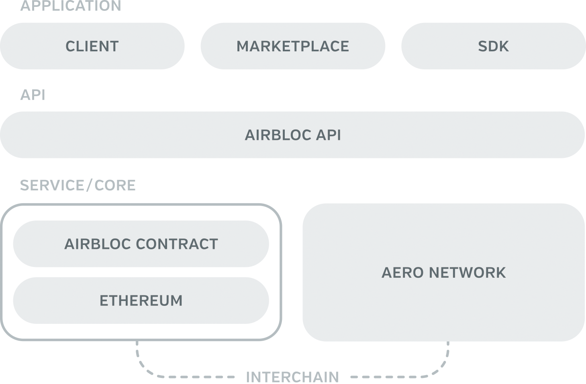
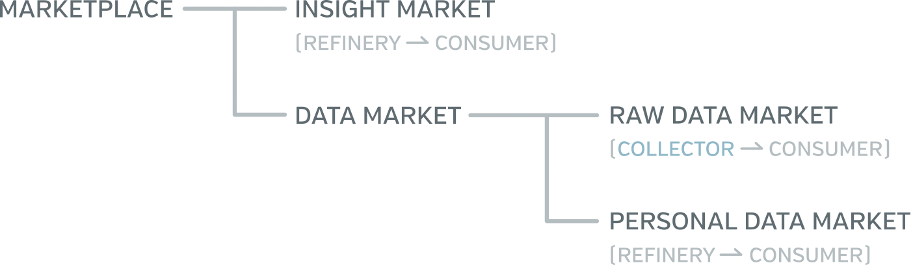
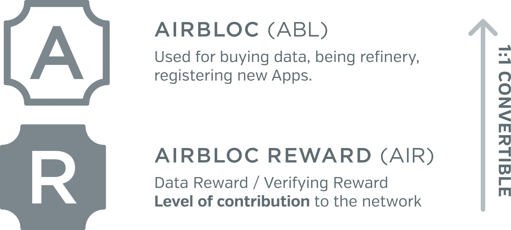
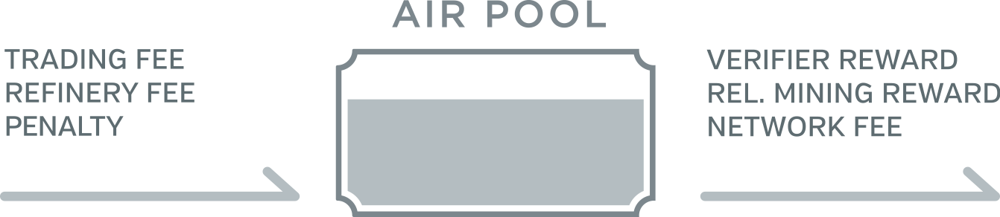

Airbloc Technical White Paper
=================

*Hyojun Kim* [hyojun@airbloc.org]()  
*Byeongsu Hong* [frostornge@airbloc.org]()

**Version 1.1** First published on April 9, 2018.  
Copyright © 2018 Airbloc Foundation. All rights are reserved.

Without permission, anyone may use, reproduce or distribute any material in this paper for non-commercial and educational use (i.e., other than for a fee or for commercial purposes) provided that the original source and the applicable copyright notice are cited.

## Table of Contents

* [Introduction](#introduction)
* [Airbloc](#airbloc)
    * [Stakeholders](#stakeholders)
    * [Architecture](#architecture)
    * [Why Blockchain?](#why-blockchain)
* [Data](#data)
    * [Types](#types)
    * [Components](#components)
    * [Rights on Data](#rights-on-data)
* [Data Pipeline](#data-pipeline-overview)
    * [Overview](#data-pipeline-overview) 
    * [Data Collection](#data-collection)
        * [DAuth](#dauth)
        * [Data Campaign](#data-campaign)
    * [Data Ingestion](#data-ingestion)
    * [Data Refinery](#data-refinery)
    * [Marketplace](#marketplace)
        * [Data Sales Methods](#data-sales-methods)
        * [Data Pricing Methods](#data-pricing-methods)
* [Airbloc Token Economy](#airbloc-token-economy)
    * [Airbloc Token (ABL)](#airbloc-token-abl)
    * [Airbloc Rewards (AIR)](#airbloc-rewards-air)
    * [AIR Pool](#air-pool)
* [Reliability Proof System](#reliability-proof-system)
    * [Personal Identification](#personal-identification-kyc)
    * [Automated Fraud Detection](#automated-fraud-detection)
    * [Personal Evaluation](#personal-evaluation)
    * [Data Cross-Validation](#data-cross-validation)
    * [Data Reliability Mining](#data-reliability-mining)
* [Aero Network](#aero-network)
* [To Be Described (TBD)](#to-be-described-tbd)
* [Citations](#citations)
* [Appendix](#appendix)
    * [Considerations](#considerations)
    * [Direct Data Engineering](#direct-data-engineering)

## Introduction
Airbloc is a decentralized data exchange platform for individuals and apps to aggregate and sell their anonymized personal data.

At this moment, the data market is dominantly controlled by centralized services a.k.a “walled gardens” and big data brokers who aggregate data to sell off insights to large enterprises to generate huge revenues. 

Under this market status, most Data Suppliers are completely alienated from the market. To individual, who is the original data source, neither fair rewards nor data ownership is granted. Likewise, small Apps with insufficient number of customers can’t sell and monetize their customers’ data. Only Apps with sufficient number of customer data are eligible for limited market participation to sell data in turn-key.  

Meanwhile, from the Data Consumer’s side, small enterprises are often barred from data purchase, even in little amount. Similarly, large enterprises within the legal jurisdiction, can only access market trends, and they can’t execute micro-targeting techniques which are highly effective for running ad campaigns. 

Via Airbloc, Users can directly submit data to the blockchain-based data supply chain. Users can track and control  data transactions, as well as monetize their own data. Through DAuth protocol on Airbloc, Apps can get permission from Users and sell data on behalf of them. Also, Advertisers can easily purchase and access small amount of data, and optimize their marketing campaigns by running effective micro-targeting based on high-quality and diverse set of user interest data. 

Our mission at Airbloc is to democratize the data market to the level where individuals and small and medium sized apps can participate, which can improve data by its quality and quantity, so that all market players will eventually benefit from the win-win cycle. 

## Airbloc

Airbloc is basically a *decentralized* ad data exchange platform. Indirect data such as installed apps, app usage history, and GPS are collected via Airbloc’s Main Client Service’s app or via services that use Airbloc’s SDK to get permission from their users with DAuth protocol. The direct data are collected by data campaigns, where advertisers use various question forms to ask for the users’ responses. The collected data will then be sold to the advertisers directly or go through data refineries to add more user-level attributes, either in a raw data format or as a group of identifiers such as AdIDs.

On Airbloc, **Individual Users** can exercise sovereignty over data as a legitimate data owner and original data source. Airbloc can track the entire record of what data is collected, how it is collected, to whom it is sold, and how it is used. Also, Users can configure permission levels as to what extent their data shall be used. For example, Users can decide for themselves if only a common identifier could be  sold as targets, neither their raw data nor personal profiles.

Also, **Apps** can monetize their data and share the rewards with the end users. With [DAuth](#dauth), Users can only monetize data that were obtained by user’s permission, and this allows Apps to monetize data while protecting  personal data security. In addition, data monetization serve as an alternative new business model or as a supplement to existing business models to monetize traffic and user clicks and impressions.

At the same time, **Advertisers** can also optimize ROIs by targeting the potential customers with the quality user-level interest data. Airbloc DMP (Data Management Platform) ensures data quantity which is auto-collected from partner Apps. Also, it can guarantee data quality and diversity with firsthand interest data that were directly surveyed from Users. 

### Stakeholders

Airbloc is run by many participants to the ecosystem, including *Data Provider*, *Data Consumer*, *Data Collector*, *Data Refinery* and *Gatekeeper*.

* **Data Providers** are the end Users, the individuals who provide the data and get incentives for the data offering. They have full control over the data usage and circulation.
* **Gatekeepers** are [Aero Network](#aero-network)’s node. They keep the network from fraudlent behaviors by validating data and detecting fraudlent users. 
* **Data Collectors** are apps that collects data and monetizes data on behalf of users. They can collect indirect data by DAuth or collect direct data by questioning to user directly.
* **Data Refineries** analyze the given Direct, Indirect Data collected from the Data Providers and refining them into another user-level attributes. Then the refined data are added to the user’s profile so that Data Consumers can filter them by user attributes when making a new segment.
* **Data Consumers** are the advertisers who purchase data for targeted ads. They will use ABL tokens to purchase and reward data.

### Architectures

The architecture of Airbloc is composed of multiple layers as below. 

* Application Layer: Composed of third-party DApps that use Airbloc, including Airbloc Client, Airbloc DMP, and SDKs.
* API Layer: An interface provided for the communication with Airbloc Network and third-party DApps.
* Service Layer: Airbloc Contract that includes the entire features of Airbloc Network.
* Core Layer: This layer is Airbloc’s blockchain platform based on Ethereum. It adopts Aero, Airbloc’s internal subchain network for data validation, and adopts interchain network to link the two blockchains.

Airbloc uses Ethereum. Therefore, ABL tokens for Airbloc is based on ERC20 standard and Airbloc Service Layer is implemented as a smart contract on EVM. Please note that the platform can be later changed to other platforms due to technical requirements.

### Why Blockchain?

Under the centralized system, legal jurisdictions or rules and regulations are usually imposed upon the centralized entity who holds and manages the system. This means that there is no room for checks and balances for other entities within the ecosystem. Unless an eminent situation arises that leads to legal interventions, the system operates in a way that maximizes the revenue of the centralized entity, leaving no preventive mechanism to other entities to ensure a fair system.

However, for decentralized systems, rules and regulations are laid out under the smart contract, in a transparent and accessible manner. Hence all participants to the system can be guaranteed with a mutual checks and balances. These systems are designed to strictly abide by the rules, and all actions will be open to the public’s surveillance. If some players doesn’t abide by the rule or attempt to manipulate the system, then they will be penalized financially.

Airbloc is a decentralized system that guarantees a fair data transaction by rules and regulations. Even the Airbloc’s managing entity, the Airbloc Foundation, are just one out of many players to the ecosystem. The power to handle data is not and should not be yielded to one specific player, but should be equitably distributed to all Users and business entities. This is the ultimate value and reason for decentralization that Airbloc aims to achieve. The specific characteristics of Airbloc are as follows.

#### Data Traceability

All data transactions on Airbloc Network will be transparently tracked.

In centralized systems, an individual user or other players in the ecosystem can’t find out how their data is collected and used. Perhaps this could be possible if the centralized system fully discloses data usage, but since it is heavily reliant on the good-will of the centralized entities and should be met with legal agreement, it can’t guarantee a 100% data traceability.

Contrastingly, in the decentralized Airbloc Network, data collection is fully controlled by Users via DAuth and data campaigns. Also, every procedural step to data’s distribution along data pipeline is recorded, so Users and Advertisers can check data lineage any time.

It is worth noting the fact that data traceability is not ensured by a single centralized entity, but rather through the smart contract which is open to the public and that is based on mutual checks and balances of all players to the network. In this regard, Users can be assured on their data traceability.

#### Data Distribution Limitation

A distinguished feature of Airbloc is that data distribution can be limited by users. The individual users, who are the Data Providers, can limit the distribution of data by setting configurations. For example, User can cap the frequency of the data sales or restrict data from being used for specific ad types. With this custom configuration function, Users can reclaim own data rights and perceive ads as an useful piece of information.

Such limited data distribution is realized on the decentralized blockchain network, as an innate feature. Once assigned, the data feature is immutable. Therefore, the data controllability is guaranteed to the Users. More details can be found from the [Data](#data) section below. 

#### Preventing Data Breach
In the traditional data exchange platforms, there lies a risk for copying or capturing the data in between transaction, without a proper data purchase. Since data is an intangible asset that owns an intrinsic value even by accessing them, this can be a crucial problem. In this context, conventional data exchange systems are always subject to the danger of not being able to completely track data pipeline. For example, “Data Escaping”, an activity of copying and subsequently exporting the disconnected data to the system, can be committed to avoid access control and tracking from the centralized system.

On Airbloc, unauthorized act of data copy can be prevented with **data anonymization**. The data on Airbloc are used for digital advertising purpose and even a piece of this data can’t be used without a third-party common identifier. In other words, anonymized data without a common identifier carries almost zero value. Following this principle, data circulated within Airbloc will be removed of common identifiers that can be used for targeting. The common identifiers will be only be accessible to the consumers who have purchased the data or the data owner, who is the data provider. However, user-level random UUIDs shall be maintained for the user-level data aggregation and analysis. 

Moreover, data anonymization is proceeded every time the data is transferred from one player to another. For example, a unique person with ID “A” will be replaced to ID “B” when handled by the refinery. Also, this person will be tagged as “C” for the gatekeeper. Only when the data consumer purchases the data and buys data ownership or usage rights, then the consumer will be able access the common identifier.

Accordingly, until the data ownership and/or usage rights are purchased, the data has almost no value, making it safe from data escaping, even if the data is breached in the middle. The aforementioned system will be built with Aero, which is Airbloc’s internal data verification network. For further details, please refer to the [Data Anonymization](#data-anonymization) section.

## Data

All data exchanged on Airbloc is digital advertising data (hereinafter referred to as ‘Ad data’). Ad data is also referred as  personal interest data because it represents individual user’s interests. Here, it is important to note that advertising data should be trackable.

Non-traceable Ad data is valueless. This is because the data is valued at the moment when it is used. A method to use personal data is to run a targeted advertisement to that person. However, the ad can’t be run if the data does not contain an identifier, which is the trackable information from the data owner. All of Airbloc data system is built on the premise that **non-trackable ad data has a zero value.**

### Types
Ad data in the Airbloc is divided into two types by the collection method: **Indirect Data** and **Direct Data**.

**Indirect Data** are types that can be automatically collected from user’s device, such as  list of installed apps, installed app usage, purchase history from Google Play, wifi history, GPS and Beacon Data. These are the data types that can be automatically collected once permission is configured. Also, Indirect Data can infer that corresponding user’s static characteristics. To be more specific, this Indirect Data guesses that the user is a cat owner given that that user is installing cat-related apps, which is not based on direct question asking, “do you have a cat?”.

On the other hand, **Direct Data** is collected with a direct question to the user about particular facts. Returning to the example above, Direct Data can ask the user “Do you have a cat or not” to collect the data. Simply put, these are directly answered and directly collected type of data.

### Components
On Airbloc, Ad data is grouped into four components: *Identifier*, *Trait*, *Payload*, and *Lineage*.

#### Identifier
The Identifier is the information that identifies the data owner such as name, email, and unique identifier (UUID). Unique identifier is a unique and traceable ID for the data owner. Also, Google Advertising ID and Apple IDFA are well-known identifiers that are generally used on other platforms.

All data exchanged on Airbloc **must include at least one unique identifier** for the data owner. This is because the main purpose of data consumption on Airbloc is to identify users’ interests and to provide them with relevant targeted ads.

#### Trait
All data on Airbloc will be given the distribution limit traits. Airbloc employs the following rules to limit the data provider’s distribution:

* Restricted usage of the data (Usage Blacklist)
* Maximum number of data re-sells (Lifespan Reach)

Data may not be used or sold to a particular advertiser or a user, and will no longer be re-sold when the maximum number of re-sales is reached. For instance, once a life span is given, it can't be extended. This trait gives a user complete control of user’s personal data.

Technically, the trait is made up of Finite State Machine, Limit Function, Transition Function and Status. Limit Function defines the condition in which that a particular action is limited on data and Transition Function changes data status when a particular action occurs. The Status can only be modified by Transition Function, and these functions are immutable.

For example, if you want to limit data re-sale count to 10 times, this can be done by creating the Transition Function  for the action `ACTION_TRADE`, and also creating the limit function  for the action.

#### Payload
The Payload contains data contents. The payload format is determined by the campaign executor for Direct Data, and for Indirect Data, standardized format is required in Airbloc. Generally, data payload is too large in its volume to be stored on blockchain. For this reason, the data is encrypted on external storage, such as IPFS or S3, and only the access hash keys are stored on blockchain. More information on saving data can be found from [Data Storing](#data-storing) section in Appendix.

#### Lineage
Lineage refers to data distribution history on Airbloc. This Lineage is created as data exchange begins. Airbloc keeps data lineage transparently so that individual users can see how their data is used while consumers can view the procedural details on how their purchased data has been distributed.

**Data Lineage can’t be accessed without data ownership.** That is to say, the Gatekeeper and the Refinery, which are located in between the data distribution pipeline, can’t view the data lineage. This is to prevent presumption of data owner’s identity by lineage queries. Even if the data is anonymized, if someone can presume the identifier of the data, then data escaping or the breach of data – using the data without paying for it – can occur. Therefore, Airbloc denies access to data lineage to those without data ownership. For more details, please see [Rights on Data](#rights-on-data) section.

### Rights on Data

Airbloc categorizes data rights into **Usage Rights**, **Tracking Rights**, and **Data Ownership**. The largest criteria for this categorization on data rights is the availability of identifiers. This is because advertising data is worthless without an identifier of the owner, as mentioned above.

**Usage Rights** is the right to access data payload. It will be given to the data refinery and gatekeeper who are located in the middle of the data pipeline. For example, a data refinery can access the data payload without purchasing data and process the user's both direct and indirect data to create the interest data. However, since the actual identifier of the user is unknown, that data is nothing more than a piece of worthless information.

**Tracking Rights** are the rights granted to access only the identifiers. This allows advertisers to target ads without having to deliver the user's raw data by allowing only the target to be sold without accessing the data payload. Many DSPs, including Facebook, do not need to upload data, but advertisers can create a target with just the ADID. This can protect users’ data and allows users to sell only the right to advertise and target that particular user.

**Data Ownership** is the right to access data’s entire contents. This right is only available to data providers or data consumers who are at the each extremes of the data pipeline. Owning data means being able to access data owner’s data information (unique identifier, lineage), and transaction in the data is regarded as trading of the data ownership.

|   |  Usage Rights  |  Tracking Rights  |  Data Ownership  |
|---|:-------:|:------:|:------:|
| Payload Access    |  ⃝ | **✕** |  ⃝ |
| Identifier Access | **✕** |  ⃝   |  ⃝ |
| Lineage Access      | **✕** |  ⃝ |  ⃝ |

## Data Pipeline Overview

The data on Airbloc will go through seven steps of SOIPRTC (Source - cOllection - Ingestion - Persistence - Refining - Trading - Consumption) pipeline, across five stakeholders. User-created data is gathered by the Data Collector and stored by the Data Collector after the Gatekeeper executes data cleansing. Refinery will refine this data into commercially available Ad data and sell data to consumers at Marketplace.

### Data Source
Data is created by a user who is the data provider on Airbloc. Indirect Data is created naturally from user behavior from static attributes, while Direct data is created by answering data campaign’s survey questions. User gets to control the data from the stage when it is created, either by limiting data types to be collected, or by configuring data’s distribution limits.

### Data Collection
Data Collector gathers these data from the Data Provider. Indirect data is collected through DAuth, and Direct data is gathered through data campaigns – through asking survey questions and receiving response from the users.

### Data Ingestion
When Airbloc aggregates data from multiple sources, data formats should be unified and schema checks must be made in order to cleanse data by removing unnecessary parts, for an effective data use. This cleansing task is referred to as **Data Ingestion**. Data Collector can only register data on blockchain through Data Ingestion (data cleansing) and this process is required for data storage. Further details can be found from [Data Ingestion](#data-ingestion) section. 

### Data Persistence
**Data Collector is responsible for storing data.** Airbloc doesn't store data internally and it does not own a seperate data storage. The obligation of data storage and maintenance is held by Data Collector, and Data Collector can store data anywhere. Various repositories including S3, HDFS, IPFS and Swarm can be used, when access conditions are met upon the needs.

Data Collectors will first cleanse the data and register data URI to Airbloc. To ensure both data quality and anonymity, each time a data owner and usage rights holder accesses data, the gatekeeper will determine if the data secure and intact. Further details can be found from [Data Storage](#data-storage) section.

### Data Refining
While the data gathered by Data Collector can be sold directly at the raw data Marketplace, which will be mentioned later, it can also be processed to become a more valuable and insightful data to Data Consumers in the forms of personal interest data or predictive indicator by data refinery. The refinery can get Direct or Indirect Data from Data Collector and process to interest data or insight data. After then,  it gets refinery incentive every time data is sold. Further details can be found on [Data Refinery](#data-refinery) section.

### Data Trading
Data Transaction is made at the Marketplace. Marketplace is composed by **Data Market** and **Insight Market**. In Marketplace, the data registered by Data Collector or Refinery is sold to consumers. When a consumer buys data from the Marketplace as an ABL token, the consumer gains data ownership. Further details can be found from [Marketplace](#marketplace) section.

### Data Consumption
When the data is consumed through data transaction, anonymized data during upload are non-anonymized, which will be delivered to Data Consumers along with the unique identifier. Data Consumers can then use this data for ads directly.

So far, overview on Airbloc data pipeline was addressed. The following sections will describe specific data distribution processes following the data pipeline order.

## Data Collection

On Airbloc, data is collected by the Apps. These Apps can monetize [Indirect Data](#indirect-data) and/or [Direct Data](#direct-data) collected by users in Airbloc. This does not mean a data monopoly on user’s app nor a violation to user’s personal data rights. Sales revenue is distributed to users at a fixed rate, and the user can choose the type and authority of the data that can be sold. In this regard, the App only shares the revenue with the user as a data sales agent

To collect data, Data Collectors should first register their App on Airbloc Network. For this, the **Data Collector is required to hold certain amount of ABL tokens in advance.** The maximum number of users that an App can upload on the Network proportionately increases in *log scale* to the ABL amount the App is holding. This is to prevent malicious apps from attacking the refinery and Marketplace through Sybil attacks and/or data generation attacks. The formula for the maximum number of users according to the App-held ABL tokens is as follows:

<!--$$
C = f(n_U) \, \log(n_U)
$$-->

where  stands for number of unique users provided to the network by app.

### DAuth
DAuth (DataAuth) is an agreement process between Data Provider and Data Consumer on the data collection and monetization on Airbloc. Once the App is installed, Users should agree with DAuth’s data collection for more than once upon app install, so that the App can collect Indirect Data from that User, allowing that particular User to determine types of data to be gathered.

While Airbloc and DAuth process can’t prevent Apps from auto-collecting data from Users, Indirect Data types that were unaccepted by Users will be filtered during data cleansing, so that they aren’t monetized on Airbloc. According to this mechanism, a fair data collection will be ensured to the Users.

Once App is registered, the Data Collector can set up types of Indirect Data to be collected on Airbloc Network and its respective reward compensation ratio. The data types to be collected can be app install list, in-app payment details, and etc. Furthermore, the reward compensation and ratio can be configured by data types and Users. Here, there is an attached condition that **at least 30% of the App’s revenue must be shared with the Users**. The registered data to be collected and compensation ratio will be saved on to the blockchain, and via DAuth, Users’ agreement will be met.

The details to DAuth are as follows:

1. Request to begin authentication to Airbloc on App
2. Issue Request Token to App on Airbloc
 * Reqeust Token is one-off, and is only used to display DAuth dialogue
3. The App launches DAuth dialogue via Airbloc SDK
4. Display DAuth dialogue to Users on Airbloc
  * Show users the data types they wish to collect, the amount of rewards, and revenue sharing ratio
5. User agrees to data collection
  * User can agree by differing data types
  * User enters Airbloc account (if unavailable, email) to receive rewards
6. Airbloc records the data types user permitted to collect
  * Data Collector can only monetize data of which users permitted via agreement
  * Unpermitted data will be filtered during [Data Ingestion](#data-ingestion) process

DAuth is not a personal identification service such as Civic [[1]](#https://tokensale.civic.com/CivicTokenSaleWhitePaper.pdf), and uPort [[2]](https://www.uport.me/). These identification services, of course, also includes an authorization feature on data collection. However, these services are identification services, so can substitute authentication method on App, which can burden the App for using an external platform. Not only that, it requires the User to own an account to the corresponding platform to log in.

Nonetheless, with DAuth, **Users are allowed to receive data sales compensation without an Airbloc account.** If a user have already installed Airbloc Client Service, compensation is automatically stored to the User account. If not, User can enter email without signing up. Later on, the User join Airbloc with User’s email account to see accumulated compensation which was earned so far.

With such features, App companies can greatly reduce the burden of using external platforms, while Users are guaranteed of their data rights without having an Airbloc account. As such, DAuth can reclaim data ownership to Users who are outside the Airbloc ecosystem.

The DAuth is built on a similar architecture to that of OAuth’s Three-Legged Authorization [[3]](https://www.ibm.com/support/knowledgecenter/en/SS9H2Y_7.5.0/com.ibm.dp.doc/oauth_threeleggedflow.html). In DAuth, Airbloc becomes the service provider of OAuth. However, while OAuth also includes personal authentication service, DAuth only includes agreement on Indirect Data collection. Moreover, the data owning entities to DAuth are individual users and/or Apps, as opposed to that of OAuth, which are service providers. In short, DAuth on Airbloc only ensures transparent monetization of personal data that only comes under user’s agreement.

### Data Campaign

On Airbloc, unlike other data exchanges, advertisers can purchase data by asking user directly what they want. Like campaigns in advertising, this procedure is called **Data Campaigns** on Airbloc. Users can get rewards by submitting responses to survey questionnaires.

While the collection of Indirect data can be managed by all Apps with Airbloc SDKs, the collection of Direct Data is only feasible by the Apps with additional Airbloc Data Campaign SDK or the Airbloc Main Client App. These Apps must be equipped with certain UI for a valid interaction with the Users.

Technically, Data Campaigns are defined as an activity to display certain proposals that involves activity of Users and Data Providers, asking them directly to submit responses to survey questions in exchange of rewards. Users who are willing to participate in Data Campaigns will accept the proposal and engage with the provided interface to directly submit their responses to surveys.

Data Campaigns are consisted of *Question*, *Rewards*, *Target*, *Period*, and *Reaching Fee*.

**Question** is an explanation on the targeted data that Data Consumers wish to collect. The Questions are categorized into natural language type questions and schema-based questions. Natural language type questions are a series of sentences or additional information attached to the question. Also, Schema defines the format of data payload that will be uploaded to the network. For example, `isMarried: Boolean` schema means payload should assign proper key-value pairs; that the key has to match the string `isMarried` and the value should follow `Boolean` type.

**Rewards** are the amount of ABL tokens that a Data Collector should pay to the Data Provider. When the Data Provider answers to the question via Data Campaign, then the Data Collector gives rewards to the Data Provider in exchange. As the Data Provider can only respond once to each campaign, the total amount of rewards that the Data Consumer has to pay is equal to ‘(Reward Price) ✕ (Number of Participants)’

**Target** is the target users, target data providers of the data campaign. This target is set according to the interest data submitted by the user in the onboarding stage. 

**Period** is the range of time the Data Campaign is reached to the Users. Campaign Period can be set by an hourly basis and is immutable. To modify a Period, the Data Collector will have to launch a new campaign.

The **Reaching Fee** must be paid with ABL tokens. The reaching fee of campaign exposure as to how many Users it could be reached, is determined by the following formula:

<!--$$\mbox{Cost} =\mbox {Period} \times  \exp \left( \frac{\mbox{Number of Target Provider Group}}{\mbox{Total Number of Provider}} \right) \times \mbox {Constant} $$
-->

In order to expose data campaigns to the more users with longer time period, then the Data Collector must pay for the higher reaching fees. This cost of Data Campaigns prevents the Data Collectors from a reckless launch of campaigns, which in turn will enhance the user experience. This cost will be accumulated on [AIR pool](#air-pool).

When Data Collectors launch the Data Campaign, that Campaign will be reached to specific group of Data Providers through push or poll. Then the Data Providers can respond to the campaigns. 

## Data Ingestion

In a data hub like Airbloc, when the data is collected from numerous sources, the system needs to cleanse the unwanted parts of data and to integrate data format before using. This process is called **Data Ingestion**.

In order to a Data Collector (App) to monetize the collected data, they must first register the data on the Network and go through Data Ingestion. The Data Ingestion in Airbloc is performed by its own data validation network called Aero.

1. To register data, the Data Collector registers data to an Aero node.  
2. The node propagates data to the network.
3. Nodes process the data according to the data integration rules specified by Airbloc.
    * It separates the Data Owner’s user identifier of the data. 
    * It adds some nonce to the separated user identifier data.
4. Nodes cleanses the data according to the data cleansing rules specified by Airbloc.
    * It filters the data that user didn’t allow to collect, referring to the user’s data authorization record on the blockchain.
    * It filters unnecessary data fields.
5. Nodes reach PoS consensus on the right data, and registers the elected data and its hash to the blockchain.
6. Nodes return the cleansed data and its hash back to the Data Collector.

The Data Collector must store data that are cleansed and ingested. If the Data Collector neglects the cleansed data and stores the original data, penalty will be given, as the Data Availability Proof Task judges that this data has been falsified. In this manner, User’s data control rights can be protected through the Data Ingestion on Airbloc.

### Data Anonymization

Airbloc separately stores the identifier of the data during data ingestion. For data registration on the blockchain, the hash and access URI of the identifier and payload are required. Therefore, the original identifier of the data can’t be known during the middle stage of the data pipeline.

Of course, the identifier of data is generally the same for one user, so there’s a possibility of problem that the data owner can be presumed with only the hash of the identifier. Airbloc prevents this problem by adding nonce to the identifier when hashing, so that the identifiers of same user will be different for every data. 

This feature itself will not incur a non-transparent data transactions within Airbloc. The purpose of this feature is to protect data during data distribution, so that data leakage to unauthorized subjects are prevented. All data transaction records will be transparently stored on blockchain transactions and data lineage.

As such, Airbloc prevents data escaping — data leakage without paying for it— using data anonymization.

## Data Refinery
The data collection as mentioned previously doesn’t carry an actual value by itself. Unrefined Data, which is ‘raw data’, is likely to bring unreliable results and frequent noise. And since raw data is specialized to a particular domain, its usage is limited. Accordingly, to the advertisers to use data, it is necessary that the raw data is processed into personal data for ads or into insights such as ‘user's expected purchase rate’ and ‘revisit rate,’ that are useful.

Data processing on Airbloc is performed by the **Data Refinery**. Data Refinery will process data as data owning entities, it will serve as an automated data analyzing engine run by advertising analytics agencies. The Refinery processes the collected data from the Data Collector from a particular User, and then sells the processed data to the Data Consumer for incentives at the Insights Market and Personal Data Market, both of which will be described in the following part.

The refining process is managed outside the blockchain. The Data Refinery will export collected data by the Data Collector, to process, import, and register the listing at the Marketplace. Generally, processing data outside the blockchain can cause data corruption and data escaping, but this risk is eliminated since the data processed by the parser is anonymized, which is simply worthless.

When the data is processed by the Data Processor, it then becomes personal data or insights data.

* **Personal Data**  is an analysis on User’s attributes. For instance, if you have an Indirect Data that Bob has downloaded many dog-related apps, and if you have a Direct Data by a User who loves dogs, then this data can be used to create personalized data that states "Bob keeps a dog."
* **Insights Data** is an indicator mainly used for ads. The predicted purchasing rate on the product A or the predicted probability of converting to purchase product B of a User can be an example. Insights data is extremely structured and quantitative in its nature, and is offered by on on-demand Data Consumer’s needs. Data Consumers can query a particular indicator for a User segment, and if the Data Processor has derived the result, then the Consumer can  either pay for the desired result, or pay for and average cost from all Data Processors. This is how Insights Data will be consumed.

### Revealing an Unknown User

From the Data Consumer’s standpoint, what the Data Refinery does can be regarded as revaling of an unknown User. As Data Campaign’s questions are answered, and as they are recorded along with Indirect Data, the Network will have better knowledge on the unknown User’s traits. The Data Refineries will improve its accuracy on revealing the person via their own analytics techniques.

### Effectiveness Maximization of Direct Data

On Airbloc, Data Refineries are responsible for maximizing the effectiveness of Direct Data. Direct Data tend to be less reliable when compared to Indirect Data, which is gathered by User’s activities. But once combined with one another, the data effectiveness can be maximized. To give an example, **Indirect Data can be used to support Direct Data** as a proof to improve data reliability. Moreover, Direct Data can be applied for Conjoint Analysis or Lookalike Target Engine as learning data, enhancing the performance of the analytical model. Data Refineries allow interaction between Direct and Indirect Data, so that data is much more reliable and accurate. Meanwhile, Data Consumer’s data effectiveness, Data Refineries’ own benefits, and Direct Data effectiveness can increase. Further details can be found from [Enhancing Model through the Interaction of Direct and Indirect Data](#) on Appendix.

### Verification of Data Reliability

As mentioned previously, Data Refineries ensure Direct Data’s reliability by using Indirect Data as a proof to Direct Data. In addition, the interaction of the combined data - both Direct Data and Indirect Data - can create a data with greater effectiveness. During this process, Data Refinery can detect illogical data sets, and can report claims on these data types. More information can be found from [Data Cross-Validation](#data-cross-validation) part.

## Marketplace

The Marketplace is where collected Direct Data and Indirect Data are traded, and also a place where processed data are exchanged. The Marketplace is divided into two categories: **Data Market** and **Insights Market**.

In **Data Market**, the refinery or the collector can sell their personal data. The data market consists of Raw Data Market and Personal Data Market. In the Raw Data Market, collectors' data delivers directly to consumers without going through the refineries. The Personal Data Market sells data processed by the data refinery. Personal data is primarily the analysis of the user's status or interest, for example, data about the type of pets that women who are more than age 30 raises.

**Insights Market** sells insights data that can be used to make an advertiser's decision. Insight data is an indicator that can be used primarily in ads. For example, the purchasing rate of an individual for a product A or the probability of conversion to a product B may be.

### Data Sales Methods

Data Sales is made on four following methods: *Simple Sales*, *Segment Sales*, and *Sales by Known Segments*.

**Simple Sales** is purchasing the data sales from the Data Seller. For example, if a Data Processor puts up the data, “Interest data from a sum of 100,000 dog lovers”, for sale, then Data Consumer will come to purchase.

**Segment Sales** are made via Data Consumer’s on-demand queries. When Data Consumer queries a Data Seller for particular segment condition, then the Data Seller returns with the number of corresponding Users, and Data Consumer sells the data once purchase is confirmed. For instance, if a Data Consumer queries a segment of interest on Data Market with "a man in his 20s who enjoys cooking", the Data Processors return with the number of Users meeting that condition based on analyzed interest data sets. When Data Consumer purchases that segment, Ad IDs and additional data will be given.

**Sales by Known Segments** allows Data Consumers to upload their own advertising IDs to query data, instead of presenting specific segment condition queries. For example, when a Data Consumer uploads 5,000 ADIDs to the Insights Market and queries the *predicted purchase rate* of these Users, then  Data Refinery will predict and sell users' purchase rate from these users.

**Sale by Known Segments** is a way for consumers to upload their own set of advertising IDs instead of presenting specific segment queries. For example, if a consumer uploads 5,000 ADIDs to the Insight Data Market and queries the purchase probability of those users, the refinery will sell users' purchase probabilities who are both in Airbloc and uploaded ADID sets.

### Data Pricing Methods

Airbloc has three data pricing method. One is “Reward-Once”, and the other is “Reward-Per-Pay”, and there’s hybrid model that combined two methods.

* **Reward-Once** is a method where Data Collector pays Data Provider during initial data collection, and later brings back all revenues generated from the data resales. This method offers lower risk to the Data Provider, but at the same time, Data Provider can’t monetize over data resales. 
* **Reward-Per-Pay** is a method which distributes revenues each time data is sold. Instead, no price is paid when data is collected. This method offers low risk to Data Collector, but at the same time, Data Providers can earn relatively less. 
* **Hybrid** is a combined method of the two methods from above. This method allows an efficient hedging of each other’s risks. 

Generally, the price of data is determined by Data Collector. Of course, the trading entity can ask for a desired data price by the bargaining feature. In this regard, the price of data is reasonably set by the Marketplace. Right now, Airbloc Network does not offer a price suggesting feature which is offered internally. However, from the front-end apps such as the Airbloc Main Exchange, price suggestion feature will soon be offered, which is based on *EMA (Exponential Moving Average)* price of ABL tokens as well as Airbloc’s own data valuation algorithms.

## Airbloc Token Economy

Airbloc offers two types of tokens. One is the **Airbloc (ABL)**, and the other is **Airbloc Reward (AIR)**. ABL is a transferable ERC20 token, and AIR is a non-transferrable token that belongs to User, but of which can be later converted to ABL by 1:1 ratio.

> ABL Token is currently issued by Ethereum as ERC20 token. Later, if the platform is switched to another because of technical requirements, ERC20 ABL Tokens will be snapshotted and migrated to the coins, or tokens on the new platform.

### Airbloc (ABL) Token
**ABL** is used as a currency unit for data trading, or pay for data usage. To get ABL, you need to buy it from the Exchange or convert AIR into ABL. Advertisers can pay by ABL to purchase data, or pay the Network to run Data Campaigns. In addition, more than a certain amount of ABL is needed to register your App to collect data, or to have the Data Refinery to process data. Thus, ABL is a token that is required to participate in the Airbloc Network. 

### Airbloc Rewards (AIR) Token
**AIR (Airbloc Rewards Token)** is given to reward productive activities within Airbloc, and the rewards can be used as a personal reliability level or for governance. The User is rewarded with AIR when the User provides data or participates in reliability mining, and the verifier is rewarded with AIR when Aero Network node is maintained, or each time the data from Data Refinery is sold. The rewarded AIR belongs individually, and it can’t be yielded to a different User. Also, artificial transition of ABL into AIR is not allowed.

AIR is used for **Contribution Level** of individual users. The amount of AIR held be a User can be regarded as the Contribution Level of the User to the network, because the User needs to provide data or add reliability value to the data by participating in reliability mining in exchange for AIR.

Moreover, AIR can be used as a means to **Governance**. Under Network’s governance — for consensus on on important decisions on subjective matters that can’t be solved automatically — individuals have a voting power proportionate to the amount of AIR they hold. This allows a greater voice to the Users with greater contribution to the Network. Further details on the governance will be explored in the upcoming White Paper, which will be published soon.

In the token economy, AIR is responsible for reducing the amount of ABL supply. Data from Users with high Contribution Level are more likely to be purchased by advertisers, and this would mean more data revenue will be  earned to the individual User, since their data is highly valued. So, this could incentivize Users to hold their AIR for a longer period of time, rather than to exchange them into ABL immediately. Also, when the User’s Contribution Level is considered too low in comparison to similar Network participants, the data won’t be sold well. In this context, Users are recommended to hold a certain amount of minimum AIR as they join the Network. 

AIR can be exchanged to ABL in a 1:1 ratio. Since it doesn’t take time to exchange AIR to ABL, it is much more convenient than Steem’s Power Down process [[4]](https://steem.io/SteemWhitePaper.pdf). However, to prevent dumping activity by AIR holders in cases such as a sudden value increase in ABL token, the maximum amount of AIR that can be exchanged for ABL per hour will be limited to 0.1% of the AIR amount, which is currently generated from the Network. Not only that, In order to prevent sales of reputation on Network, **ABL cannot be converted to AIR.**

### AIR Pool 

Airbloc maintains an AIR Pool (Airbloc Reward Pool) to cover  rewards for verification and operation fees such as the network fee. The fees are charged when data is traded, and data usage rights fees paid by the refinery periodically, and penalties are accumulated in the AIR Poo. Also, it can be given as reward to the verifier or reliability mining participants, which will be described in the following.

Both AIR and ABL can be accumulated in AIR Pool, but they are actually converted into ABL in the pool. Moreover, the reward given to verifier or reliability mining participants will be offered in AIR. In addition, to facilitate early participation and ensure a stable reward payment, 10% of the total ABL token distribution is allocated to the AIR Pool as the initial reserve.

The detailed values of AIR Pool may change depending on the simulation result from the development or operation during the pilot test phases.

## Reliability Proof System
The problem with data trading is that you can’t guarantee the reliability of the data transaction among players. From a Data Consumer’s standpoint, the data to be purchased and the Data Seller can’t be trusted. Likewise, from the Data Seller’s standpoint, Data Consumer can’t be trusted. Airbloc solves the player’s reliability issue by **Personal Evaluation System** which is based on Contribution Level and Participation Level for the Network. Also, data’s reliability can be ensured by **Data Cross-Validation** and **Data Reliability Mining**.

Indeed, there will always be some malicious users regardless of reliability evaluation. However, Airbloc will prevent these malicious users from commiting Sybil Attacks and Frauds by conducting KYC (Personal Identification) and activating the fraud detection system.

| Stakeholder  | Personal Reliability | Data Reliability |
|--------------|:----------------------|:------------------|
| Apps         | Personal Identification (KYC) | -       |
| Gatekeepers  | Automated Fraud Detection | Automated Fraud Detection Data Validation       |
| Data Refinery| -               | Data Cross-Validation |
| Users        | -               | Data Reliability Mining |
| Network      | Personal Reputation Evaluation | Data Reliability Mining |

### Personal Identification (KYC)

Apps are required to execute KYC (Personal Identification) on Users. The KYC can be done through phone number opt-in, social logins, and other decentralized services like uPort and Civic. Apps need to hash User profile attributes such as email and phone number, before providing it to Airbloc Network. KYC can mitigate Sybil Attacks that auto-generates malicious accounts to attack the network.

### Automated Fraud Detection
Airbloc Network detects and prevents fraudulent activities by Gatekeepers on Aero Network. With their automated nodes, Gatekeepers detect certain malicious users who show specific patterns in data. In order to detect fraud, they repeatedly perform detection tasks as below.

* Analyze Direct Data Answering Patterns
* Validate & Cross-check Unique Identifiers
(ADIDs, IMEIs, Device IDs, Hashed Emails, Hashed Phone numbers, etc.)
* Analyze Network Usage Patterns

Gatekeepers will receive only a partial data for every task completion. Then, a Pass or Fail decision is made on the target User to tell if it is fraudulent. Afterwards, voters will reach consensus with majority vote; each voter will have voting power according to their stake of AIR tokens. If ⅔ fraud detections point to the Fail result, then this user will be identified as a fraudulent user and the target user should pay penalty to the network.

### Personal Reputation Evaluation

If the fraud detection is to prevent malicious users from participation, **Personal Reputation Evaluation** is to sort out good users to assign them chance to take part in Airbloc’s governance. Airbloc computes reputation score by criteria including Contribution Level and Participation Level based on Airbloc’s token economics; reputation score will be a relative score across users. These three metrics will be used as a reference to advertisers and refinies when they create segment or compute new user attribute, or it can be used as a criteria for selecting credibility mining eligible users. 

#### Contribution Level

**Contribution Level** is amount of AIR holding which is given the user by creating value in this ecosystem. By participating in credibility mining or submitting data to the network, the users can be deemed as adding values to the Airbloc Network, thus the amount of AIR hold by the user can be a metrics reflecting the user’s contribution to the network. 

Important thing to note is contribution level is the **“current” holding amount of AIR** by the user. Once you exchange AIR to ABL, then contribution level diminishes. Since you cannot reversely convert ABL to AIR, thus in order to recover your contribution level, you need to acquire AIR token by credibility mining. In this sense, contribution level adjusts ABL supply and induces users to contribute more to the network for higher contribution level. 

Important thing to note is that, the Contribution Level is basically the **“current” AIR holding amount** by user. Once AIR is exchanged to ABL, then Contribution Level diminishes. Since a reverse conversion of ABL into AIR is impossible, to recover Contribution Level, AIR token needs to be acquired through reliability mining. In this sense, Contribution Level adjusts to ABL supply and induces users to actively contribute to the Network, to obtain a higher Contribution Level. 

#### Participation Level

Participation Level is the metric to measure how long and diligent the User has been participating to the Network. Participation Level is computed by the formula as below:

<!--$$P_U = \log(\sum{b_{R}}) \log(n_{D}) \, (1 - d)^t$$-->

*  is the total amount of AIR that the user has received so far
*  is the number of data  produced by the user
*  stands for a depreciation coefficient,  stands for time

Participation Level will increase if the User receives more AIR token by taking part in reliability mining. Unlike the Contribution Level, Participation Level is proportionate to the current AIR balance, not to the AIR revenues, so the Participation Level is unaffected even if certain portion of AIR is converted to ABL.

Participation Level works as a criteria for dividing the range of Reputation Level into multiple tiers, and it can act as a criteria to select “Exemplary Citizens” who are eligible to participate in reliability mining. That means that, User with higher Participation Level will have the greater chance of participating in reliability mining, leading to many more reward opportunities. However, depending on the depreciation factor, Participation Level can decrease a little over time, so maintaining a steady activities is crucial to increase and/or maintain Participation Level.

#### Reputation Level

Lastly, Reputation Level is **the relative ranking of Users sorted by Contribution Level** belonging to the same tier, based on their Participation Level.

<!-- $$
{R_U} = 1 - \frac{{rank}(C_U, \mathbb{T})}{C(\mathbb{T})}, \, where \,  \mathbb{T} = {tier}(P_U)
$$ -->

For instance, suppose there is a tier with Users with Participation Level under 100, called *“newbies”*. If a User belongs to the top 3% of the *“newbie”* tier, then the reputation becomes is . Splitting tiers according to Participation Level can prevent polarization of existing participants and new participants.

### Data Cross-Validation
Data Cross-Validation is a system where Data Refinery can file a **claim** on a User’s data if it logically contradicts across different data types. For example, if a User answered a No for a game preference, but with the game App usage history with over 40%, then the Data Refinery can file a claim for this data.

When the Data Refinery files a claim, that data can no longer be sold. Furthermore, a single claim does not lower the Data Reliability or penalize the User. This is to prevent the Data Refinery from malicious abuse of the claim system. Eventually, the Data Refinery can’t sell the data that was filed with claim, so the supply of that data in the Marketplace is reduced, resulting in reduced amount of rewards to the User. 

Nonetheless, to Users who have accumulated claims more than three times by two or more validators, the data reliability mining process can directly verify the data reliability and adjusts the data reliability in accordance with the reliability mining result.

### Data Reliability Mining

Data Reliability Mining is a system that selects users with high Participation Level and allow them to evaluate reliability of other Users’ direct answers from questionnaires. These users are called **"Good Citizen"**. This system can run on Airbloc Main Client App or Airbloc SDK installed apps, and it can show Users the target data which is to be validated with reliability mining. The participants to the Data Reliability Mining (data validation process) can rate data’s reliability on four levels (-2, -1, +1, +2).

The following are the targeted data for Data Reliability Mining:

* Data that got more than 3 claims from at least 2 refineries
* Randomly sampled data from data with no claim
* Randomly sampled data from the top k% sold data and the bottom n% data

Based on Participation Level, Data Reliability Mining will be conducted to the top k% good Users for the data above. Good Users will be asked with questions on data reliability in a form of a regular Data Campaign question, and the data required for decision making will be displayed together. The data is anonymized so nobody can identify data owner. Mid-range attacks can be prevented in advance because data reliability is evaluated on four stages.   

Based on the participation level, reliability mining is done by top % good citizen users for above data. Good citizens are asked questions about the reliability of data in the form of a regular data campaign question, and the data required for decision making is shown. The data is anonymous so nobody knows about given data’s owner. Middle-range attacks are also impossible because data’s reliability is evaluated in four stages. 

**Data Reliability** is derived by weighted average of the reliability results from good citizens, in accordance with user's **Contribution Level**. In other words, the more AIR held, the more influence a user can have on reliability evaluation. Reward will be given in AIR to good citizens, in proportion to their Contribution Level.

* Each time a data with a high reliability (R > 0) is sold, an AIR reward is paid to the good citizen user who gave that evaluation.
* There is no additional reward to a data rated with a low reliability (-1 <= R <= 0).
* If the data is rated with very low reliability (R < -1), the AIR reward income of the User who provided the data will decrease. However, User’s balance will stay unaffected.

The reward amount that can be achieved through Data Reliability Mining is constant per cycle. If Users are indifferent to Data Reliability Mining, so only a small number of people participate, the reward amount for individual User will increase. In this regard, making the amount of total reward stay constant could encourage the participation of good Users.

In addition, to maintain the number of good citizens who participate in reliability mining and to prevent participants from malicious reputation ratings (good or bad) to every data, the amount of good and bad ratings that a good citizen can give are limited to +10 and -10 points per a week. Detailed values will be determined through subsequent simulations and will be described in a next version of the white paper.

#### Considerations of Data Reliability Mining 

* Consider the situation that Good Citizens are morally indifferent to evaluations:
  * When **giving good ratings to bad data**, the total number of User’s good rating to be given in a week is limited. So, the user’s AIR reward income will be less than other User who gave a careful rating. If the AIR reward income decreases, the User will naturally lose its position as a Good Citizen due to AIR reward income difference.  
  *  When **giving bad ratings to good data**, this will lead to the income difference with the other Users since the User can’t receive rewards from the good data. So, the User will naturally lose its position as a Good Citizen.
* Because only the Users with top k% of Participation Level are selected as good User, when Users don’t regularly contribute to network and therefore don’t earn AIR rewards, their Participation Level may fall and lose its position as a good User. Therefore, a continuous participation to the network is required to do Data Reliability Mining.
* Reliability mining can be viewed as a kind of token-based curation. The amount of holding AIR is a sort of a curation power, and like a curation, you get rewards every time the good rated data you evaluated is sold, proportionate to the AIR amount (curation power). However, unlike other token-based curation systems, it is not possible to purchase curation power (contribution, ie, AIR) on Airbloc.

## Aero Network

Data management is a complex task to be performed on smart contracts, which includes data provision and data validation. Airbloc performs data management on its own separate blockchain network named **Aero**.

Aero is a data validation network on blockchain. Nodes of the Aero network plays a validator role in Airbloc, so they perform various validation tasks about data and receive block rewards from AIR Pool. Nodes maintain a distributed ledger for the Active Data Table (ADT), which contains a task queue to perform and record them. The Aero network uses a “Consensus-By-Bet” proof-of-stake consensus for verification tasks and distribution ledgers, so gatekeeper gets rewards in propotion to stakes.

Aero Network coexists with the service layer on Ethereum. Aero is only responsible for data validation tasks and most of the functionality is implemented as a contract on service layer on Ethereum. Simply put, introduction of the Aero Network does not mean an introduction of main-net. Communication between Aero network and service layer is made via interchain platform. ICON [[5]](https://docs.icon.foundation/ICON-Whitepaper-EN-Draft.pdf) and Cosmos [[6]](https://cosmos.network/whitepaper) are considered for it.

Aero is composed by Task, Round, ADT (Active Data Table). Task is a data verification task performed by node, Round is a cycle in which task is performed, and ADT contains a queue of tasks for each data.

### Task

Task is composed by Run Conditions, Required Data, and Action. Currently, Aero has three types of tasks:

* Data Ingestion Task
* Data Availability Proof Task
* Fraud Detection Task *(Subjective Task)*

**Run Condition** is when a task has to be executed for a certain type of data. For example, in case of Data Ingestion Task, the creation of the data would be the Run Condition. When the Run Condition is met, a new task corresponding to the condition will be added to the job queue of the data in ADT.

**Required Data** is the data required to run task. For example, in case of Data Ingestion Task, the access URI of data and hash would be the Required Data. Only anonymized data will be provided to nodes, so the privacy of the data owner will be protected.

**Action** refers to the logic that a task performs with Required Data. As in the previous example, the Action could be a logic such as “compare if the hash of downloaded data and the hash registered on blockchain are the same”. 

When the task is completed, it will produce a Result. The **Result** will be binary — `PASS` or `FAIL`. The proof-of-stake consensus will be reached for the task result, and the result from the majority vote selected as the task result.

If the task is *Subjective Task*, the nodes who gave minority answer about the task will not lose their stakes. But if it’s not the subjective task, **the minority nodes will lose their stakes** because there’s answer on the objective proof task. On the other hand, the majoriy nodes can get block reward proportionate to their stakes. 

### Round

These tasks are performed on a periodical basis, on **Round**. On a single Round, multiple tasks can be performed and the task performance log will be saved as validation log on blockchain. When the Round ends, nodes will get block rewards in AIR, proportionate to stakes.

### ADT (Active Data Table)

ADT (Active Data Table) is the list of tasks that should be performed per data. There’s task queue per data, and the task queue has tasks need to be performed and required data that will be used in tasks. If a task satisfies the run condition or registered manually, the task will be is added in the queue in ADT and will be executed in next round. 

Task registrant must pay a certain amount of fee in order to register task. This is for preventing Sybil Attack or DoS attacks. The detailed fee policy for task registration will be described in the next version of the technical white paper.

## To Be Described (TBD)

* **Evaluation methods for Refinery.** There is a problem that it is difficult to objectively evaluate refineries because they process the data through various subjective methods. The most accurate way to evaluate it is evaluating effect value of the data for data consumers, so measuring ROAS (Return On Ad Spent) would be the way but it is hard to measure for Airbloc. An indirect alternative would be holding a competition through learning data regularly, such as Numerai [[7]](https://numer.ai/whitepaper.pdf) or Enigma Catalyst [[8]](https://enigma.co/enigma_full.pdf), and evaluate the accuracy of the refineries based on the results.
* **KYC of the Consumer.** In order for a provider to be able to sell data to a consumer with confidence, at least the trust of the consumer must be secured. uPort [[2]](https://uport.me) is being considered as a means for consumer KYC.
* **Data Lifespan.** Since the user's personal data is the data that expresses the current status of the individual at the present time, the data will expire when the status of the user changes. For example, data that says the user is unmarried will become false data when the user marries.
* **Governance.** Users get votes proportional to the amount of AIR they holding. We will provide details about the governance in the next version of the technical whitepaper.

## Citations

- [[1]](https://tokensale.civic.com/CivicTokenSaleWhitePaper.pdf) Civic Technologies. Civic, A Secured Identity For Everyone.
- [[2]](https://www.uport.me/) uPort, Open Identity System for the Decentralized Web.
- [[3]](https://www.ibm.com/support/knowledgecenter/en/SS9H2Y_7.5.0/com.ibm.dp.doc/oauth_threeleggedflow.html) IBM. Three-legged OAuth flow.
- [[4]](https://steem.io/SteemWhitePaper.pdf) Steem. An incentivized, blockchain-based, public content platform.
- [[5]](https://docs.icon.foundation/ICON-Whitepaper-EN-Draft.pdf) ICON Foundation. ICON, Hyperconnect the world.
TO REAL WORLD
- [[6]](https://cosmos.network/whitepaper) Kwon, Buchman. Cosmos, A Network of Distributed Ledgers.
- [[7]](https://numer.ai/whitepaper.pdf) Craib, Bradway, Dunn, et al. Numeraire: A Cryptographic Token for Coordinating Machine
Intelligence and Preventing Overfitting.
- [[8]](https://enigma.co/enigma_full.pdf) Zyskind, Nathan, Pentland. Enigma: Decentralized Computation Platform with
Guaranteed Privacy

Appendix
========

## Considerations

### Data Economics

### Asymmetrical Expectation for Data Price

The biggest problem with data trading between an user and an advertiser is that the rewards that individuals expect and the rewards that advertisers expect are different. Assume that an user thinks that 1 ABL would be a resonable reward price for single data, and an advertiser thinks that 1,000 ABL would be a resonable price for 10,000 person's data— compared to other DMP platforms. If the data price is matched to the users', the advertiser need to pay 10,000 ABL, which is expensive than the expected price. If the price is matched to the advertisers', the user can get only 0.1 ABL, which is cheaper than expected reward price. So there's problem that the expected price of data is different between Data Providers and Data Consumers.

But data has different property than real goods. Data is an intangible goods – so single data can be sold to many consumers. If a collector buys data at an user's expected price and then sells it to multiple advertisers at the their expected price, a collect can provide the right price to the both individual and the advertiser. However, there is a risk that a "data stock" phenomenon will occur where the collector fails to achieve a break-even point because there is not enough demand of advertisers. Therefore, Airbloc provides [Reward-Per-Pay](#data-sales-method) method, which can reduce the risk of Data Collectors.

| Pricing Methods | Provider Risks | Collector Risks |
|-----------------|----------------|-----------------|
| Reward-Once     | Low            | High            |
| Reward-Per-Pay  | High           | Low             |
| Hybrid          | Medium         | Medium          |

## Direct Data Engineering
To be translated soon.

