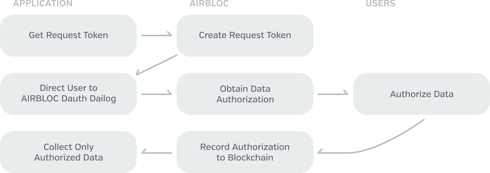

Airbloc Technical Whitepaper
=================

**Version 1** First published on April 4, 2018. 

**요약** : 에어블록은 탈중앙화된 광고 데이터 거래 네트워크이다.
에어블록에선 앱이 개인 사용자가 DAuth를 통해 동의한 간접 데이터를 수집하거나, 광고주가 데이터 캠페인을 통해 사용자에게 직접 질문하는 방식으로 직접 데이터를 수집한다. 이렇게 수집된 데이터는 가공자를 통해 광고 데이터의 형태로 가공되어 광고주에게 판매되게 되고, 개인 사용자에게 데이터 보상이 지급된다. 개인 사용자는 데이터에 대한 정당한 보상 뿐만이 아니라 통제권까지 얻게 되어 데이터에 대한 주권을 가질 수 있고, 앱사는 정당하게 수집한 데이터를 수익화해 사용자와 보상을 나눠가질 수 있으며, 광고주는 개인에 대한 정확한 관심 데이터를 통해 고품질의 타겟팅 광고를 집행할 수 있다.

Copyright © 2018 Airbloc Foundation. All rights are reserved.

Without permission, anyone may use, reproduce or distribute any material in this paper for non-commercial and educational use (i.e., other than for a fee or for commercial purposes) provided that the original source and the applicable copyright notice are cited.

## 목차

* [문제의식]()
* [에어블록이란]()
    * [참여 주체]()
    * [아키텍쳐]()
* [왜 블록체인을 사용하는가?]()
* [에어블록의 데이터 파이프라인]()
* [데이터]()
    * [종류]()
    * [구성 요소]()
    * [데이터에 대한 권리]()
* [데이터 파이프라인 개요]()
* [데이터 수집]()
    * [DAuth]()
    * [데이터 캠페인]()
* [데이터 올리기]()
* [데이터 가공]()
* [마켓플레이스]()
    * [판매 방식]()
    * [가격 책정 방식]()
* [에어블록 토큰 경제 구조]()
    * [에어블록 토큰 (ABL)]()
    * [에어블록 리워드 (AIR)]()
    * [AIR Pool](#air-pool)
* [신뢰도 검증 시스템]()
    * [개인 신원 확인]()
    * [사기 탐지 시스템]()
    * [개인 평가]()
    * [데이터 교차 검증]()
    * [데이터 신뢰도 마이닝]()
* [Aero 네트워크]()
* [추가적으로 다뤄질 내용 (TBD)]()
* [결론]()
* [참고문헌]()
* [부록 (Appendix)]()
    * [고려사항 및 FAQ]()
    * [직접 데이터 공학]()

## 문제의식

### 개인의 데이터 권리 침해

이제 광고기술 시장에서 ‘데이터’는 하나의 전략적 무기이다. 광고를 보다 효율적으로 집행하기 위해 데이터를 활용하여 ‘내 제품을 살 만한 사람들에게만 광고하는’ 타겟팅 광고 상품은 구글과 페이스북, 그리고 각국의 대표 검색엔진 등 거대 IT 기업들의 주요 수익화 방법이 되었다. 이 기업들은 ‘개인의 관심데이터’를 활용하여 광고를 노출하고 개인들이 이 광고를 선택하면, 심지어 보기만 하더라도 매출을 얻게 된다.

하지만 정작 ‘개인 관심데이터’를 제공하는 주체인 ‘개인’에게는 타겟팅 광고 매출의 1원도 돌아가지 않는다. 자신들에게서 어떠한 데이터가 수집되어 어떠한 가치로 매겨지는지, 누구에게 판매되는지 전혀 알 수 없다. 심지어 데이터는 기업의 약관 변경등을 통해 원하지 않은 방식으로 수집되어 원하지 않는 주체에 판매되기도 한다.

### 광고주의 비효율적인 타겟팅 광고 

그럼에도 불구하고, 광고주는 생각보다 개인에 대해 정확히 알고 있진 않다.

관심데이터를 사용해 과거에 비해 더욱 효율적으로 타겟팅 광고를 할 수 있게 되었지만 이 관심데이터가 개인이 직접 제공한 정보가 아닌 간접 제공한 데이터를 기반으로 통계적으로 ‘추측’된 데이터에 불과하다. 따라서 개인의 관심사를 더 잘 추측하려면 더 많고 더 다양한 종류의 데이터가 필요하다.

 하지만 일개 기업이 수집할 수 있는 데이터는 한계가 있다. 플랫폼 사업자가 아닌 이상 일개 기업이 수집할 수 있는 데이터의 모집단은 해당 기업의 서비스로만 한정되기 때문이다. 따라서 개인의 입장에서는 데이터 권리의 침해가 빈번히 일어나지만, 기업의 입장에서도 결국 소수의 플랫폼이 다수의 데이터를 독과점하는 구조이기 때문에 개인에 대한 데이터 확보가 힘들다. Google 및 Facebook과 같은 광고 플랫폼을 사용하더라도, 플랫폼에 많은 광고주들이 몰리면서 시작된 광고 비용 상승으로 인해 광고주들에게 여전히 문제가 존재한다.

따라서 정확한 개인 데이터와, 그를 통한 세밀한 광고 타겟팅은 광고주들에게 어느 때보다 더 절실해진 상태이다.

### 광고의 노이즈화
앞서 설명한 것처럼 개인의 데이터는 무단으로 도용되는 데 반해, 정작 개별 광고주에겐 개인에 대한 정확도 높은 데이터가 부족한 딜레마가 존재한다. 이는 결국 타겟팅 광고의 질 저하로 이어졌고, 개인에게 광고는 노이즈로서 전락했다. 광고를 서비스를 사용하기 위해 지불해야 할 시간적 비용, 즉 필요악으로서 인식하는 것이다.

이 문제는 근본적으로 현재 디지털 광고 생태계가 **제로섬 게임**에 놓여있는 상태이기에 발생한다. 기업이 개인에 대해서 더 많은 데이터를 얻어내 광고를 통한 이윤을 창출하려면 개인의 데이터 권리를 더욱 착취해야 한다. 그렇다고 현 생태계에서 개인이 개인정보 수집을 거부하는 방식으로 데이터 권리를 행사한다면, 이는 광고의 노이즈화를 가속화해 개인의 광고에 대한 불신은 늘어날 것이며 광고의 전환율은 감소할 것이다. 이러한 문제를 해결하려면, 개인의 데이터 권리와 기업의 광고 간에 트레이드오프를 유지할 수 있는 "플러스 섬 게임" 생태계의 구축이 요구된다.

## 에어블록이란

에어블록은 탈중앙화된 광고 데이터 거래 플랫폼이다. 에어블록을 통해 **수집자**가 개인 사용자에게서 DAuth를 통해 동의한 간접 데이터를 수집하거나, 데이터 캠페인을 통해 사용자의 관심사를 직접 질문하는 방식으로 직접 데이터를 수집한다. 이렇게 수집된 데이터는 **가공자**를 통해 관심 데이터나 인사이트의 형태로 가공되어 광고주에게 판매된다. 광고주는 데이터로 타겟팅 광고를 집행할 수 있으며, 개인은 판매한 데이터에 대한 보상을 받을 수 있다.

에어블록은 **개인**에게 데이터 권리를 되찾아 준다. 데이터에 대한 보상을 개인에게 지급하고, 데이터 판매 수익을 분배한다. 또한 사용자가 제공한 데이터가 어떻게 판매되고 사용되는지는 블록체인을 통해 투명하게 추적이 가능하며, 사용자는 데이터의 사용 권한이나 주체를 직접 제한할 수 있다. 이처럼 에어블록을 통해 개인은 데이터의 주권을 되찾을 수 있다.

에어블록은 **앱**들에게 새로운 형태의 수익 모델이 된다. 앱사들은 사용자들을 통해 모은 데이터를 대리 판매함으로서 수익을 창출할 수 있다. 데이터 판매 수익은 사용자에게 배분되고, [DAuth](#dauth) 과정을 통해 사용자가 동의한 데이터만 수익화할 수 있기 때문에 개인의 데이터 권리를 보장하면서 앱사들은 정당히 수익을 창출할 수 있다. 이처럼 에어블록은 앱사들에게 그 자체로 새로운 "데이터 비즈니스" 모델"이 될 수 있다.

에어블록은 **광고주**들에게 고품질의 타겟팅 광고를 집행할 수 있게 해주는 DMP (Data Management Platform)가 된다. 에어블록에는 다양한 앱에서 수집된 많은 종류의 간접 데이터가 있기 때문에 데이터의 모집단을 크게 늘릴 수 있고, 데이터 캠페인을 집행해 사용자에게 직접 질문함으로서 원하는 데이터를 수집할 수도 있다. 이로 인해 광고주는 개인에 대해 더 정확하게 알 수 있고, 개인의 관심사를 더 잘 반영한 타겟팅 광고를 집행할 수 있다.

### 참여 주체

에어블록은 데이터에 대한 *프로바이더*, *컨슈머*, *수집자*, *가공자*와 *검증자*의 참여를 통해 이루어진다.

* **프로바이더 (Provider)** 는 데이터를 제공하는 개인 사용자다. 데이터를 제공하고 소비자에게 보상을 받아가며, 데이터 사용 및 유통에 대한 통제권을 지닌다.
* **수집자 (Collector)** 는 데이터를 수집해 대리 판매하는 앱이다. DAuth를 통한 간접 데이터를 수집하거나 질문을 통해 직접 데이터를 수집한다.  
* **가공자 (Refiner)** 는 사용자의 직 · 간접 데이터를 분석해 관심 데이터로 가공해서 컨슈머에게 판매하는 데이터 분석 엔진 및 업체이다.
* **컨슈머 (Consumer)** 는 데이터를 구매하는 광고주이다. 타겟팅 광고에 사용할 데이터를 구매하고 그에 대한 보상을 지불한다.
* **검증자 (Verifier)** 는 후술할 Aero 네트워크의 노드이다. 데이터를 관리하고 증명하는 역할을 한다. 

### 아키텍쳐

에어블록은 다음과 같은 4가지의 레이어로 구성되어 있다.

 * Application Layer : 에어블록을 사용하는 Dapp들을 가리킨다. 에어블록 클라이언트, 에어블록 마켓플레이스 및 SDK 등이 포함된다.
 * API Layer : 에어블록과 통신할 수 있는 API 레이어를 가리킨다.
 * Service Layer : 에어블록 컨트랙트를 가리킨다. 에어블록 네트워크의 기능이 서비스 레이어에 구현된다.
 * Core Layer : 에어블록이 블록체인 플랫폼을 가리킨다.
    * Ethereum을 서비스 플랫폼으로 사용한다.
    * [Aero]()란 자체 데이터 증명 네트워크를 사용한다.
    * 두 블록체인을 연동하기 위해 인터체인 플랫폼을 사용한다.

에어블록은 Ethereum을 서비스 플랫폼으로서 사용한다. 따라서 에어블록에서 사용되는 ABL 토큰은 ERC20 표준을 따르며, 에어블록 컨트랙트는 EVM 위에서 스마트 컨트랙트로서 구동된다. 블록체인 플랫폼은 추후 에어블록의 기술적 요구사항에 의해 다른 플랫폼으로 변경될 수 있다.

## 왜 블록체인을 사용하는가?

탈중앙화 애플리케이션 (Dapp)은 얼마든지 중앙화된 형태로도 구현될 수 있다. 에어블록도 이러한 가능성과 함께, 혹자는 "왜 에어블록이 굳이 블록체인을 사용해야 하는가?"라는 질문을 제기할 수 있다. 하지만 에어블록은 중앙화된 형태가 아닌 탈중앙화된 블록체인 위 네트워크로 구현됨으로서 다음과 같은 특징을 지니게 된다.

### 데이터의 추적성 (Data Traceability)

에어블록 네트워크 안에서 유통되는 모든 데이터의 활용 과정은 블록체인에 의해 투명하게 추적된다.

중앙화된 시스템에선 사용자의 데이터가 어떻게 수집되고 활용되거나 판매되는지 알 수 없다. 중앙화된 시스템이 데이터의 활용 기록을 투명하게 공개한다면 가능하겠지만, 이는 중앙화 주체의 선의 및 법적인 동의에 의해서만 이루어지기 때문에 사용자에게 데이터의 추적성을 완전히 보장해주진 않는다.

하지만 탈중앙화된 에어블록 네트워크에서는 데이터 수집을 DAuth나 데이터 캠페인을 통해 사용자가 컨트롤할 수 있으며, 수집된 개별 데이터의 유통 과정은 블록체인을 통해 투명하게 기록되기 때문에 사용자와 광고주는 해당 데이터의 계보 (Data Lineage)를 언제든지 확인할 수 있다.

중요한 것은 이러한 추적성이 단순히 한 주체의 의지에 의해서만 보장되는 것이 아닌, 공개된 스마트 컨트랙트와 네트워크상의 상호 견제 설계 구조를 통해 이루어지기 때문에 사용자는 데이터의 추적성을 네트워크 자체에 의해 보장받을 수 있다.

### 데이터 유통 제한 (Data Distribution Limitation)

에어블록의 가장 큰 특징은 데이터의 생산자인 개인 사용자가 직접 데이터의 유통 과정을 제한할 수 있다는 것이다. 예를 들어 데이터가 특정 분야의 광고에는 사용될 수 없게 제한하거나, 데이터가 몇번 이상 재판매되지 않도록 횟수를 제한할 수 있다. 이러한 유통 제한 기능을 통해, 사용자는 자신의 데이터에 대한 주권을 행사할 수 있다. 

이러한 데이터 유통 제한은, 탈중앙화된 블록체인 위에서 데이터 특성으로서 구현된다. 한번 데이터에 부여된 특성은 변경할 수 없기 때문에, 개인 사용자들은 자신의 데이터가 자신의 통제권 안에서 다뤄지는 것을 보장할 수 있다. 자세한 내용은 [데이터](#데이터) 문단에 서술되어 있다.

### 데이터의 무단 탈취 방지
전통적인 데이터 거래 네트워크에선, 중간 과정에서 값을 지불하지 않은 채로 데이터를 복사할 수 있는 위험이 있다. 데이터는 무형의 디지털 자산이기 때문에, 단순히 내용을 열람할 수 있는 것만으로도 가치를 탈취할 수 있기 때문이다. 이로 인해 기존 시스템에선 데이터의 유통을 제대로 제어할 수 없다. 예를 들어 데이터 사용 통제 및 추적을 피하기 위해 데이터를 복사했다가 다시 시스템에 임포트하는 방식으로 데이터 계보를 끊어버리는 데이터 이스케이핑 (Data Escaping) 등의 행위가 가능하다.

에어블록에선 데이터의 무단 복제를 데이터의 익명화를 통해 사전에 차단한다. 에어블록에서 유통되는 데이터는 광고 데이터인데, 광고 데이터는 데이터의 소유자에 대한 트래킹 가능한 정보가 들어 있는 식별자 없이는 활용할 수 없기 때문에 식별자가 없는 익명 데이터는 아무런 가치를 지니지 않는다. 이를 이용해서 에어블록 안에서 유통되는 데이터는 식별자가 제거된 채 익명화된 상태로 유통된다. 데이터에 대한 식별자는 오직 데이터 소유권을 구매한 컨슈머나 데이터의 소유자인 프로바이더만이 접근할 수 있다.

또한 어떠한 방식으로든 데이터 소유자를 특정하는 것을 막기 위해, 익명화는 한 주체에서 다른 주체로 넘어갈 때마다 수행된다. 예를 들어 A라는 사람의 데이터는 가공자에게 넘어갈 땐 X라는 사람이 되며, 검증자에겐 Y라는 사람으로 보여진다. 컨슈머가 데이터에 대한 비용을 지불해 소유권을 구매해야 비로소 그 데이터가 A라는 사람의 데이터라는 것을 알 수 있는 것이다. 

따라서 에어블록 내의 데이터는 소유권을 얻기 전까진 익명화된 무가치 데이터이므로, 데이터가 중간에 복사되더라도 데이터 이스케이핑의 문제 및 무단 탈취 문제가 없다. 이는 에어블록의 자체 데이터 관리 네트워크인 [Aero](#aero-네트워크)를 이용해 구현된다. 자세한 내용은 [익명화 레이어](#익명화-레이어) 문단에 서술되어 있다.

### 탈중앙화를 통한 데이터 권력의 민주화
이러한 모든 기능이 가능한 이유는 바로 에어블록이 탈중앙화된 형태로 구현되기 때문이다.

중앙화된 시스템에선 아무리 법적인 효력을 가진 약관과 규칙이 있다고 해도 다른 주체들은 중앙 주체를 견제할 수단이 없으며 해당 규칙을 따르는지 감시할 방법 또한 없다. 그저 중앙화된 주체와의 이해관계에 의해서만 규칙이 유지된다. 앞서 설명한 데이터의 추적용이성이나 데이터 특성 부여 등은 얼마든지 중앙화된 시스템에서도 구현이 가능하지만, 해당 시스템이 공정하게 작동하고 유지된다는 보장 장치는 전혀 없으며 오직 중앙화된 주체의 의지로만 작동되기 때문이다.

하지만 탈중앙화 시스템 위에서는 스마트 컨트랙트로 명문화된 투명한 규칙 하에 각 참여 주체가 상호견제하는 환경이 조성된다. 시스템은 규칙을 따르도록 설계되어 있고, 해당 규칙에 따른 모든 행동은 투명하게 공개되어 감시가 가능하다. 규칙을 어기고 어뷰징하는 주체는 경제적 패널티를 얻게 된다. 시스템 자체가 시스템이 공정하게 작동하고 유지된다는 보장 장치가 되는 것이다. 

에어블록은 탈중앙화 시스템이기 때문에, 정해진 규칙에 따른 공정한 데이터 유통을 보장할 수 있다. 심지어 에어블록을 운영하는 주체인 에어블록 파운데이션조차도 에어블록에선 참여 주체의 일부이기 때문에, 데이터를 다룰 수 있는 권력은 어느 누구에게 집중되지 않고 사용자와 기업 모두에게 공평하게 분배될 수 있다. 이것이 에어블록이 지향하는 탈중앙화 가치이며, 에어블록이 탈중앙화된 형태를 지니는 이유이다.

## 데이터

에어블록에서 거래되는 모든 데이터는 광고 데이터이다. 광고 데이터는 어떤 개인에 관한 트래킹 가능한 데이터로서, 주로 개인의 관심사를 표현하기 때문에 관심 데이터라고도 불린다. 여기서 주목해야 할 점은 광고 데이터는 트래킹 가능해야한다는 점이다.

트래킹 가능하지 않은 광고 데이터는 가치가 없다. 이는 데이터는 활용되는 순간에 가치를 지니기 때문이다. 어떤 개인의 광고 데이터를 활용하는 방법은 그 사람에게 트래킹 광고를 집행하는 것인데, 트래킹 광고는 관심 데이터가 있더라도 데이터의 소유자에 대한 트래킹 가능한 정보가 들어 있는 식별자가 없다면 집행할 수 없다. 에어블록의 모든 데이터 시스템 설계는 **트래킹 가능하지 않은 광고 데이터는 가치가 0**이라는 전제에서 출발한다.

### 종류
에어블록에서의 광고 데이터는 수집 방식의 측면에서 **간접 데이터**, **직접 데이터** 2가지로 나뉜다.

**간접 데이터 (Indirect Data)** 는 사용자의 디바이스 등에서 자동으로 수집될 수 있는 데이터로 예를 들어 설치된 앱 리스트, 앱 사용 행태, Google Play 결제 내역, WIFI 데이터, GPS 데이터, 비콘 데이터 등이 있다. 이런 데이터는 사용자의 권한(Permission) 부여만으로도 자동으로 수집될 수 있다는 특징을 가지며, 또한 이러한 데이터를 사용하여 간접적으로 해당 사용자의 정적인 속성을 추측할 수 있다는 점에서 간접데이터라고 불린다. 예를 들어 그 사용자가 “고양이를 키우는지 아닌지”를 직접적으로 물어보는 것이 아니라 그 사용자가 고양이와 관련된 앱을 설치하고 있는지의 여부로 간접적으로 추측하기 때문에 간접 데이터인 것이다.

반면에 **직접 데이터 (Direct Data)** 는 말 그대로 그 사용자에게 직접 특정 사실에 대해서 물어본 것이라고 할 수 있다. 위의 예시로 돌아가면, 직접 데이터를 수집하려면 “고양이를 키우는지 아닌지”를 직접 그 사용자에게 물어보면 된다. 나아가서 그 사용자가 실제로 고양이를 현재 키우고 있는지, 아니면 키우고 있지 않는데도 단지 관심만 가지는 것인지를 질문해서 답을 받으면 된다. 직접 물어본 것이기에 이는 직접 데이터에 속한다.

### 구성 요소
에어블록에서의 광고 데이터는 식별 정보, 특성, 페이로드 (내용), 계보로 구성된다.

#### 식별자 (Identifier)
식별자는 데이터 소유자를 식별할 수 있는 정보로서 이메일, 이름, 고유 식별자 (UUID) 등이 포함된다. 이중 고유 식별자는 해당 데이터 소유자에 대한 트래킹 가능한 고유 ID이다. 일반적으로 고유 식별자로는 타 플랫폼에서 트래킹이 가능한 Google Advertising ID나 Apple IDFA 등의 광고 ID가 많이 쓰인다.

에어블록 네트워크에서 거래되는 데이터엔 **반드시 데이터 소유자의 고유 식별자가 최소 하나 이상 포함되어야 한다.**  이는 에어블록에서 데이터를 소비하는 가장 큰 목적이 개인의 관심사를 알아내어 알맞은 타겟팅 광고를 제공하기 위함이기 때문이다. 

#### 특성 (Trait)
에어블록의 모든 데이터엔 유통 제한 특성이 부여된다. 에어블록에서는 프로바이더의 데이터 유통 제한을 위해 다음과 같은 특성을 사용한다.

* 데이터의 사용 제한 범위
* 데이터의 최대 재판매 횟수 (도달 수명)

데이터는 특정 주체에 사용되거나 판매될 수 없을 수 있고, 최대 재판매 횟수에 도달해 남은 재판매 횟수가 0이 되면 더이상의 재판매가 불가능해질 수도 있다. 또한 한번 부여된 특성은 **절대 변경할 수 없다.** 예를 들어, 도달 수명은 한번 부여된 이상 절대 임의로 연장할 수 없다. 이를 통해 사용자는 개인 데이터의 통제권을 완전히 보장받을 수 있다.

기술적으로 특성은 유한 상태 기계 (Finite State Machine)으로서, 제한함수 (Limit Function)과 전이함수 (Transition Function), 상태 (Status)로 구성된다. 제한함수는 데이터에 대한 특정 Action의 실행을 제한하는 조건을 정의하며, 전이함수는 특정 Action이 발생했을 때 상태를 변경시키는 상태전이함수이다. 상태는 오직 전이함수만이 변경시킬 수 있으며, 함수들은 불변성을 지닌다.

예를 들어, 데이터의 재판매 횟수를 10번으로 제한한다고 하자. `ACTION_TRADE`라는 Action에 라는 특성함수를 만들고  이란 제한함수를 만들면 된다.

#### 페이로드 (Payload)
페이로드는 데이터의 내용을 담고 있다. 페이로드 형식은 직접 데이터의 경우 캠페인 집행자가 결정하고, 간접 데이터의 경우 에어블록 내에서 표준화된 형식을 사용해야 한다. 일반적으로 데이터의 페이로드는 블록체인 위에 저장하기엔 너무 크기 때문에, 페이로드는 IPFS 및 S3와 같은 외부 스토리지에 암호화되어 저장되며 블록체인 상에는 접근 해시 키만을 저장한다. 데이터 저장에 대한 자세한 내용은 [데이터 저장](#) 문단 및 부록의 [데이터 저장 방식](#데이터-저장-방식) 문단에 서술되어 있다.

#### 계보 (Lineage)
계보는 한 데이터가 에어블록 상에서 유통된 이력을 나타낸다. 이는 데이터가 거래되면서 자연적으로 생성된다. 에어블록은 데이터의 계보를 무조건 투명하게 유지하기 때문에, 개인 사용자는 자신의 데이터가 어떻게 사용되는지 투명하게 알 수 있으며 컨슈머는 구매한 데이터가 어떤 과정을 통해 자신에 손에 오게 되었는지 알 수 있다.

**데이터 계보는 데이터에 대한 소유권 없이는 열람할 수 없다.** 즉 데이터 유통에서 중간 과정에 있는 가공자, 검증자들은 데이터 계보를 조회할 수 없다. 이는 데이터 계보 조회를 통해서 데이터 소유자의 신원을 특정하는 것을 방지하기 위함이다. 익명화된 데이터여도 소유자의 신원 특정이 가능해지면 앞서 설명한 무단 복제나 데이터 이스케이핑이 가능해지기 때문에, 소유권이 없는 주체에겐 계보를 숨긴다. 이는 [데이터에 대한 권리](#데이터에-대한-권리) 파트에서 자세히 다룬다.

### 데이터에 대한 권리

에어블록은 데이터에 대한 권리를 **사용권**, **추적권**, **소유권**으로 구분한다. 권리를 나누는 가장 큰 기준은 식별자에 대한 접근 가능 여부이다. 그 이유는 앞서 설명된 것처럼 광고 데이터는 소유자에 대한 식별자 없이는 무가치하기 때문이다.

**사용권**은 데이터 페이로드에 접근할 수 있는 권리이다. 이 권리는 데이터 파이프라인의 중간에 위치한 가공자와 검증자가 가지게 된다. 예를 들어 가공자는 데이터를 구매하지 않고도 데이터의 페이로드에 접근해 해당 사용자의 직접 데이터와 간접 데이터를 가공해 관심 데이터를 만들 수 있지만, 해당 사용자의 실제 식별자는 알지 못하므로 데이터를 탈취해도 해당 광고 데이터는 무가치한 데이터일 뿐이다.

**추적권**은 식별자에만 접근할 수 있는 권리이다. 데이터의 페이로드에 접근하지 않고서도 그 타겟 자체만 판매할 수 있게 함으로써 사용자의 원 데이터의 전달 없이도, 광고주들이 광고 타겟팅을 할 수 있도록 도와준다. 이는 Facebook을 포함하여 많은 DSP들은 데이터를 업로드하지 않더라도 광고 ID만으로도 타겟을 생성하게끔 할 수 있기 때문이다. 이를 통해 사용자의 데이터를 보호하고 오직 그 사용자를 타겟팅하여 광고할 수 있는 권리만 판매할 수 있다.

**소유권**은 데이터의 전체 내용을 접근할 수 있는 권리이다. 이 권리는 데이터 파이프라인의 양극단에 위치한 프로바이더나, 컨슈머만이 가지고 있다. 데이터의 소유권을 가진다는 것은 데이터의 소유자 정보 (고유 식별자, 계보)에 접근할 수 있게 된다는 의미를 지니며, 데이터의 거래는 데이터의 소유권을 거래하는 것으로 볼 수 있다.

|   |  사용권  |  추적권  |  소유권  |
|---|:-------:|:------:|:------:|
|페이로드 접근    |  ⃝ | **✕** |  ⃝ |
| 식별자 접근    | **✕** |  ⃝   |  ⃝ |
|계보 접근      | **✕** |  ⃝ |  ⃝ |

## 데이터 파이프라인 개요

에어블록에서의 데이터는 다섯 주체를 거치며 일곱 과정의 SOIPRTC 파이프라인 (Source - cOllection - Ingestion - Persistence - Refining - Trading - Consumption)을 통해 컨슈머에게 전달된다. 사용자가 만든 데이터는 수집자에 의해 수집되어, 검증자의 정제 (Cleansing) 후 수집자가 저장한다. 가공자는 이를 가공해 마켓에서 데이터를 컨슈머에게 판매하게 된다. 

### 데이터 원천 (Data Source)
데이터는 프로바이더인 사용자에게서 만들어진다. 간접 데이터는 사용자의 행동이나 정적인 속성으로부터 자연스럽게 만들어지고, 직접 데이터는 데이터 캠페인 질문에 답변하면서 만들어진다. 사용자는 수집될 수 있는 데이터의 종류를 제한하거나, 데이터에 유통 제한을 거는 방식으로 데이터가 만들어지는 단계에서 데이터를 통제할 수 있다.

### 데이터 수집 (Data Collection)
수집자는 프로바이더로부터 이러한 데이터를 수집한다. 간접 데이터의 경우 앱사들이 DAuth를 거쳐 수집하고, 직접 데이터의 경우 캠페인 집행자가 사용자들에게 질문을 하고 답변을 받는 방식으로 수집한다.

### 데이터 올리기 (Data Ingestion)

에어블록과 같은 데이터 시스템은 수많은 소스로부터 데이터를 가져올 때 데이터의 형식을 하나로 통합하고, 필요없는 부분을 삭제하는 클렌징 (Cleansing) 작업을 거쳐야 데이터를 다룰 수 있다. 이러한 가공 작업을 데이터 올리기 (Data Ingestion)이라고 한다. 수집자는 데이터 올리기 과정을 통해 클렌징되어 블록체인에 등록된 데이터를 저장해야 한다. 자세한 과정은 [데이터 올리기](#데이터-올리기) 문단에 서술되어 있다.

### 데이터 저장 (Data Persistence)
**데이터 저장은 수집자가 담당한다.** 에어블록은 자체적으로 데이터를 저장하지 않으며, 별도의 저장 수단을 마련하고 있지 않는다. 데이터 저장 및 유지의 의무는 수집자가 지게 되고, 수집자는 어디에든 데이터를 저장할 수 있다. 필요할 때 접근이 가능한 조건을 충족시키는 S3, HDFS, IPFS, Swarm 등의 다양한 저장소를 사용할 수 있다.

수집자는 올리기 과정에서 가공된 데이터를 저장하고, 해당 데이터의 URI를 에어블록에 등록해야 한다. 대신 데이터 사용권 및 소유권자가 데이터에 접근할 때마다 검증자에 의해 데이터 검증이 이루어진다. 자세한 내용은 부록의 [데이터 저장 방식](#데이터-저장-방식) 문단에 서술되어 있다.

### 데이터 가공 (Data Refining)
수집자가 수집한 데이터는 후술할 Raw 데이터 마켓에서 직접 컨슈머에게 팔릴 수도 있지만, 데이터는 가공자에 의해 세그먼트나 지표 등으로 의미있게 가공되어 더 높은 가치로 컨슈머에게 제공될 수 있다. 가공자는 여러 수집자로부터 직접 데이터와 간접 데이터를 받아 관심 데이터나 인사이트 데이터 형태로 가공하고, 데이터가 판매될 때 마다 가공자 인센티브를 받는다. 자세한 내용은 [가공자](#가공자) 문단에 서술되어 있다.

### 데이터 거래 (Data Trading)
데이터의 거래는 마켓플레이스에서 이루어진다. 마켓플레이스는 **데이터 마켓**과 **인사이트 마켓**으로 나뉜다. 마켓플레이스에서는 수집자나 가공자가 등록한 데이터가 소비자에게 판매된다. 소비자는 데이터를 소비하기 위해선 마켓플레이스에서 데이터를 ABL 토큰으로 구매해 소유권을 사야 한다. 자세한 내용은 [마켓플레이스](#마켓플레이스) 문단에 서술되어 있다.

### 데이터 소비 (Data Consumption)
소비자가 거래를 통해 데이터를 구매하면, 올리기 과정에서 익명화되었던 데이터들은 Aero 네트워크를 통해 비익명화되어 소비자에게 전달된다. 소비자들은 이 데이터를 Facebook Audience 등으로 Export 해 광고에 바로 활용할 수 있다.

지금까지 에어블록의 데이터 파이프라인 개요를 다뤘다. 다음 문단부터는 데이터 파이프라인 순서에 따라서 구체적인 데이터 유통 과정이 서술되어 있다.

## 데이터 수집

에어블록에서의 데이터 수집은 앱이 담당한다. 앱은 사용자들에게 수집한 [간접 데이터](#간접-데이터)나 [직접 데이터](#직접-데이터)를 에어블록에서 판매해 수익화할 수 있다. 하지만 이것이 앱의 데이터 독점이나 개인 데이터 권리 침해를 의미하진 않는다. 판매 수익은 사용자에게 일정 비율로 배분되며, 판매할 수 있는 데이터의 종류와 권한은 사용자가 직접 선택할 수 있기 때문에 앱은 오로지 데이터 판매 대리인의 역할로서 사용자와 수익을 나누게 되는 것이다.

데이터를 수집하려면 먼저 에어블록 네트워크에 앱을 등록해야 한다. 이때 앱을 등록하려면 최소 1,000 ABL 이상을 홀딩해야 한다. 또한 앱이 마켓플레이스에서 판매할 수 있는 최대 개별 사용자의 수는 앱이 홀딩하는 ABL의 양에 비례해 늘어난다. 이는 악성 앱이 시빌 공격이나 데이터 생성 공격 등을 통해 가공주와 마켓플레이스를 공격하는 것을 방지하기 위함이다. 이와 관련된 수식은 추후 공개될 예정이다.

### DAuth
DAuth (DataAuth)는 에어블록에서 사용자의 데이터 수집 및 수익화에 대한 수집자와 사용자간의 동의 절차이다. 앱을 설치한 후 최소 한번 이상의 DAuth를 통해 개별 사용자로 하여금 데이터 수집에 동의하고, 수집할 데이터의 종류를 결정하게 하는 과정을 거쳐야 앱은 비로소 그 사용자에게서 간접 데이터를 수집할 수 있다.

비록 에어블록과 DAuth 과정은 앱이 자연적으로 사용자에게서 데이터를 수집하는 것을 막을 순 없다. 대신, 사용자에게 동의받지 않은 종류의 간접 데이터는 에어블록에 올려서 수익화하지 못하게 데이터 클렌징 과정에서 필터링된다. 이를 통해 사용자는 데이터의 정당한 수집을 보장받을 수 있다.

수집자는 앱을 등록한 후, 에어블록 네트워크에 앱이 수집할 간접 데이터의 종류와 보상의 비율을 등록한다. 수집할 데이터의 종류는 예를 들어 설치된 앱 리스트, 인앱 결제 내역 등을 수집할 수 있다. 데이터의 종류별로 보상을 설정하고, 사용자와 얼마의 비율로 분배할 것인지 설정한다. 단, **앱은 최소 30% 이상의 수익을 사용자에게 분배해야 한다.** 이렇게 등록된 수집할 데이터와 보상 비율은 블록체인에 기록되며, DAuth 절차를 통해 사용자에게 동의받게 된다.

DAuth의 구체적인 절차는 다음과 같다.

1. 애플리케이션에서 에어블록에 인증 절차 시작을 요청한다.
2. 에어블록에서 애플리케이션에게 요청 토큰을 발급한다.
 * 요청 토큰은 1회성이며 DAuth 다이얼로그를 띄울 때 사용된다.
3. 애플리케이션에서 에어블록 SDK를 통해 DAuth 다이얼로그를 띄운다.
4. 에어블록에서 사용자에게 DAuth 다이얼로그를 표시한다.
  * 다이얼로그엔 앱이 수집을 원하는 데이터의 종류, 보상 및 수익 분배 비율이 나열된다.
5. 사용자가 데이터 수집에 동의한다.
  * 사용자는 데이터 종류별로 수집에 동의할 수 있다.
  * 보상을 지급받을 에어블록 계정 (없으면 이메일)을 입력한다. 
6. 에어블록은 사용자가 동의한 데이터의 종류를 블록체인에 기록한다.
7. 수집자는 사용자가 동의한 데이터만 에어블록에서 수익화할 수 있다.
  * 동의하지 않은 데이터는 [데이터 올리기](#데이터-올리기-(data-ingestion)) 단계에서 필터링되므로, 에어블록에 올릴 수 없다.

DAuth는 Civic [[1]](https://tokensale.civic.com/CivicTokenSaleWhitePaper.pdf), uPort [[2]](https://www.uport.me/)와 같은 개인 인증 시스템은 아니다. 물론 이러한 개인 인증 시스템엔 데이터 수집에 대한 동의 기능도 포함되어 있지만, 대신 앱에서의 인증 수단을 대체하기 때문에 앱 (수집자)에게 외부 플랫폼 사용에 대한 부담을 줄 수 있고 사용자에게도 로그인을 하려면 해당 플랫폼의 계정이 있어야 한다는 부담을 줄 수 있다.

하지만 **DAuth는 에어블록 계정 없이도 데이터 판매 보상을 받을 수 있다.** 사용자가 에어블록 클라이언트를 설치한 상태라면 자동으로 사용자의 계정으로 보상이 들어오지만, 그렇지 않다면 사용자는 별도의 가입 절차 없이 이메일만 입력하고 해당 이메일에 보상을 모아둘 수 있다. 나중에 해당 이메일로 에어블록에 가입하면 그동안 쌓인 보상을 받을 수 있다. 

위와 같은 특성으로 인해 앱사들은 외부 플랫폼 사용에 대한 부담을 크게 줄일 수 있고, 사용자는 에어블록 계정 없이도 데이터 권리를 보장받을 수 있다. 이처럼 DAuth는 에어블록 생태계 밖의 사용자에게도 데이터 주권을 되찾아주는 역할을 수행할 수 있다.

DAuth는 OAuth의 Three-Legged Authorization [[3]](https://www.ibm.com/support/knowledgecenter/en/SS9H2Y_7.5.0/com.ibm.dp.doc/oauth_threeleggedflow.html) 방식과 유사한 구조를 가지고 있다. DAuth에서의 에어블록은 OAuth에서 서비스 프로바이더가 되는 것이다. 하지만 OAuth는 개인 인증 목적을 포함하는 반면 DAuth는 간접 데이터 수집에 관한 동의만을 다루며, OAuth에선 데이터의 소유 주체가 서비스 프로바이더이지만 DAuth에서의 데이터 소유 주체는 개인 및 앱이다. DAuth에서의 에어블록은 개인의 데이터가 개인의 동의하에 투명하게 수익화되는 것을 보장할 뿐이다.

### 데이터 캠페인

에어블록에선 다른 데이터 거래소에서와는 다르게, 광고주가 사용자에게 원하는 관심 데이터를 질문하는 방식으로 데이터를 살 수 있다. 광고에서의 캠페인처럼, 에어블록은 이를 **데이터 캠페인**이라고 한다. 사용자는 수집자의 앱을 통해 질문에 답하며 보상을 얻을 수 있다. 

기술적으로 데이터 캠페인은 캠페인 집행자가  데이터를 수집하기 위해, 원하는 데이터를 제공하면 그에 대한 보상을 주겠다는 제안을 네트워크 내 특정 프로바이더에게 정해진 기간동안 노출시키는 행동을 의미한다. 사용자들은 제안을 수락하고 질문에 답변할 인터페이스를 통해 직접 데이터를 제공하게 된다.

간접 데이터 수집이 에어블록 SDK를 사용하는 모든 앱에서 이루어질 수 있는 반면, 데이터 캠페인을 통한 직접 데이터 수집의 경우 별도의 에어블록 캠페인 SDK를 사용하는 앱이나 에어블록 메인 클라이언트 앱에서 참여가 가능하다. 이러한 앱들은 반드시 사용자가 질문에 답변할 수 있는 UI를 갖추고 있어야 한다.

캠페인은 질문, 보상, 타겟, 캠페인 기간, 도달 비용으로 이루어진다.

**질문 (Query)** 은 수집하길 원하는 데이터에 대한 설명이다. 질문은 자연어 질문과 스키마로 이루어져 있다. 자연어 질문은 사용자에게 표시될 문장 형태의 질문이나 부가 정보이며, 스키마는 원하는 데이터의 페이로드 형식을 정의한다. 예를 들어 `isMarried: Boolean`이라는 스키마는 데이터 프로바이더가 페이로드의 `isMarried`라는 필드에 `Boolean` 형식의 데이터를 전송해야 함을 의미한다.

**보상**은 컨슈머가 데이터당 프로바이더에게 지불해야 할 ABL 토큰의 양이다. 프로바이더가 캠페인에 응답해 데이터를 제공하면, 컨슈머는 프로바이더에게 보상을 제공한다. 프로바이더는 한 캠페인당 최대 한번밖에 응답할 수 없기 때문에, 컨슈머가 지불해야 할 총 보상액은 (보상 가격) ✕ (응답한 프로바이더 수)가 된다.

**타겟**은 캠페인을 노출시킬 프로바이더 사용자군 설정이다. 이는 프로바이더가 초기에 설정한 관심 정보에 따라서 이루어지며, 설정된 타겟군에 해당하는 관심을 가진 프로바이더에게만 캠페인이 노출되게 된다.

**캠페인 기간**은 캠페인을 노출시킬 기간 설정이다. 캠페인 기간은 시간 단위로 설정이 가능하며, 연장이 불가능하다. 연장하려면 새 캠페인을 생성해야 한다.

이렇게 구성된 캠페인을 집행하려면 **도달 비용**을 ABL 토큰으로 지불해야 한다. 도달 비용은 얼마나 많은 사용자에게 캠페인이 노출될지를 다음 공식에 따라 결정한다.

<!--$$\mbox{Cost} =\mbox {Period} \times  \exp \left( \frac{\mbox{Number of Target Provider Group}}{\mbox{Total Number of Provider}} \right) \times \mbox {Constant} $$
-->

더 많은 사용자들에게, 더 오래 캠페인을 노출시키려면 더 많은 도달 비용을 지불해야 한다. 이렇게 도달 비용을 둠으로서, 불필요한 정크 캠페인의 집행을 제한해 사용자 경험을 향상시킬 수 있다. 지불된 비용은 [AIR Pool]()에 쌓인다.

캠페인을 집행하면, 해당 캠페인은 Push 방식을 통해 네트워크에 전파되어 특정 프로바이더들에게 노출된다. 프로바이더들은 캠페인에 응답해 데이터를 제공하고 보상을 받을 수 있다.

## 데이터 올리기 (Data Ingestion)

에어블록과 같은 데이터 시스템은 수많은 소스로부터 데이터를 가져올 때 데이터의 형식을 하나로 통합하고, 필요없는 부분을 삭제하는 클렌징 (Cleansing) 작업을 거쳐야 데이터를 다룰 수 있다. 이러한 가공 작업을 데이터 올리기 (Data Ingestion)이라고 한다.

수집자가 자신이 수집한 데이터를 거래하려면 에어블록 네트워크에 데이터를 올리는 과정을 거쳐야 한다. 에어블록의 데이터 올리기 과정은 Aero라는 별도의 데이터 관리 네트워크에서 이루어진다.

* 수집자가 데이터를 등록하려면 먼저 한 Aero 노드에게 데이터를 등록한다.
* 해당 노드는 데이터를 Aero 네트워크상에 전파한다.
* 노드들은 정해진 데이터 형식 통합 규칙에 따라 데이터를 가공한다.
    * 사용자의 식별자 정보를 별도로 분리한다.
    * 사용자의 식별자 정보에 Nonce를 추가한다.
* 노드들은 정해진 데이터 클렌징 규칙에 따라 데이터를 가공한다.
    * 블록체인에 올려진 사용자의 데이터 수집 동의 내역을 참조해, 사용자가 수집에 동의하지 않은 데이터를 필터링한다.
    * 불필요한 데이터를 필터링한다.
* PoS 컨센서스를 수행해 채택된 가공 데이터와 그 SHA256 해시를 블록체인에 등록된다.
* 가공된 데이터와 함께 해시를 다시 수집자에게 전달한다.

수집자는 위 과정을 통해 가공되어 등록된 데이터를 저장해야 한다. 수집자가 가공된 데이터를 무시하고 원 데이터를 저장하더라도, Data Availability Proof Task를 통해 변조된 데이터로 인식되어 패널티를 받게 된다. 따라서 에어블록의 데이터 올리기 과정을 통해 사용자의 데이터를 지킬 수 있다.

### 익명화된 데이터 유통

에어블록은 데이터 올리기 과정에서 데이터에 있는 식별자 정보를 별도로 분리해 저장한다. 이후 블록체인에 데이터가 등록될 때는 식별자와 페이로드에 대해 해시값과, 열람 권한이 있어야 접근할 수 있는 접근 URI만이 각각 저장되어 유통되기 때문에 데이터 유퉁 과정 중간 과정에서는 사용자의 원래 식별자를 알 수 없다.

물론 일반적으로 식별자 정보는 사용자에 대해서 모두 동일하기 때문에 식별자에 대한 해시값만으로도 데이터의 소유자를 특정할 수 있는 문제가 생길 수 있지만, 데이터 올리기 과정에서 식별자에 Nonce가 추가되어 해시화되기 때문에 같은 사용자의 식별자라도 전부 다르게 해시화되므로 이러한 문제는 사라진다.

이 기능의 존재가 에어블록에서의 데이터 거래의 불투명성을 야기하진 않는다. 이 기능의 존재 목적은 오직 개인 데이터가 허가되지 않은 주체에게 유출되는 상황을 방지하기 위해 데이터 유통 과정에서 데이터를 보호하는 것이다. 데이터 거래 기록은 블록체인 트랜잭션과 데이터 계보로서 투명하게 저장된다.

에어블록은 이처럼 익명화된 데이터 유통을 통해 데이터 이스케이핑 (Data Escaping) 등 데이터에 대한 값을 제대로 치루지 않고 데이터의 가치를 유출시키는 것을 방지한다.

## 가공자 (Refinery)
위와 같은 수집 과정을 통해 수집된 사용자의 데이터는 그 자체만으로 큰 가치를 발휘하진 않는다. 가공하지 않은 Raw 데이터는 상대적으로 낮은 신뢰성과 높은 노이즈를 지니고 있으며, 도메인 특화된 데이터이기 때문에 제한적인 활용성을 보인다. 따라서 광고주가 데이터를 사용하려면 Raw 데이터를 가공하여 광고에 사용되기 용이한 개인 데이터나, 사용자의 예상 구매율 및 재방문율 등의 인사이트 데이터로 바꿔주는 가공 과정이 필요하다.

에어블록에서의 데이터 가공 과정은 가공자가 수행한다. 가공자는 데이터 사용권을 가지는 데이터 가공 주체들로서, 광고 데이터 분석 업체들에 의해 운영되는 자동화된 데이터 분석 엔진이 될 것이다. 가공자는 어떤 개인에 대해 수집자가 모은 데이터를 가공해, 후술할 인사이트 마켓 및 개인 데이터 마켓에서 컨슈머에게 가공한 데이터를 판매하고 인센티브를 얻는다.

가공자의 가공 과정은 블록체인 밖에서 이루어진다. 가공자는 수집자가 모은 데이터를 Export해 가공하고, 다시 Import해 마켓플레이스에 매물을 등록하게 된다. 일반적으로 블록체인 밖에서 데이터를 처리하는 것은 데이터의 무단 탈취 문제 및 데이터 이스케이핑 문제를 야기하지만, 가공자가 처리하는 데이터는 익명화된 데이터이기 때문에 무가치하므로 그러한 위험이 사라진다.

그렇게 해서 데이터가 가공자에 의해 가공되면 개인 데이터나 인사이트 데이터가 된다. **개인 데이터**는 가공자가 개인에 대한 속성을 분석한 내용이다. 예를 들어 Bob이란 사람이 애견 앱을 많이 설치했다는 간접 데이터가 있고, 강아지를 좋아한다는 답변을 한 직접 데이터가 있다면 가공자는 이러한 데이터를 통해 "Bob이 개를 키운다"고 분석한 개인 데이터를 만들 수 있다.

**인사이트 데이터**는 주로 광고에 쓰일 수 있는 지표이다. 예를 들어 A라는 상품에 대한 개인의 구매율이나, B라는 상품으로의 전환 확률 등이 될 수 있다. 인사이트 데이터는 극도로 정형화되고 정량적인 데이터이며, 컨슈머의 수요에 의해 온디맨드로 제공된다는 특징이 있다. 컨슈머들은 사용자 세그먼트에 대한 특정 지표를 쿼리하고, 그에 대해 가공자들이 결과를 도출하면, 그중 원하는 가공자의 결과에 대해 값을 지불하거나 모든 가공자의 결과에 대해 값을 지불하고 평균값을 매기는 식으로 인사이트 데이터를 소비하게 된다. 

### 미지의 개인 드러내기

컨슈머 사이드 관점에서, 가공자가 하는 일은 어떤 미지의 개인을 드러내는 것이라고 볼 수 있다. 사용자의 직접 데이터 답변 기록이 축적되고 간접 데이터가 축적될 수록 가공자는 미지의 개인에 대해 아는 내용이 점점 많아진다. 가공자는 자신들만의 분석 기법을 통해 이러한 개인 드러내기 (Revealing Person) 과정을 더 정확한 방향으로 촉진시키는 것이다.

### 직접 데이터의 효용 극대화 효과

에어블록에서 가공자의 존재는 직접 데이터의 효용을 극대화하는 역할을 수행한다. 직접 데이터는 사용자의 행동에 의한 간접 데이터보다 신뢰도가 대체로 낮은 편이지만, 간접 데이터와 직접 데이터를 함께 사용한다면 효용을 극대화시킬 수 있기 때문이다. 예를 들어 간접 데이터가 직접 데이터의 형식적 증거로 작용해 직접 데이터의 신뢰도를 높여주는 역할로 사용될 수 있고, 직접 데이터를 컨조인트 분석 기법 (Conjoint Analysis)이나 유사타겟 엔진 (Lookalike Target Engine) 등의 모형에 학습 데이터로 사용해 분석 모형의 성능을 높이는데 사용될 수 있다. 가공자는 직접 데이터와 간접 데이터를 상호작용시켜 가공된 데이터의 신뢰도와 정확도를 높임으로서, 컨슈머의 데이터 효용과 자신의 이익을 극대화할 뿐만 아니라 직접 데이터의 효용가치를 올릴 수 있다. 자세한 내용은 부록의 [간접 데이터와 직접 데이터의 상호작용을 통한 모수 확대](#간접-데이터와-직접-데이터의-상호작용을-통한-모수-확대) 문단에 서술되어 있다.

### 데이터의 신뢰도 검증

앞서 설명한 대로, 가공자는 간접 데이터를 직접 데이터의 형식적 증거로 작용시키는 식으로 직접 데이터의 신뢰도를 보장할 수 있으며 직접 데이터와 간접 데이터의 상호작용을 통해 더 큰 효용가치의 데이터를 가공해 낼 수 있다. 가공자는 이 과정에서 논리가 맞지 않는 데이터를 발견할 수 있으며, 이러한 데이터에 대해서 클레임을 걸 수 있다. 자세한 내용은 [데이터 교차검증](#데이터-교차검증) 문단에 서술되어 있다.

## 마켓플레이스

마켓플레이스는 수집된 직접 · 간접 데이터 및 그를 가공한 데이터의 거래가 이루어지는 곳이다. 마켓플레이스는 **데이터 마켓**과 **인사이트 마켓** 두 종류로 나뉜다.

**데이터 마켓** 에서는 개인 데이터의 판매가 이루어진다. 데이터 마켓은 Raw 데이터 마켓과 개인 데이터 마켓으로 이루어지는데, Raw 데이터 마켓은 수집자가 모은 데이터를 가공자를 거치지 않고 컨슈머에게 직접 판매한다. 개인 데이터 마켓에서는 가공자가 가공한 개인 데이터를 판매한다. 개인 데이터는 주로 사용자의 상태나 관심에 대해 가공자가 분석한 내용으로, 예를 들어 30대 여성이 키우는 애완동물의 종류에 대한 데이터가 될 수 있다. 

**인사이트 마켓** 에서는 광고주의 의사결정에 쓰일 수 있는 인사이트 데이터를 가공자가 판매한다. 인사이트 데이터는 주로 광고에 쓰일 수 있는 지표이다. 예를 들어 A라는 상품에 대한 개인의 구매율이나, B라는 상품으로의 전환 확률 등이 될 수 있다. 

### 판매 방식

데이터가 판매되는 방식에는 **단순 판매**, **세그먼트 판매**와 **알려진 세그먼트에 의한 판매**가 있다.

단순 판매는 판매자가 만든 데이터 매물을 구매하는 것이다. 예를 들어 가공자가 "개를 좋아하는 사람 100,000명의 관심 데이터"라는 매물을 올리면 컨슈머가 해당 데이터를 구매하는 방식이다.

세그먼트 판매는 컨슈머의 쿼리에 의해 온디맨드로 이루어진다. 컨슈머가 판매자들에게 특정 세그먼트 조건을 쿼리하면, 판매자들이 조건에 해당하는 사용자 수를 반환하고, 컨슈머가 구매를 확정할 시 조건에 해당하는 사용자들의 데이터를 판매하는 방식이다. 예를 들어, 컨슈머가 관심 데이터 마켓에서 "요리를 좋아하는 20대 직장인 남성"이라는 세그먼트를 쿼리하면 가공자들은 자신들이 분석한 관심 데이터를 바탕으로 해당 조건에 부합하는 사용자 수를 반환하고, 컨슈머가 세그먼트를 구매하면 해당 사용자들의 광고 ID 셋과 추가적인 데이터를 제공하게 된다.

알려진 세그먼트에 의한 판매는 특정 세그먼트 조건을 제시하는 대신 컨슈머가 자신이 가지고 있는 광고 ID 셋을 업로드하는 것이다. 예를 들어, 컨슈머가 인사이트 데이터 마켓에 광고 ID 5,000개를 업로드하고 이 유저들의 구매 확률을 쿼리하면 가공자들은 그 광고 ID중 에어블록이 가진 광고 ID와 겹치는 사용자들의 구매 확률을 판매하게 된다.

### 가격 책정 방식

가격 책정 방식엔 Reward-Once 방식과 Reward-Per-Pay, 그리고 이를 섞은 하이브리드 방식이 존재한다.

* Reward-Once 방식은 처음에 수집자가 데이터를 수집하면서 프로바이더에게 값을 지불하고, 이후에 데이터의 재판매 수익을 전부 다 가져가는 방식이다. 이 방식은 프로바이더의 리스크가 적지만, 프로바이더는 재판매 수익을 얻지 못한다는 단점이 있다.
* Reward-Per-Pay 방식은 수집 과정에서 값을 지불하지 않는 대신, 데이터가 팔릴 때마다 수집자와 프로바이더가 수익을 분배받는 방식이다. 이 방식은 수집자의 리스크가 적지만, 프로바이더는 상대적으로 적은 수익을 얻을 수 있다는 단점이 있다.
* 하이브리드 방식은 이를 섞은 방식으로, 서로의 리스크를 효과적으로 헤징할 수 있다.

가격은 일반적으로 수집자가 결정한다. 물론 상대 거래 주체도 자신이 원하는 가격을 주장할 수 있게 흥정 (Bargaining) 기능을 제공해, 데이터의 가격이 시장에 의해서 적정 선으로 결정될 수 있게 한다. 에어블록 네트워크에는 자체적으로 데이터의 적정 가격을 제시하는 기능이 없지만, 적정한 데이터 가격 형성을 위해 에어블록 메인 거래소 등의 프론트엔드 앱에서는 ABL 토큰의 지수이동평균 가격과 자체적인 데이터 가치 산정 알고리즘을 통해 적정가를 추천하는 기능을 제공할 예정이다.

## 에어블록 토큰 경제 구조

에어블록의 토큰은 **에어블록 (ABL)** 과 **에어블록 리워드 (AIR)** 로 나뉜다. ABL은 ERC20 형태의 거래 가능한 토큰이며, AIR는 개인에게 귀속되어 **전송 및 거래가 불가능**한 대신 ABL로 1:1 교환만 가능한 토큰이다.

> 에어블록에서의 토큰은 Ethereum 위에서 ERC20 형태로 발행되지만, 추후 기술적 요구사항에 의해 플랫폼이 변동될 경우 ERC20 ABL 토큰은 스냅샷되어 새로운 플랫폼에서의 토큰이나 코인으로 전환될 수 있다.

### 에어블록 (ABL) 토큰
**ABL**은 에어블록 내에서의 거래 수단이나 사용료 지불 수단으로 쓰인다. ABL을 얻으려면 거래소에서 구매하거나, AIR를 ABL로 전환해야 한다. 광고주가 데이터를 구매하려면 ABL을 지불해서 데이터를 구매하며, 데이터 캠페인을 집행하면 네트워크에 ABL을 지불해야 한다. 또한 에어블록에 앱을 등록해 데이터를 수집하거나, 가공자가 되어 데이터를 가공하려면 일정량 이상의 ABL을 홀딩해야 한다. 이처럼 ABL은 네트워크에 참여하기 위한 수단으로서의 토큰이다.

### 에어블록 리워드 (AIR) 토큰
**AIR**는 에어블록 내에서의 생산적인 행위에 대한 보상으로 지급되며, 지급된 AIR는 개인의 신뢰도로 쓰이거나 가버넌스에 쓰일 수 있다. 사용자가 데이터를 제공하거나, 신뢰도 마이닝에 참여하거나, 검증자가 노드를 유지하거나, 가공자가 가공한 데이터가 팔릴 때마다 AIR로 보상을 받는다. 이렇게 받은 AIR는 개인에게 귀속되며, 타인에게 전송할 수 없다. 인위적으로 ABL을 AIR로 전환하는 것 또한 불가능하다.

AIR는 개인의 **기여도**로 사용된다. AIR를 받으려면 데이터를 제공하거나, 신뢰도 마이닝을 통해 데이터에 신뢰 가치를 더하거나, 데이터의 검증 및 가공을 하는 식으로 네트워크에 가치를 더하는 기여를 해야 하기 때문에 개인이 보유한 AIR의 양은 개인의 네트워크에 대한 기여도라고 볼 수 있다. 

AIR을 통해 **가버넌스**에 참여할 수 있다. 네트워크에 가버넌스가 생길 때, 개인은 자신이 보유하고 있는 AIR 양에 비례한 Voting Power를 갖는다. 이는 네트워크의 운영 측면에서 봤을때 네트워크에 많이 기여했을수록 가버넌스에서의 발언권을 크게 주는 것이 옳기 때문이다. 가버넌스에 대한 내용은 추후 버전의 기술 백서에 자세히 설명될 예정이다.

AIR는 ABL의 공급을 줄이는 역할을 한다. 기여도가 높으면 광고주가 자신의 데이터를 구매할 가능성이 높아지고 자신의 데이터에 대한 가치가 고평가되기 때문에 개인은 더 많은 데이터 수익을 얻을 수 있기 때문에, AIR를 바로 ABL로 교환하기보단 홀딩을 유도한다. 또한 비슷한 참여도의 사람들과 비교했을 때 기여도가 너무 낮으면 신뢰도가 낮게 평가되어 데이터가 잘 판매되지 않을 수 있기 때문에, 개인은 네트워크에 참여할수록 일정량 이상의 AIR를 홀딩하고 있는 것이 권장된다.

AIR는 ABL로 1:1 교환이 가능하다. AIR는 ABL로 교환하는 데에 별도의 시간 지연이 존재하지 않기 때문에 이는 Steem에서의 Power Down 과정보다 훨씬 편리하다는 장점이 있다. 단 ABL 토큰 가치가 급격히 상승하는 등의 상황에서 AIR 홀더들에 의한 덤핑을 방지하기 위하여 네트워크에서 시간당 ABL로 교환할 수 있는 AIR의 양은 **현재 네트워크에 생성된 AIR 양의 0.1%로 제한한다**. 또한 돈을 주고 네트워크에서의 평판을 사는 행위를 방지하기 위해, **ABL은 AIR로 교환할 수 없다**.

### AIR Pool (에어블록 리워드 풀) 

에어블록은 검증 과정에서 지급해야 할 리워드와 네트워크 수수료 등의 운영비를 충당하기 위하여 AIR Pool (에어블록 리워드 풀)을 유지한다. 데이터를 거래할 때 부과되는 수수료, 가공자가 주기적으로 지불하는 데이터 사용권료 및 패널티로 인한 벌금 등은 AIR Pool에 쌓이게 되며, 이는 후술할 검증자 및 신뢰도 마이닝 참여자에게 리워드로 주어질 수 있고 에어블록의 지속적인 운영을 위해 네트워크 수수료 등의 유지 비용으로 사용될 수 있다.

AIR Pool에는 ABL과 AIR 모두 쌓일 수 있지만, 실제로 풀 안에서는 ABL로 교환되어 유지된다. 그리고 검증자나 신뢰도 마이닝 참여자에게 지급되는 보상은 AIR로 교환되어 지급된다. 또한 네트워크 초기 운영 과정에서의 안정적인 리워드 지급을 위해, 전체 토큰 발행량의 10%를 AIR Pool에 리저브로 할당한다.

AIR Pool과 관련된 세부적인 수치는 개발 단계나 파일럿 테스트 단계에서의 시뮬레이션 결과 및 운영 결과에 의해 변동될 수 있다.

## 신뢰도 검증 시스템
데이터 거래의 문제점은 상호 거래 주체간의 신뢰성을 보장할 수 없다는 것이다. 데이터를 구매하는 입장에서는 거래되는 데이터와 거래 대상을 신뢰할 수 없고, 데이터를 판매하는 입장에선 구매자를 신뢰할 수 없다. 이렇게 거래 주체에 대한 신뢰성 문제와 데이터 신뢰성에 대한 문제가 존재하는데 에어블록은 거래 주체에 대한 신뢰성을 개인 신원 인증과 토큰에 기반한 **개인 신뢰도 평가 시스템**을 통해, 데이터에 대한 신뢰성을 **데이터 교차 검증**과 **신뢰도 마이닝**을 통해 해결한다. 

물론 개인과 데이터의 신뢰도를 평가함을 떠나서 악의적인 목적을 가지고 행동하는 주체들이 생길 수 있다. 에어블록은 이러한 주체들을 막기 위해 개인에 대한 신원 인증과 사기 탐지 시스템을 통해 시빌 공격 (Civil Attack) 및 사기 (Fraud)의 가능성을 차단한다.

### 개인에 대한 신원 인증 (Individual User Identification)

앱은 사용자들에 대해 개인에 대한 신원 인증 (KYC)을 진행해야 한다. 신원 인증의 수단은 전화번호 인증, 소셜 서비스 로그인 등이 될 수 있으며 uPort, Civic과 같은 탈중앙화된 신원 서비스가 될 수도 있다. 앱은 사용자를 등록할 때 사용자의 신원 정보를 해시화해서 에어블록 네트워크에 제공해야 한다. 신원 인증 과정은 악의적인 계정을 생성해 네트워크를 공격하는 시빌 공격을 경감하는 효과를 지닌다.

### 사기 탐지 시스템 (Fraud Detect System)
에어블록 네트워크는 사기 탐지를 통해  검증자에 의해 Aero 네트워크상에서 이루어진다. 검증자들은 자신의 자동화된 노드를 통해 일정 패턴에 맞는 악성 사용자 (Fraud) 들을 탐지하게 된다. 검증자들은 Fraud를 검출하기 위해, 사용자에 대해 라운드마다 다음과 같은 검증 태스크들을 지속적으로 수행한다.

* 직접 데이터 답변 패턴 검증
* 고유 식별 정보 유효성 검증
* 네트워크 사용 패턴 검증

검증자들은 태스크마다 작업을 수행하는 데 필요한 부분적인 데이터를 받고, 해당 태스크를 수행한 후 이 사용자가 Fraud인지 아닌지에 대한 여부를 Pass / Fail로 판단한다. 이후 지분 투표를 통한 합의를 실시해 과반수 의견이 각 태스크의 결과로 채택된다. 한 라운드 안의 모든 태스크의 2/3 이상을 Fail하면 해당 사용자는 Fraud로 판정되며, 에어블록 네트워크에서 패널티를 얻게 된다.

### 개인 평가 (Personal Evaluation)

앞선 기능들은 악의적인 참여자를 방지하기 위함이였다면, 개인 평가는 좋은 참여자를 평가하기 위한 수단이다. 에어블록은 개인 평가를 통해 토큰 경제에 기반한 지표인 기여도와 참여도, 그리고 참여도별로 상대적인 기여도 순위를 매긴 지표인 명성이 부여된다. 이 3개의 지표는 특성에 따라 광고주나 가공자가 데이터 및 세그먼트를 선별하는데 참고 자료로 사용되거나, 네트워크에서 신뢰도 마이닝 대상이 선별되는데 사용될 수 있다.

#### 기여도 (Contribution Level)

기여도는 에어블록에서 가치를 생산함으로서 받은 AIR 토큰의 보유량이다. 앞서 설명한대로, 신뢰도 마이닝에 참여하거나 데이터를 제공함으로서 AIR 토큰을 받은 것은 에어블록 네트워크에 가치를 더한 것으로 볼 수 있으므로 사용자의 AIR 토큰 보유량을 네트워크에 한 기여의 정도로 사용할 수 있다.

중요한 점은 기여도는 사용자의 **현재 AIR 토큰 보유량**이란 점이다. AIR 토큰을 ABL로 바꿔 출금하면 기여도는 감소한다. ABL을 AIR 토큰으로 다시 바꿀 순 없으므로, 사용자가 감소한 기여도를 다시 올리는 방법은 데이터 제공이나 신뢰도 마이닝을 통해 AIR 토큰을 받는 방법밖에 없다. 이러한 점에서 기여도는 토큰 경제적으로 ABL 공급을 조절하고 네트워크에 더 많은 기여를 유도하는 효과를 발생시킨다.

#### 참여도 (Participation Level)

참여도는 사용자가 얼마나 오랫동안, 성실하게 네트워크에 활동했는지를 나타내는 지표이다. 참여도는 다음과 같은 공식에 의해 계산된다.

<!--$$P_U = \log(\sum{b_{R}}) \log(n_{D}) \, (1 - d)^t$$-->

* 는 지금까지 사용자가 받은 AIR의 양
* 는 사용자가 제공한 데이터 수
* 는 감가상각 계수, 는 시간

신뢰도 마이닝 등에 많이 참여해 AIR 토큰을 많이 받았을수록, 데이터를 많이 제공할수록 참여도는 높아진다. 기여도와는 달리, 참여도는 AIR 토큰의 현재 잔고가 아닌 AIR 수입에 비례하기 때문에 AIR를 ABL로 교환해도 참여도에는 영향을 주지 않는다.

참여도는 명성을 평가할 구간을 나누는 역할을 하며, 후술할 신뢰도 마이닝의 대상이 되는 모범 시민을 선정하는 기준이 되기도 한다. 따라서 높은 참여도를 가질수록 신뢰도 마이닝에 더 많이 참여할 수 있게 되어 많은 보상의 기회가 생기게 된다. 하지만 감가상각 계수에 따라 참여도는 시간이 지날수록 조금씩 감소하기 때문에, 네트워크에서 꾸준한 활동을 해야 참여도를 유지하거나 높일 수 있다.

#### 명성 (Reputation)

마지막으로 명성은, **비슷한 참여도를 가진 사용자끼리의 기여도 순위**이다. 해당 참여도에 따라 참여 구간 (Tier)를 나눠서, 참여 구간에서 자신의 기여도의 상대적 순위를 명성으로 사용한다.

<!-- $$
{R_U} = 1 - \frac{{rank}(C_U, \mathbb{T})}{C(\mathbb{T})}, \, where \,  \mathbb{T} = {tier}(P_U)
$$ -->

예를 들어 참여도가 100 미만인 "신입"이라는 참여 구간이 있다고 가정하고, 한 유저가 신입 구간에서 기여도가 상위 3%에 속한다면 명성은 이 된다. 참여도에 따라 구간을 나눠 해당 구간에서 상대적으로 명성을 평가하는 것은, 네트워크의 신규 진입자와 기존 진입자간의 격차를 상쇄해 양극화를 방지하는 것에 있다. 

### 데이터 교차검증 (Data Cross-Validation)
데이터 교차검증은 가공자가 사용자의 서로 다른 종류의 데이터에 대해서 교차 검증을 수행했을 때, 만약 데이터간에 상호 위배되는 사실이 발견될 경우 이를 클레임 (Claim) 할 수 있는 시스템이다. 예를 들어 어떤 사용자가 자신의 결혼 상태에 대해서 Yes라고 답했는데 해당 사용자의 앱 사용 내역 데이터에선 소개팅 앱이 40% 이상의 사용률을 보인다면, 검증자는 이 데이터에 대해 클레임을 제기할 수 있다.

가공자가 클레임을 걸면 클레임을 건 가공자는 해당 데이터를 판매할 수 없다. 가공자가 클레임 시스템을 악의적으로 남용하는 것을 방지하기 위해, 한번의 클레임만으로 데이터의 신뢰도를 낮추거나 사용자에게 패널티를 가하진 않는다. 해당 가공자는 클레임을 건 데이터를 판매하지 않으므로, 마켓플레이스에서 해당 데이터의 공급이 감소하게 되어 데이터를 제공한 사용자의 보상이 자연스럽게 줄어들게 된다.

단 교차검증을 통한 클레임이 2명 이상의 검증자에 의해 3회 이상 누적된 사용자에 대해선 데이터 신뢰도 마이닝 과정을 통해 직접적인 신뢰도 검증을 실시하고, 신뢰도 마이닝 결과에 따라 데이터의 신뢰도를 조정하게 된다.

### 데이터 신뢰도 마이닝 (Data Reliability Mining)

신뢰도 마이닝은 **참여도**가 높은 개인 사용자인 **모범시민**을 선정해, 질문의 형식을 통해 다른 사용자의 답변의 신뢰성을 평가하게 하는 시스템이다. 직접 데이터의 입력이 가능한 에어블록 클라이언트나 에어블록 캠페인 SDK를 사용하는 개인 사용자에게 질문의 형식으로 해당 데이터를 보여주고, 해당 데이터의 신뢰도를 4가지 단계 (-2, -1, +1, +2)로 판단하게 한다.

데이터 신뢰도 마이닝의 대상이 되는 데이터는 다음과 같다.

* 클레임이 2명 이상의 검증자에 의해 3회 이상 누적된 사용자의 클레임된 데이터
* 클레임이 걸리지 않은 데이터의 주기적인 무작위 샘플링
* 판매량 상위 % 데이터와 하위 % 데이터에 대한 샘플링

위 데이터들을 참여도를 기준으로 상위 %의 모범시민 사용자를 선정해 신뢰도 마이닝을 진행한다. 모범 시민들에게는 일반 데이터 캠페인 질문과 같은 형태로 데이터의 신뢰도를 묻는 질문이 표시되고, 의사결정에 필요한 데이터가 보여진다. 해당 데이터가 어떤 유저의 데이터인지는 익명화되어 알 수 없다. 신뢰도를 4단계로 나누어 평가하기 때문에 중간값 공격이 불가능하다.

한 데이터의 신뢰도는 각 모범시민이 평가한 신뢰도를 해당 사용자의 **기여도**에 따라 가중평균을 매겨 산출한다. 즉 많은 AIR 보상을 홀딩하고 있을 수록 신뢰도 평가에 더 영향력을 줄 수 있다. 신뢰도 평가에 참여한 모범시민에겐 해당 사용자의 기여도에 비례해 AIR 보상을 지급한다.

* 좋은 신뢰도 평가 (R > 0) 를 한 데이터가 판매될때마다 해당 평가를 준 모범시민에게도 AIR 보상을 지급한다.
* 낮은 신뢰도 평가 (R <= 0)를 받은 데이터에 대해선 추가 보상은 없다.
* 매우 낮은 신뢰도 평가 (R < -1)를 받은 데이터의 경우 해당 데이터를 제공한 사용자의 AIR 보상 수입을 줄이고 AIR 가치를  패널티를 제공한다. 사용자의 잔고를 감소시키진 않는다.

한 주기마다 신뢰도 마이닝을 통해 얻을 수 있는 보상의 총량은 일정하다. 모범시민들이 신뢰도 마이닝에 무관심해 적은 사람만이 참여한다면 오히려 개인에게 돌아가는 보상은 늘어나기 때문에, 이는 모범시민들의 참여를 촉진시킬 수 있다. 

또한 신뢰도 마이닝에 참여하는 모범시민 수를 유지하고 모범시민이 모든 데이터에 신뢰도 평가를 좋거나 나쁘게 주는 것을 방지하고자, 한 모범시민이 신뢰도 마이닝에 참여해 줄 수 있는 좋은 평점과 나쁜 평점은 각각 일주일에 +10점, -10점으로 한정된다. 자세한 수치들은 이후 시뮬레이션을 통해 결정될 예정이다.

#### 신뢰도 마이닝 고려사항 

* 모범시민이 도덕적으로 평가에 무관심한 상황을 고려해 보자.
    * **나쁜 데이터에 높은 신뢰도 평가를 줄 경우**, 모범시민이 일주일에 줄 수 있는 좋은 점수는 한정되어 있기 때문에 신중히 점수를 사용해 평가한 사람보다 AIR 보상 수입이 떨어진다. AIR 보상 수입이 떨어지면 참여도의 차이로 인해 자연스럽게 모범시민 대상에서 밀려날 수밖에 없다.
    * **좋은 데이터에 나쁜 신뢰도 평가를 줄 경우**, 좋은 데이터를 나쁘게 평가하면 해당 데이터를 좋게 평가한 다른 사람보다 추가적인 AIR 보상 수입이 떨어지게 되고 자신의 몫 만큼 다른 사람이 보상을 가져가게 된다. 따라서 이 경우 역시 참여도의 차이로 인해 자연스럽게 모범시민 대상에서 밀려나게 된다.
* 참여도 상위 k%의 사용자만 모범시민으로 선정되기 때문에, 주기적으로 네트워크에 기여해서 AIR 보상을 얻지 않으면 참여도 순위가 밀려나 모범시민에서 제외될 수 있으므로 신뢰도 마이닝 보상을 얻기 위해선 네트워크에 지속적인 참여가 요구된다.
* 신뢰도 마이닝은 일종의 토큰 기반 큐레이션으로 볼 수 있다. 홀딩하고 있는 AIR의 양인 기여도가 일종의 큐레이션 보팅 파워가 되고, 데이터에 대한 평가를 해 좋게 평가한 데이터가 팔릴 때마다 보유중인 큐레이션 보팅 파워에 비례한 보상을 받는다는 점에서 토큰 기반의 큐레이션과 유사하다. 단, 토큰 기반 큐레이션 시스템과는 달리 에어블록에서는 큐레이션 보팅 파워 (기여도, 즉 AIR) 의 구매 및 파워 업이 불가능하다.

## Aero 네트워크

데이터를 가공하고, 검증하고, 평가하는 등의 데이터 관리 작업은 스마트 컨트랙트 위에서 이루어지긴 너무 복잡한 작업이다. 에어블록은 데이터 관리 작업만을 Aero 네트워크라는 별도의 자체 블록체인 네트워크 상에서 수행한다.

Aero는 에어블록의 데이터 검증 블록체인 네트워크이다. Aero 네트워크의 노드들은 에어블록 상에서 검증자의 역할을 수행하며, 데이터에 관한 각종 검증 태스크들을 수행하고 댓가로 블록 보상을 AIR Pool로부터 AIR 토큰으로 얻게 된다. Aero 노드들은 검증 작업을 수행한 기록, 해야 할 작업의 목록을 담은 ADT (Active Data Table)에 대한 분산 원장을 유지하게 된다. 검증 작업 및 분산 원장에 대한 합의 알고리즘으로는 "Consensus-by-bet" 형태의 Proof-of-Stake 컨센서스를 사용하기 때문에 지분에 비례한 보상을 얻게 된다. 

Aero 네트워크는 Ethereum 플랫폼 위의 서비스 레이어와 공존한다. Aero는 오직 데이터 검증의 역할만 수행하며 대부분의 기능은 Ethereum 위의 서비스 레이어에 컨트랙트로서 구현된다. 즉 Aero 네트워크의 도입이 메인넷 도입을 의미하진 않는 것이다. 서비스 레이어와의 통신은 인터체인 플랫폼을 통해서 이루어지며, ICON [[4]](https://docs.icon.foundation/ICON-Whitepaper-EN-Draft.pdf)이나 Cosmos [[5]](https://cosmos.network/whitepaper) 등이 사용될 수 있다.

Aero는 노드들이 데이터에 대해 수행하는 검증 행위인 작업 (Task), 작업을 수행하는 주기인 라운드 (Round), 그리고 데이터별로 필요한 작업의 큐를 담고 있는 ADT (Active Data Table)로 구성된다.

### 작업 (Task)

작업은 실행 조건, 필요 데이터, 행동으로 이루어진다. Aero에는 현재 다음 종류의 작업이 존재한다.

* Data Ingestion Task
* Data Availability Proof Task
* Fraud Detection Task *(Subjective Task)*

**실행 조건**은 어떤 데이터에 대해 작업이 실행되어야 할 조건을 의미한다. 예를 들어 Data Ingestion Task의 경우, 데이터가 처음 생성되는 것이 실행 조건이 된다. 실행 조건이 충족되면 ADT에서 해당 데이터의 작업 큐에 조건에 해당하는 새로운 작업이 추가된다.

**필요 데이터**는 작업이 실행되는데 요구되는 데이터를 의미한다. 예를 들어 Data Availability Proof Task라면 해당 데이터의 접근 URI와 해시 값이 필요 데이터가 된다. **행동**은 이러한 필요 데이터를 가지고 작업이 실제로 수행해야 하는 로직을 의미한다. 앞의 예에서 행동은 "해당 데이터의 접근 URI를 통해 내려받은 데이터의 해시값과 블록체인에 등록된 해시값이 같은지 비교하는 로직"이 되는 것이다.

이렇게 해서 작업이 끝나면 **결과 (Result)** 가 생성된다. 검증 태스크에서는 Yes, No와 같은 이진 결과를 가지게 된다. 작업이 끝난 이후 결과에 대해서 Proof-of-Stake 컨센서스를 진행해, 2/3 이상의 득표를 얻은 결과가 해당 작업의 최종 결과로 선출된다.

만약 작업이 주관적 작업 (Subjective Task) 이라면, 소수 의견에 해당하는 결과를 내놓은 노드들은 각자 건 Stake를 잃진 않는다. 하지만 그렇지 않은 작업의 경우, 소수 의견 노드들은 **각자 건 Stake를 잃게 된다.** 객관적인 증명 (Proof)에는 정답이 있기 때문이다. 다수 의견에 해당하는 노드들은 건 Stake에 따라 블록 보상을 받아갈 수 있다.

### 라운드 (Round)

이러한 작업은 주기적인 라운드에 따라 실행된다. 한 라운드에는 여러 개의 작업이 동시에 수행되며, 수행 기록은 블록에 검증 작업 기록으로서 저장된다. 한 라운드에 실행할 수 있는 최대 작업 갯수는 블록 크기에 따라 결정된다. 한 라운드가 끝나면 AIR로 블록 보상이 부여되고, 노드들은 각자 건 Stake의 양에 비례해 블록 보상을 나눠가질 수 있다.

### ADT (Active Data Table)

ADT (Active Data Table)은 데이터별로 수행해야 되는 작업의 목록이다. 데이터별로 작업 큐가 있고, 작업 큐에는 수행해야 하는 작업과 그에 사용되는 필요 데이터가 들어간다. 특정 작업이 실행 조건을 만족하거나 외부의 작업 등록으로 인해 ADT에 작업이 추가된다면 해당 작업은 다음 라운드에 실행되게 된다.

작업 등록을 하려면 작업 실행 주체 (에어블록 컨트랙트, 수집자, ...)는 일정량의 수수료를 내야 한다. 이는 시빌 공격이나 DoS 공격을 방지하기 위함이다. 작업 등록에 따른 수수료 부과 정책은 다음 버전의 기술 백서에서 자세히 다룬다.

## 추가적으로 다뤄질 내용 (TBD, To Be Described)

* **가공자에 대한 정량적 평가 방법.** 가공자들은 각자 주관적인 방법을 통해 데이터를 가공하기 때문에 객관적인 평가가 힘들다는 문제가 있다. 이를 평가하는 가장 확실한 방법은 컨슈머의 효용을 측정하는 것이므로 해당 데이터를 통한 ROAS (Return On Ad Spend)를 측정하는 것이지만 이는 에어블록이 정확히 측정하기 힘든 영역이다. 간접적인 대안으로 Numerai [[6]](https://numer.ai/whitepaper.pdf), Enigma Catalyst [[7]](https://enigma.co/enigma_full.pdf)와 같이 주기적으로 학습 데이터를 통한 Competition을 개최해 그 결과를 바탕으로 가공자의 정확도를 평가하는 방법 등이 있다.
* **컨슈머의 KYC.** 프로바이더가 컨슈머에게 안심하고 데이터를 판매하기 위해서는 최소한 컨슈머의 신원 확보를 통한 신뢰 보장이 이루어져야 한다. 이에 대한 수단으로는 uPort [[2]](https://www.uport.me/) 등이 고려되고 있다.
* **데이터의 수명.** 사용자의 개인 데이터는 결국 현 시점에서의 개인의 상태를 표현한 데이터이기 때문에, 개인의 상태가 바뀌는 순간 해당 데이터는 수명을 다하게 된다. 예를 들어, 결혼 여부에 대해 미혼이라고 답한 데이터는 해당 사용자가 결혼을 하는 순간 잘못된 데이터가 되어버리는 것이다.  
* **데이터 서비스.** 특정 앱이 수집한 데이터를 가공자가 데이터 서비스화시켜서 판매할 수 있다. 데이터 수에 따른 일괄 구매 방식이 아닌, 데이터 서비스를 구독하며 정기적으로 지불하는 토큰 양에 데이터의 종류 및 양이 비례하는 방식을 생각해볼 수 있다.
* **가버넌스.** AIR 토큰은 에어블록 블록체인의 가버넌스에도 Voting Power로서 쓰일 수 있다. 자세히 어떠한 부분에 가버넌스가 적용될 수 있는지에 대한 내용은 추후 기술 백서를 통해 자세히 공개한다.

## 결론

## 참고문헌

- [[1]](https://tokensale.civic.com/CivicTokenSaleWhitePaper.pdf) Civic Technologies. Civic, A Secured Identity For Everyone.
- [[2]](https://www.uport.me/) uPort, Open Identity System for the Decentralized Web.
- [[3]](https://www.ibm.com/support/knowledgecenter/en/SS9H2Y_7.5.0/com.ibm.dp.doc/oauth_threeleggedflow.html) IBM. Three-legged OAuth flow.
- [[4]](https://docs.icon.foundation/ICON-Whitepaper-EN-Draft.pdf) ICON Foundation. ICON, Hyperconnect the world.
TO REAL WORLD
- [[5]](https://cosmos.network/whitepaper) Kwon, Buchman. Cosmos, A Network of Distributed Ledgers.
- [[6]](https://numer.ai/whitepaper.pdf) Craib, Bradway, Dunn, et al. Numeraire: A Cryptographic Token for Coordinating Machine
Intelligence and Preventing Overfitting.
- [[7]](https://enigma.co/enigma_full.pdf) Zyskind, Nathan, Pentland. Enigma: Decentralized Computation Platform with
Guaranteed Privacy

부록 (Appendix)
========

## 고려사항

### 데이터 경제 (Data Economics)
데이터 특성 부여는 단순히 개인의 데이터에 대한 권리 회복을 의미하는 것 뿐만이 아니라, 에어블록 내 거래되는 데이터에 특수한 경제적 효과를 불러 일으킬 수 있다.

데이터의 도달 수명을 제한하는 것은 실물 세계에서의 감가상각과 비슷한 원리를 만들어낸다. 시간이 지날수록 실물의 가치가 감소하는 것 처럼, 에어블록에서의 데이터 가치 또한 재판매를 거칠수록 수명이 감소함으로서 가치가 하락한다. 이는 데이터의 공급을 제한하는 효과를 불러 일으킨다.

만약 각 주체간에 데이터의 무한한 재판매가 가능해진다면 공급 과잉으로 인해 데이터의 인플레이션이 발생하고, 데이터의 가치는 하락하게 된다. 하지만 도달 수명을 제한하는 것은 재판매에 한계를 둠으로서 에어블록 네트워크 내 공급을 조절하는 효과를 발생시킨다.

또한 사용자가 직접 데이터의 사용 범위를 제한할 수 있다는 점은 특정 종류 데이터의 희소성을 만들어낸다. 사용자가 과도한 노출을 꺼리는 민감한 데이터일수록, 사용자는 데이터의 도달 범위와 재판매 횟수를 제한하게 된다. 이는 해당 데이터의 공급을 감소시키므로, 해당 종류의 데이터에 희소성을 만들어냄과 동시에 가격을 상승시키는 효과를 불러 일으킬 수 있다.

### 데이터에 대한 기대 가격의 비대칭성
개인과 광고주간의 데이터 거래의 가장 큰 문제는 개인이 기대하는 보상과 광고주가 기대하는 보상이 다르다는 점이다. 개인에게 데이터 적정가가 1 ABL이라고 가정하고, 광고주에겐 10,000명의 데이터 적정가가 타 플랫폼과 비교했을 때 1,000 ABL이라고 가정하자. 데이터 가격을 개인이 원하는 가격에 맞추면 광고주는 10,000 ABL이란 상당히 비싼 가격을 지불해야 하고, 광고주가 원하는 가격에 맞추면 개인은 0.1 ABL의 보상밖에 받지 못한다.

하지만 데이터 거래는 실물과는 다른 속성이 존재한다. 바로 데이터는 무형재로서 여러 번 팔릴 수 있다는 점이다. 

수집자가 데이터를 개인 적정가에 맞춰서 구매한 다음에 이를 여러 명의 광고주에게 광고주 적정가로 판매한다면 개인과 광고주에게 적정선의 가격을 제공할 수 있다. 그러나 이 방식은 수집자가 충분한 광고주의 수요가 없어서 손익분기점 달성에 실패하는 "데이터 재고" 현상이 일어날 리스크가 존재하기 때문에, 에어블록에선 데이터 가격을 광고주가 원하는 저렴한 가격으로 맞추는 대신 데이터가 팔릴때마다 사용자에게 보상을 제공하는 Reward-Per-Sale 방식 또한 제공한다. 

|   | 소비자 리스크  |  수집자 리스크  |
|---|:-------:|:------:|
| Reward-Once | 낮음 | 높음 |
| Reward-Per-Sell | 높음 | 낮음 |
| Hybrid | 중간 | 중간 |

### 데이터 저장 방식
에어블록은 자체적으로 데이터를 저장하지 않으며, 별도의 저장 수단을 마련하고 있지 않다. 데이터 저장 및 유지의 의무는 수집자가 지게 되며, 수집자는 어디에든 데이터를 저장할 수 있다. 에어블록은 해당 데이터의 URI를 저장하고 소유권을 구매한 컨슈머에게 제공해주는 역할만 수행한다. 수집자는 IPFS, Swarm, S3, HDFS등의 다양한 저장소를 사용할 수 있으며, 수집자는 데이터를 저장한 후 해당 데이터의 URI를 Aero에 등록하면 된다.

자체적인 데이터 저장소가 없고 수집자에게 그 의무를 부과하는 것에 대해 혹자는 중앙화 문제, 데이터 변조 문제, 데이터 가용성 문제를 제기할 수 있다. 하지만 에어블록이 이런 접근법을 취한 이유는 자체 데이터 저장소를 운영하더라도 이러한 문제가 여전히 존재하기 때문이다.

에어블록이 중앙 데이터 저장소를 운영하면 중앙화 문제가 발생할 것이며, 스토리지 노드들에 의해 유지되는 탈중앙화된 데이터 저장소를 운영하더라도 개별 노드들에 의한 변조 문제와 가용성 문제는 여전히 존재하기 때문에 이에 대해 Filecoin과 같은 검증 및 증명 수단이 필요하다.

에어블록은 수집자에게 데이터 저장의 의무를 부과하고, Aero 네트워크를 통해 데이터의 가용성 및 온전성을 검증한다. 이는 자체 데이터 저장 네트워크를 운영해도 결국 검증이 필요하기 때문에, 이는 역으로 검증이 있으면 자체 데이터 저장 네트워크는 필요가 없음에서 기인한다. 또한 데이터를 판매해야 할 수집자가 데이터 저장소를 유지하는 것은 Data Generation Attack을 막는 효과가 있다.

만약 데이터 소유권자의 필요에도 불구하고 데이터의 가용성이 보장되지 않거나 데이터의 변조 사실이 확인되었다면, 검증 시스템에 의해 수집자의 데이터 매물은 마켓플레이스에서 사라지고 수집자는 패널티를 받게 된다. 

>데이터를 저장하고 유지할 여건이 되지 않는 수집자를 위해, 에어블록 메인 마켓플레이스 앱에선 수집자를 위한 데이터 대리 저장 기능을 옵션으로 제공할 예정이다. 이는 선택적이며, 에어블록 메인 마켓플레이스 저장소의 무조건적인 사용이나 중앙화를 의미하지 않는다.

### 네트워크 수수료에 대한 고려사항
에어블록은 개인 프로바이더의 입장에서 리워드 시스템으로 보여질 수 있다. 직접 데이터를 제공하고 간접 데이터 수집을 허가할 때 마다 일정량의 리워드를 받기 때문이다.

문제는 리워드를 받기 위해 데이터를 제공하려면 사용자 및 수집자와 서비스 레이어와의 인터렉션이 필요한데, 블록체인 위에 있는 서비스 레이어와의 인터렉션은 네트워크 수수료 (Gas)를 요구한다. 물론 네트워크 수수료는 기술적으로 Dapp과 블록체인 네트워크에 대한 시빌 공격 및 DoS 공격을 방지하기 위해서 꼭 필요한 존재이다. 하지만 개인의 입장에서는 데이터 제공을 통해 받는 보상과 네트워크 수수료가 비슷하거나 더 커진다면 에어블록은 리워드 시스템으로서의 가치를 상실하게 되므로 문제가 된다.

이 문제를 해결하는 방법은 수집자가 데이터를 모아뒀다가 한번에 보냄으로서 수수료를 절약하는 Bufferring 방식이나, Dapp 서비스 프로바이더인 에어블록이 사용자들의 네트워크 수수료를 대신 지불하는 Fueling 방식이 있다. 후자의 경우 별도의 Fueling 서비스 없이도 Ethereum에선 Constantinople을 통해 [EIP-859](https://github.com/ethereum/EIPs/issues/859) 제안이 메인 네트워크에 반영되면 가스 지불 주체를 에어블록으로 변경함으로서 구현할 수 있다. 또한 Ethereum이 아니더라도, [EOS.IO](https://eos.io/) 등의 블록체인 플랫폼을 사용하는 것도 현재 고려 대상에 있다.

### Aero Network의 대체 가능성
Aero 네트워크는 데이터를 검증하는 역할을 수행하는 외부 블록체인 네트워크이지만, 이 역할은 자체 네트워크를 개발 및 운영하지 않고 [Enigma]() 등의 탈중앙화 데이터 처리 프레임워크를 통해 대체할 수 있는 가능성이 존재한다. Enigma는 Private MPC 플랫폼으로서, Secret Contract 등을 통해 데이터의 내용을 제 3자에게 노출하지 않으면서 데이터에 대한 MPC (Multi-Party Computation)가 가능한 프레임워크이다. 이 부분은 추후에 Aero Network의 세부 스펙이 확정된 이후 시점에 고려될 예정이다.

## 직접 데이터 공학

이 문단에서는 에어블록에서 고찰한 직접 데이터의 필요성과 간접 데이터와 구별되는 특징 및 한계점에 대해 자세히 서술한다.

### 광고 데이터의 속성

오늘날의 디지털 광고에서 개인으로부터 수집할 수 있는 데이터 중 내재적으로 가치있는 데이터는 반드시 아래의 2가지 속성을 가진다.

1. 균질성
2. 확실성

**균질성**의 뜻은 어떤 데이터셋에 포함되어있는 속성(attribute)이 빈 칸이 없이 일정해야 한다는 뜻이다. 예를 들어 안드로이드 모바일 디바이스에 설치된 앱 리스트는 모든 안드로이드 디바이스에서 예외없이 수집할 수 있다는 점에서 매우 균질성이 높은 데이터이다. 균질성은 어떤 데이터 셋에 대한 선형적인 모델 자체의 예측 정확도를 높여주는 역할을 한다.  

**확실성**의 뜻은 선형적인 모델을 통해 예측을 할 때 학습의 재료가 되는 데이터가 매우 정확하다는 것을 뜻한다. 예를 들어 어떤 영화에 대한 특정인의 선호도를 알고자 할 때 “별점”이라는 확실한 정량화된 수단을 통해서 이를 평가한다. 확실성은 비교적 높은 정확도를 가진 선형적인 모델에게 유사성을 판단할 수 있는 근거를 마련해준다.

### 간접 데이터와 직접 데이터

간접 데이터는 위에서 밝힌 균질성과 확실성 모두를 가지고 있다는 점에서 매우 내재적으로 가치 있는 데이터이다. 모두에게서 프로그래밍적으로 자동으로 수집되기 때문에 균질성이 확보되고, 사용자의 거짓말이 보태질 수 없는 있는 그대로의 사실이기 때문에 확실한 데이터이다.

특히 간접 데이터는 데이터의 내재적 가치 밖에서 비즈니스적으로 정형성이라는 새로운 속성을 부여받아 가지고 있다. 정형성은 곧 우리가 수집할 데이터의 스키마(형식)이 정해져 있다는 뜻이다. 어떤 데이터를 어떤 형식으로 수집해야 할지가 정해져있다는 것이다.
지난 20년간 디지털 광고업은 빠르게 발전해왔고, 머신러닝을 이용한 고도의 개인화 타겟팅 기법이 발전하게 되면서 Criteo와 같은 성공사례를 만들어내게 되었다. 데이터의 수집 주체와 활용 주체가 분리된 디지털 광고업의 특성 상 어떤 데이터를 수집해서 누구에게 어떤 데이터를 줘야할지가 오히려 표준화 되어버렸다. 이런 생태계 특성 상 정형성은 디지털 광고 업의 간접 데이터가 가진 뚜렷한 특정이 되게 되었다.

반면에 직접 데이터의 경우에는 균질성과 확실성 모두 없으며, 정형성을 가지고 있지도 않다. 예를 들어 1,000만 명의 패널이 있다고 하면, 이 1,000만 명에게 누군가 마음먹고, 예컨대 국가에서 Census 등을 실시하지 않는 한 도무지 균질한 데이터를 모을 방법이 없다. 어떤 사람의 어떤 데이터는 가지고 있고, 어떤 사람의 데이터는 어떤 데이터는 없을 수밖에 없는 것이다. 유일하게 현대의 IT 서비스가 균질한 데이터를 모을 수 있는 공간은 회원가입 시 특정 정보를 필수적으로 입력하게 하는 것이다.

직접 데이터는 확실성을 가지지도 않는다. 그 데이터의 진실성을 보장할 방법이 없기 때문이다. 따라서 그 사람의 진술에 의존할 수밖에 없다는 한계를 가진다. 예를 들어서 어떤 사람이 “나는 고양이를 키운다”라고 진술하여도 그것의 진실성을 증명하기가 결코 쉽지 않다는 것이다. 이는 필연적으로 직접 데이터의 진실성, 즉 진실성을 증명할 수 있느냐의 확실성의 문제로 이어지게 된다.

마지막으로 직접 데이터는 정형적이지도 않다. 직접 데이터의 비정형성은 텍스트로 된 자연어에서부터 질문과 답으로 이뤄진 비교적 정형화된 데이터까지 그 정도가 다양하다. 그러나 설령 질문과 답으로 이뤄진 문답이라고 데이터의 정형성이 그다지 높지 않다. 왜냐하면 우선 질문과 그 대답의 형식이 항상 다르기 때문이며, 또한 그 질문에서 지칭하는 대상에 대한 의미론적인(Semantic) 구조 혹은 온톨로지가 합의되지 대부분 합의되지 않았기 때문이다. 예를 들어 “고양이를 키우십니까?”라는 질문과 “고양이를 좋아하십니까?”는 완전히 다른 질문이 될 수 있다.

### 직접 데이터의 필요성

그럼 디지털 광고업에서는 균질성, 확실성, 그리고 심지어 정형성까지 갖추고 있는 직접 데이터만 필요하고 직접 데이터는 필요하지 않은가? 그렇지 않다. 그 이유는 다시 “고양이를 키우는지 아닌지”의 질문으로 돌아가면 알 수 있다.

자동으로 수집하는 간접 데이터로는 그 사람이 확실하게 고양이 쇼핑몰에 들어가고, 확실히 고양이 먹이를 샀고, 확실히 고양이 관련 앱을 자신의 디바이스에 설치하고 있다는 것은 알 수 있다. 그러나 이 이렇게 확실한 사실들로도 여전히 그 사람이 실제로 고양이를 키우는지는 아닌지는 알 수가 없다. 수의사일수도 있고, 애완동물 샵에서 일하는 직원일 수도 있다. 

설령 선형적인 모델을 통해서 추측하고 싶다고 해도 여전히 확실한 정답은 필요하다. 그리고 확실한 정답을 얻기 위해서는 직접 물어보고, 그 물어본 대답이 진실성을 가지게 만들 수밖에 없다. 즉, 간접 데이터로 수집할 수 있는 데이터의 종류는 분명 한계가 있고, 어떤 종류의 데이터는 작은 양이라도 직접 물어봐서 확실히 수집할 수밖에 없다는 결론이 도출된다.

또한 이어서 직접 물어본다고 해도 그것을 믿을 수 없으므로 확실하게 증명까지 끝내야 한다는 결론이 나온다. 만약 어떤 사람의 직접적인 진술이라고 해서 선형적인 모델에서 사용되는 예측의 재료로 사용한다면 이는 잘못된 예측의 결과로 이어질 수 있다.

오늘날 디지털 광고 업계에서 우리는 비교적 풍부한 간접 데이터와 그 진술의 진실성이 비교적 확실하지도 않고, 양도 매우 적은 간접 데이터의 불균형적인 상태에 놓여있다고 할 것이다. 이 상태를 해결하는 것이 생태계적으로 에어블록이 해결해야 할 문제이다. 

### 직접 데이터의 최고의 가치는 확실성

여태까지 데이터가 가질 수 있는 최상의 내재적 가치와 에어블록 네트워크에서 수집할 수 있는 데이터들의 종류와 그 특성에 대해서 살펴보았다. 이를 표로 정리하면 아래와 같다.

| 데이터 속성 | 간접 데이터 | 직접 데이터 |
|---------:|:---------:|:--------:|
| 균질성   | 매우 높음 | 매우 낮음 |
| 확실성   | 매우 높음 | 매우 낮음 |
| 정형성   | 매우 높음 | 매우 낮음 |
| 수집 가능 종류 | 적음 | 이론상 무한대 |

 
균질성, 확실성, 정형성을 확보하고 있는 간접 데이터는 수집 가능한 데이터의 종류가 무척 적고, 직접 데이터는 수집 가능한 종류가 매우 높음에도 불구하고 균질성, 확실성, 정형성의 측면에서 부족한 점이 많음을 알 수 있다.

여기서 직접 데이터의 한 가지 속성이 확보된다면 아주 적은 양으로도, 심지어 비정형적인 데이터라도, 또한 균질성이 일체 없이도 경제적인 가치를 가지게 되는데 이것은 확실성이다. 왜냐하면 직접 데이터의 확실성은 간접 데이터와의 상호작용을 통하여 그 모수를 늘려줄 수 있는 가능성을 가지고 있기 때문이다.

### 간접 데이터와 직접 데이터의 상호작용을 통한 모수 확대
디지털 광고에서 가장 최상의 시나리오는 확실한 직접 데이터와 균질적이고 확실한 간접 데이터의 상호작용을 통한 모수의 확대이다. 간접 데이터는 균질하고 확실한 데이터로 선형적인 모델 ㅡ 예컨대 그것이 머신러닝이나 통계학적 방법론일 때 ㅡ 작은 샘플만으로도 많은 모수에 대한 추측을 할 수 있게 해준다.

Criteo나 개인화된 타겟팅 리타겟팅 광고의 원리도 이러하다. 이들은 웹사이트에서의 사용자의 행동을 우선 정형화시키어 간접 데이터의 형식으로 만든다. 웹사이트 진입, 검색, 상품 리스트 조회, 상품 상세페이지 조회, 상품 장바구니 담기, 상품 구매의 6개의 정형화된 이벤트를 기록한다. 이렇게 수집된 간접 데이터는 모든 방문객들에 대해서 균질하게 기록되며, 실제 사실이므로 확실한 데이터이다.
여기서 특정 상품을 살 가능성을 모든 웹사이트 방문자들에 대해서 추측한다고 하면 그 특정 상품에 대한 기존 구매자들과 비슷한 사람들을 여태까지 수집한 간접 데이터에 선형적인 모델을 적용하여 찾기만 하면 된다.
 
즉, 결론적으로 작은 양의 간접 데이터를 통해 많은 양의 모수를 찾아올 수 있는 것이다. 이렇게 균질성있고 확실한 간접 데이터셋에 직접 데이터를 학습 재료 삼아서 모수를 확대하는 것을 유사타겟 엔진(Lookalike Audience Engine)이라고 한다. 실제로도 페이스북은 1,000명 이상의 타겟만 가져온다면 그 타겟을 통하여 유사타겟을 만들어준다.
학습 데이터는 무조건 정확하여야 하고, 진실성이 있어야 한다. 그래야지만 유사타겟 엔진을 통한 정확한 추측이 가능해진다는 결론으로 돌아오게 된다. 즉, 직접 데이터는 반드시 높은 확실성을 가지고 있어야 한다. 

### 확실한 데이터를 위한 증명
이렇듯 몇 가지 논리를 통해 모든 직접 데이터는 반드시 확실한 데이터야만 한다. 즉 그 데이터의 진실성으로 증명해야만 한다. 직접 데이터의 확실성은 그 직접 데이터를 제공하는 개인들에 의하여 총 3가지 방법을 통해서 증명될 수 있다.

1. 형식적 증거를 통한 증명
2. 자연어 진술을 통한 증명
3. 형식적 진술을 통한 증명

**형식적 증거**는 말 그대로 특정 진술을 증명하는 확실한 증거를 보여주는 것이다. 예를 들어서 “고양이를 키우는지 아닌지”를 형식적으로 증명하는 방법은 자신이 키우는 고양이의 사진을 찍어서 보여주는 것이다. 이 때 이 사진이 인터넷에서 퍼온 것이 아니라는 것이 증명된다면 이는 확실한 증거가 될 수 있다. 특정 회사에 다니고 있다는 것을 증명하려면 그 회사의 주소를 사용한 개인 이메일로 이메일을 보내서 인증을 할 수 있다. 특정 회사의 학생이라는 것을 알리려면 학생증을 찍어서 인증하면 된다. 이 방법은 비교적 확실한 대신 증명을 위해서 비교적 많은 자원과 시간이 소모된다는 단점을 가지고 있다.

**자연어 진술을 통한 증명**은 특정 주제에 대해서 말 그대로 자연어적으로 진술을 하는 것이다. 예를 들어서 “애완동물”이라는 주제에 대해서 진술을 하면 “나는 애완동물을 어릴적부터 키워왔다. 6살 때는 금붕어를 키웠고, 8살 때는 병아리를 키웠다. 한 동안 애완동물을 키우지 않았지만, 최근에 들어서는 고양이를 키우고 있다. 내 고양이는 … “ 와 같은 식으로 자연어적 진술을 하는 것이다. 이 진술은 형식적인 질문에 대한 대답보다는 신빙성을 가질 수 있으나 여전히 비교적 많은 자원과 시간이 소모된다는 단점을 가지고 있다.

**형식적 진술을 통한 증명**은 주어진 질문에 대한 대답으로서 진술을 하고, 그것 자체가 증명을 하는 한 방식이 되는 경우이다. 일반적인 설문조사가 형식적 진술을 통한 증명에 속한다고 볼 수 있다. 
